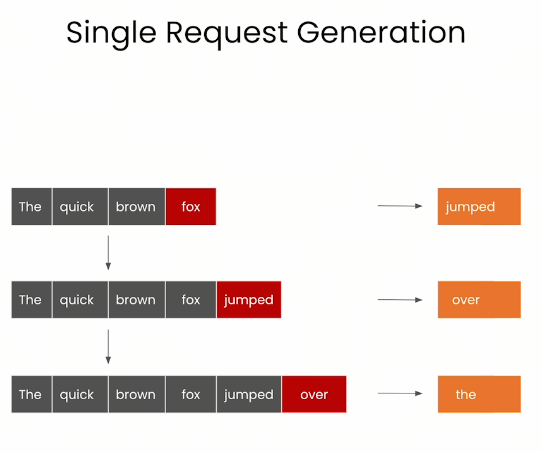
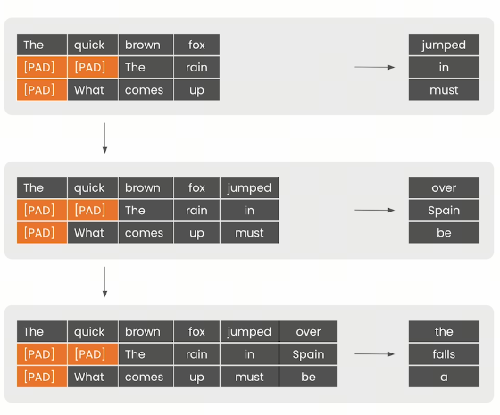
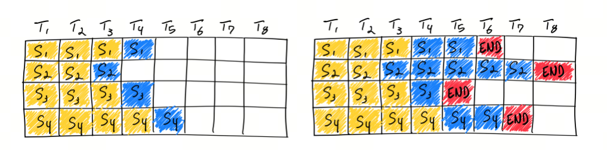

What is the difference between latency and throughput in large models?

## 1. Introduction

To use large models quickly, we need to buy commercial large-model services. Before purchasing, while talking with sales, we described our scenario and requirements:

Q: Our prompt token count is in the 1500 to 2000 range, and completion tokens are around 500. In this situation, how long does prefilling take? How long does each output token take?

Sales answer: standard 3500-token input, first packet comes out in under 1 second; throughput is 300 token/s.

Did you notice that the answer did not match the question?

The question was about latency, while the answer was about throughput. So what is the difference between these two words, if even salespeople in this field can mix them up?


Before understanding latency and throughput, let's look at KV cache and prefilling.

## 2. KV Cache

KV Cache uses the idea of trading space for time: it reuses KV cache from previous inference, which can greatly reduce memory pressure, improve inference performance, and does not affect compute accuracy.

In a decoder architecture, the key part is a stack of transformer self-attention structures. The essence of KV cache is that previously computed key-value pairs and the current query are used to generate the next token.

Prefill means that when generating the first token, `kv` has no cache yet: the KV matrix corresponding to the prompt must be filled and cached first. So the first token is the slowest to generate. Starting from the second token, the model quickly reads from the cache and also caches the `kv` of the previous token.

You can see that this is a space-for-time scheme: the cache keeps growing. So during private deployment and GPU memory calculation, besides model size, you need to consider the prompt and completion sizes in your application, and of course batch size.

## 3. Prefilling and Decoding

If you use a commercial large model or deploy an open source large model locally, then besides generation quality, another key metric is token generation speed. And it is not just tokens per second. It has two separate stages:

- prefill: parallel processing of input tokens;
- decoding: generating the next token one by one.

### Prefill

During prefill, the model processes the input prompt, meaning input tokens, in parallel and creates KV cache. This step includes one full forward pass and outputs the first token. The time of this process is mostly determined by the input tokens, because a full calculation is needed to initialize the whole generation process.

### Decoding

Decoding is the process of generating the next token one by one. At this step, the number of output tokens determines how many forward passes need to run. Although each forward pass is faster thanks to KV cache, the model still has to compute repeatedly, gradually generating each following token.

### Different Companies Use Different Terms:

- First token latency, Time To First Token (TTFT), prefill, Prefilling

  These all mean the delay from input to the first output token.

- Latency of each output token (excluding the first token), Time Per Output Token (TPOT)

  This means output speed starting from the second token.

- Latency

  Theoretically, this is the time from input to the last output token. The basic formula is: Latency = (TTFT) + (TPOT) * (the number of tokens to be generated).

- Tokens Per Second (TPS):

  (the number of tokens to be generated) / Latency.

## 4. Latency vs. Throughput

- Latency: delay, time from input to output, meaning time from input to the last output token.



- Throughput: the number of tasks processed per unit time, meaning the number of tokens processed per second.



Below is a way to calculate latency and throughput:

```python
# constants
max_tokens = 10

# observations
durations = []
throughputs = []
latencies = []

batch_sizes = [2**p for p in range(8)]
for batch_size in batch_sizes:
    print(f"bs= {batch_size}")

    # generate tokens for batch and record duration
    t0 = time.time()
    batch_prompts = [
        prompts[i % len(prompts)] for i in range(batch_size)
    ]
    inputs = tokenizer(
        batch_prompts, padding=True, return_tensors="pt"
    )
    generated_tokens = generate_batch(inputs, max_tokens=max_tokens)
    duration_s = time.time() - t0

    ntokens = batch_size * max_tokens
    throughput = ntokens / duration_s
    avg_latency = duration_s / max_tokens
    print("duration", duration_s)
    print("throughput", throughput)
    print("avg latency", avg_latency)
    print()

    durations.append(duration_s)
    throughputs.append(throughput)
    latencies.append(avg_latency)
```

## 5. Naive Batching

Naive batching means combining several inputs into one batch and feeding them into the model once. This reduces the number of model forward passes and improves efficiency.
Some people also call this synchronous batching or static batching, as opposed to continuous batching, described below.



The drawback of naive batching is that if one input in the batch is very large, the compute time of the whole batch stretches out, so the whole batch takes longer.

## 6. Continuous Batching

In traditional batching, the whole group of requests must finish processing before results are returned together. This means short requests have to wait for long requests, wasting GPU resources and increasing inference latency. Continuous Batching lets the system return a request result immediately after the current iteration if that request has finished, without waiting for the whole batch. This noticeably improves hardware utilization and reduces idle time.


Continuous Batching also solves resource waste caused by different compute amounts across requests: through iteration-level scheduling, it dynamically adjusts batch size, adapts to the complexity of different requests, and effectively reduces wait time for high-complexity requests.

It is important to note that implementing Continuous Batching requires handling several key issues: early-finished requests, late-joining requests, and batching requests of different lengths. Two design ideas proposed by OCRA, Iteration-level Batching and Selective Batching, are meant to solve exactly these problems.

In practice, different frameworks may implement Continuous Batching differently. For example, vLLM uses a simplified implementation that separates prefill and decoding, while FastGen uses SplitFuse: it splits a long prompt into small blocks and schedules them across several steps. All these implementations aim to improve inference performance, reduce latency, and optimize resource use.

Code for generating continuous batching:

```python
# seed the random number generator so our results are deterministic
random.seed(42)

# constants
queue_size = 32
batch_size = 8

# requests waiting to be processed
# this time requests are tuples (prompt, max_tokens)
request_queue = [
    (prompts[0], 100 if i % batch_size == 0 else 10)
    for i in range(queue_size)
]

t0 = time.time()
with tqdm(total=len(request_queue), desc=f"bs={batch_size}") as pbar:
    # first, let's seed the initial cached_batch
    # with the first `batch_size` inputs
    # and run the initial prefill step
    batch = init_batch(request_queue[:batch_size])
    cached_batch = generate_next_token(batch)
    request_queue = request_queue[batch_size:]

    # continue until both the request queue is
    # fully drained and every input
    # within the cached_batch has completed generation
    while (
        len(request_queue) > 0 or
        cached_batch["input_ids"].size(0) > 0
    ):
        batch_capacity = (
            batch_size - cached_batch["input_ids"].size(0)
        )
        if batch_capacity > 0 and len(request_queue) > 0:
            # prefill
            new_batch = init_batch(request_queue[:batch_capacity])
            new_batch = generate_next_token(new_batch)
            request_queue = request_queue[batch_capacity:]

            # merge
            cached_batch = merge_batches(cached_batch, new_batch)

        # decode
        cached_batch = generate_next_token(cached_batch)

        # remove any inputs that have finished generation
        cached_batch, removed_indices = filter_batch(cached_batch)
        pbar.update(len(removed_indices))

duration_s = time.time() - t0
print("duration", duration_s)
```

## References

[1] [deeplearning.ai](https://learn.deeplearning.ai/courses/efficiently-serving-llms/lesson/3/batching)

[2] [Continuous Batching: a tool for improving throughput when deploying LLMs](https://www.high-flyer.cn/en/blog/continuous-batching/)

[3] [LLM inference optimization: Continuous Batching and its implementation](https://yangwenbo.com/articles/llm-continuous-batching.html)

[4] [How continuous batching enables 23x throughput in LLM inference while reducing p50 latency](https://www.anyscale.com/blog/continuous-batching-llm-inference)

[5] [GitHub: LLMForEverybody](https://github.com/luhengshiwo/LLMForEverybody)
