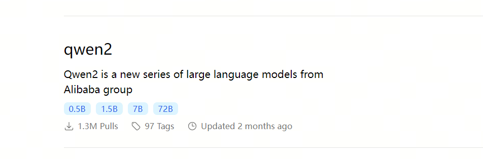
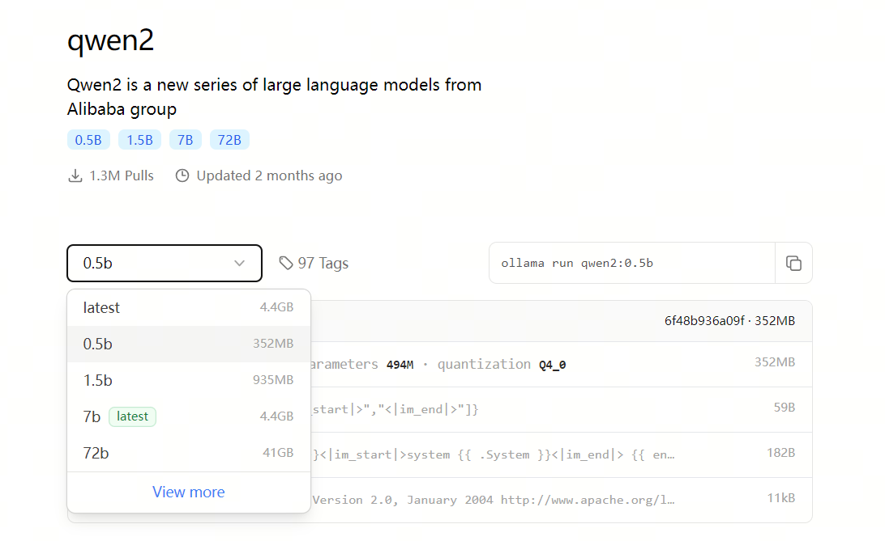

# Private Local LLM Deployment in 10 Minutes

## Introduction

Today, deploying an LLM privately on your own machine is no longer a high-bar technical task. In most cases, it is more about knowing which tools to use. If you follow this guide, even a beginner can get an LLM running locally.

Technical requirements: you should be able to click a mouse and type. We only need two applications:

Ollama: https://ollama.com/

ChatBox: https://chatboxai.app/zh

## Ollama

`Ollama` is an open-source tool for serving large language models (`LLM`). It makes local LLM usage simpler and lowers the entry barrier. With it, developers, researchers, and enthusiasts can quickly try, manage, and deploy modern open-source LLMs, including `Qwen2`, `Llama3`, `Phi3`, `Gemma2`, and others. `Ollama` provides a simple interface for creating, running, and managing models, plus a useful library of ready-to-use models for different applications.

### 1. Download Ollama

Download `Ollama` from the official website: https://ollama.com/

### 2. Install Ollama

Run the normal installer. A few clicks, and it is done.

### 3. Download a model

In the `Ollama` model library at https://ollama.com/library, find a model that fits your machine. For a quick test, a small `tiny` model is a good choice.

You can use `qwen2:0.5b`. It uses 4-bit quantization, and the model size is only 352 MB.

In a `cmd` terminal, run this command to download the model:

> ollama pull qwen2:0.5b

### 4. Run Ollama

Run this command to start `qwen2:0.5b`:

> ollama run qwen2:0.5b

At this point, you already have a local LLM running on your computer. If you want better answers, you can download a larger model later.

## ChatBox

`Chatbox AI` is a client-side AI application and intelligent assistant. It supports many modern AI models and APIs, and it is available on `Windows`, `MacOS`, `Android`, `iOS`, `Linux`, and the web.

### 1. Download ChatBox

Download `ChatBox` from the official website: https://chatboxai.app/zh#download

### 2. Install ChatBox

Run the normal installer. Again, a few clicks are enough.

### 3. Configure ChatBox

Open settings in the lower-left corner of `ChatBox`.

Choose `ollama` as the model provider.

Set the API endpoint:

> http://localhost:11434

Set the model:

> qwen2:0.5b

Click save.

Now test it.

You can see that the answer is generated through `qwen2:0.5b`. If you have a powerful GPU, you can download and deploy a larger model for better results.

The whole process does not require deep computer knowledge. Installing normal applications is enough.

## References

[1] [GitHub: LLMForEverybody](https://github.com/luhengshiwo/LLMForEverybody)

---

## 📚 相关概念

[[sources/推理引擎/LLM 推理 优化|LLM 推理 优化]] | [[sources/推理引擎/推测解码|推测解码]] | [[sources/推理引擎/分布式推理|分布式推理]] | [[concepts/模型 压缩 蒸馏|模型 压缩 蒸馏]] | [[concepts/LLM 应用 生态|LLM 应用 生态]] | [[sources/推理引擎/vllm|vllm]] | [[sources/推理引擎/tensorrt-llm|tensorrt-llm]] | [[sources/推理引擎/sglang|sglang]] | [[entities/Hugging Face|Hugging Face]] | [[sources/推理引擎/LLM 推理 优化|LLM 推理 优化]]

> 📌 来源：[[sources/LLMForEverybody/索引|LLMForEverybody 导航]] · 章节：部署与推理
