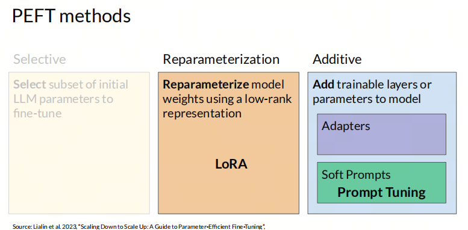
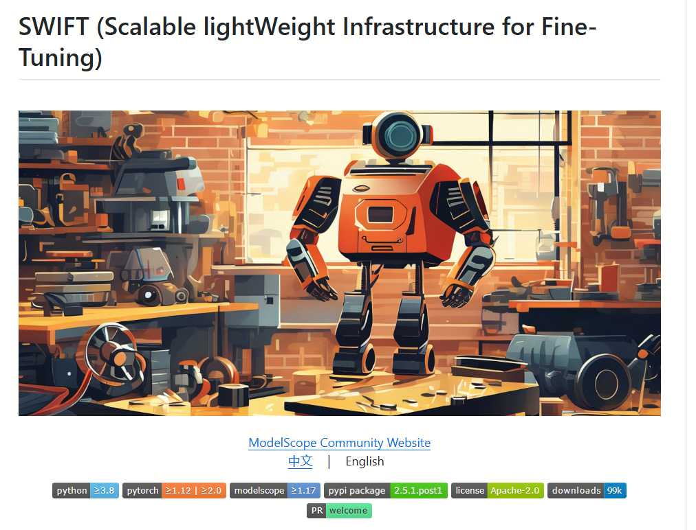
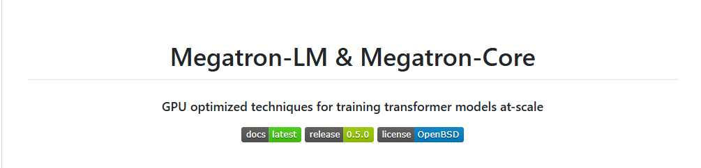

One article to understand frameworks for fine-tuning large models

## 1. What Is Fine-Tuning Large Models?

Fine-tuning large models usually means continuing to train an already pretrained large language model (LLM) on a specialized dataset, so the model adapts to a specific task or domain. This process lets the model learn knowledge from the target domain and improve quality on specific NLP tasks, such as sentiment analysis, entity recognition, text classification, dialogue generation, and so on.

1. **Pretrained model**: before fine-tuning, the large model has usually already gone through large-scale unsupervised pretraining. Because of that, it has learned basic statistical properties of language and knowledge, and it knows how to predict the next word.

2. **Task-specific dataset**: during fine-tuning, the model is trained on labeled data related to a specific task. This data gives the model information from the domain it needs to master.

3. **Weight adjustment**: during fine-tuning, model weights are adjusted using task-specific data. This can mean updating all parameters (Full Fine-tuning), or parameter-efficient fine-tuning (PEFT), where only part of the model parameters are updated.

## 2. PEFT (Parameter-Efficient Fine-Tuning)

Compared with traditional fine-tuning methods, PEFT effectively reduces compute and memory requirements: it fine-tunes only a small part of the model parameters while freezing most of the pretrained network. This strategy reduces catastrophic forgetting in large language models and noticeably cuts compute and storage costs.

For main PEFT methods, see the links to Adapters and Soft prompts.



## 3. Framework Overview

1. **huggingface/peft**[1](#refer-anchor-1): a basic open source tool from Hugging Face for Parameter-Efficient Fine-Tuning.


2. **modelscope/ms-swift**[2](#refer-anchor-2): a lightweight open source fine-tuning framework from ModelScope, mainly aimed at Chinese large models and supporting different fine-tuning methods. Fine-tuning can be run through scripts or with one command from a code environment. The framework comes with datasets for fine-tuning and validation, so you can quickly fine-tune and validate a model.



3. **hiyouga/LLaMA-Factory**[3](#refer-anchor-3): a full-stack fine-tuning tool that supports many models and common fine-tuning methods. It lets you run fine-tuning with scripts, work through a web interface, and use basic training datasets. Besides fine-tuning, it also supports incremental pretraining and full fine-tuning.


4. **NVIDIA/Megatron-LM**[4](#refer-anchor-4): a large-model training framework developed by NVIDIA. It supports large-scale pretraining and fine-tuning, and is suitable for training and fine-tuning large models that need very high performance and scale.



## 4. PEFT Library

PEFT (parameter-efficient fine-tuning) is a library for efficiently adapting large pretrained models to different downstream applications without fine-tuning all model parameters, because that is too expensive. PEFT methods fine-tune only a small number of additional model parameters while reaching quality comparable to full fine-tuning. This makes it easier to train and store large language models (LLMs) on consumer hardware.


PEFT integrates with Transformers, Diffusers, and Accelerate, providing a faster and simpler way to load, train, and use large models for inference.

Using the PEFT library can be summarized in these steps:

### 1. Install the PEFT Library

The PEFT library can be installed through PyPI with:

```bash
pip install peft
```

Or, if you need to install from source to get the newest features, use:

```bash
pip install git+https://github.com/huggingface/peft
```

Users who want to contribute code or see the latest results can clone the repository from GitHub and install the editable version:

```bash
git clone https://github.com/huggingface/peft
cd peft
pip install -e .
```

### 2. Configure the PEFT Method

Each PEFT method is defined by a `PeftConfig` class, which stores all important parameters for creating a `PeftModel`. Using LoRA as an example, you need to specify task type, inference mode, low-rank matrix dimension, and other parameters:

```python
from peft import LoraConfig, TaskType
peft_config = LoraConfig(task_type=TaskType.SEQ_2_SEQ_LM, inference_mode=False, r=8, lora_alpha=32, lora_dropout=0.1)
```

### 3. Load the Pretrained Model and Apply PEFT

Load the base model for fine-tuning and use `get_peft_model()` to wrap the base model with `peft_config`, creating a `PeftModel`:

```python
from transformers import AutoModelForSeq2SeqLM
from peft import get_peft_model
model = AutoModelForSeq2SeqLM.from_pretrained("bigscience/mt0-large")
model = get_peft_model(model, peft_config)
```

### 4. Train the Model

Now the model can be trained with `Trainer` from Transformers, Accelerate, or any custom PyTorch training loop. For example, training through `Trainer`:

```python
from transformers import TrainingArguments, Trainer
training_args = TrainingArguments(
    output_dir="your-name/bigscience/mt0-large-lora",
    learning_rate=1e-3,
    per_device_train_batch_size=32,
    num_train_epochs=2,
    weight_decay=0.01,
)
trainer = Trainer(
    model=model,
    args=training_args,
    train_dataset=tokenized_datasets["train"],
    eval_dataset=tokenized_datasets["test"],
    tokenizer=tokenizer,
    data_collator=data_collator,
    compute_metrics=compute_metrics,
)
trainer.train()
```

### 5. Save and Load the Model

After training finishes, the model can be saved to a directory with `save_pretrained` or pushed to the Hugging Face Hub with `push_to_hub`:

```python
model.save_pretrained("output_dir")
from huggingface_hub import notebook_login
notebook_login()
model.push_to_hub("your-name/bigscience/mt0-large-lora")
```

### 6. Inference

Use `AutoPeftModel` and `from_pretrained` to easily load any inference model trained with PEFT:

```python
from peft import AutoPeftModelForCausalLM
from transformers import AutoTokenizer
model = AutoPeftModelForCausalLM.from_pretrained("ybelkada/opt-350m-lora")
tokenizer = AutoTokenizer.from_pretrained("facebook/opt-350m")
inputs = tokenizer("Preheat the oven to 350 degrees and place the cookie dough", return_tensors="pt")
outputs = model.generate(input_ids=inputs["input_ids"], max_new_tokens=50)
print(tokenizer.batch_decode(outputs.detach().cpu().numpy(), skip_special_tokens=True)[0])
```

## 5. LLaMA-Factory

Many people first encounter large-model fine-tuning through LoRA in LLaMA-Factory, roughly the same way data scientists used to start with predicting Titanic passenger survival on Kaggle. LoRA in LLaMA-Factory is a good starting point.

- 3

## 1. Web-UI

LLaMA Factory provides a convenient visual interface (WebUI) that lets users fine-tune large language models without writing code.

**Interface overview**:

- The WebUI in LLaMA Factory mainly consists of four screens: training, evaluation and prediction, chat, and export.

**Training screen**:

- On the training screen, the user can specify the model name and path, training stage, fine-tuning method, training dataset, learning rate, number of epochs, and other training parameters, then start training.
- Resume from checkpoint is supported; the adapter checkpoint is saved in the `output_dir` directory.

**Evaluation, prediction, and chat screens**:

- After model training finishes, the user can specify paths to the model and adapter on the evaluation and prediction screen and run evaluation on a given dataset.
- The user can also chat with the model through the chat screen and observe model quality.

**Export screen**:

- If the user is satisfied with model quality and wants to export it, they can specify the model, adapter, shard size, export quantization level, calibration dataset, export device, export directory, and other parameters on the export screen, then click export.

**Usage steps**:

- The user can open `http://localhost:7860` in a browser, enter the web interface, choose a model, configure parameters, and track training progress.
- Switching the language to Chinese is supported, which is convenient for users in China.

**Supported models and datasets**:

- LLaMA Factory supports different pretrained models, such as LLaMA, BLOOM, Mistral, and others, and can automatically download and cache model and dataset resources from ModelScope.

**Fine-tuning methods**:

- Different fine-tuning methods are available, including full-parameter fine-tuning, freeze fine-tuning, LoRA fine-tuning, and others.

**Parameter configuration**:

- WebUI lets the user optimize the model by simple dragging and parameter adjustment, so even people without programming experience can easily take part in model optimization.

- 0

## 2. Beyond LoRA

LLaMA-Factory provides a set of advanced features for complex fine-tuning and deployment of large models:

**Compatibility with many models**: LLaMA-Factory supports different large language models, such as LLaMA, BLOOM, Mistral, Baichuan, Qwen, ChatGLM, and others.

**Training algorithm integration**: the framework integrates different training algorithms, including incremental pretraining, supervised fine-tuning on instructions, reward model training, PPO training, DPO training, KTO training, ORPO training, and others.

**Compute precision and optimization algorithms**: different compute-precision options are available, such as 32-bit full-parameter fine-tuning, 16-bit freeze fine-tuning, 16-bit LoRA fine-tuning, and 2/4/8-bit QLoRA fine-tuning based on AQLM/AWQ/GPTQ/LLM.int8. Advanced algorithms such as GaLore, DoRA, LongLoRA, LLaMA Pro, LoRA+, LoftQ, and Agent fine-tuning are also supported.

**Inference engine support**: Transformers and vLLM inference engines are supported, giving users flexible inference options.

**Experiment dashboard integration**: integration with LlamaBoard, TensorBoard, Wandb, MLflow, and other experiment dashboard tools makes it easier to monitor and analyze training.

**API Server function**: LLaMA-Factory supports starting an API Server, letting users call the model through an API, which simplifies integration and application.

**Benchmarks for evaluating large models**: popular benchmark tools for evaluating large models are provided, helping users measure model quality.

**Docker installation and Huawei NPU adaptation**: Docker installation and Huawei NPU usage are supported, improving framework portability and hardware compatibility.

**Quantization technologies**: PTQ, QAT, AQLM, OFTQ, and other quantization technologies are supported, optimizing deployment efficiency and model quality.

These advanced features let LLaMA-Factory support not only basic model fine-tuning, but also more complex research and applied tasks, giving users a powerful and flexible toolkit.

## References

<div id="refer-anchor-1"></div>

[1] [peft](https://huggingface.co/docs/peft/index)

<div id="refer-anchor-2"></div>

[2] [ms-swift](https://github.com/modelscope/ms-swift)

<div id="refer-anchor-3"></div>

[3] [LLaMA-Factory](https://github.com/hiyouga/LLaMA-Factory)

<div id="refer-anchor-4"></div>

[4] [Megatron-LM](https://github.com/NVIDIA/Megatron-LM)

## Follow my GitHub and WeChat channel [The Real Ship of Theseus]: no time to explain, hurry aboard!

[GitHub: LLMForEverybody](https://github.com/luhengshiwo/LLMForEverybody)

The repository has the original Markdown files, and everything is fully open source. Stars and forks are very welcome.
