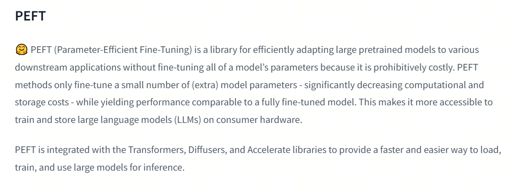

## 1. Parameter-Efficient Fine-Tuning

Parameter-Efficient Fine-Tuning (PEFT) is a technique for fine-tuning large pretrained models, such as language models. Its key goal is to adapt the model to specific downstream tasks without noticeably increasing the number of model parameters. This approach is especially useful in resource-constrained environments or when full fine-tuning of the whole model is impossible because the compute cost is too high.

For main PEFT methods, see the links to Adapters and Soft prompts.


## 2. PEFT Library

PEFT (parameter-efficient fine-tuning) is a library for efficiently adapting large pretrained models to different downstream applications without fine-tuning all model parameters, because that is too expensive. PEFT methods fine-tune only a small number of additional model parameters while reaching quality comparable to full fine-tuning. This makes it easier to train and store large language models (LLMs) on consumer hardware.



PEFT integrates with Transformers, Diffusers, and Accelerate, providing a faster and simpler way to load, train, and use large models for inference.

Using the PEFT library can be summarized in these steps:

### 1. Install the PEFT Library

The PEFT library can be installed through PyPI with:

```bash
pip install peft
```

Or, if you need to install from source to get the newest features, use:

```bash
pip install git+https://github.com/huggingface/peft
```

Users who want to contribute code or see the latest results can clone the repository from GitHub and install the editable version:

```bash
git clone https://github.com/huggingface/peft
cd peft
pip install -e .
```

### 2. Configure the PEFT Method

Each PEFT method is defined by a `PeftConfig` class, which stores all important parameters for creating `PeftModel`. Using LoRA as an example, you need to specify task type, inference mode, low-rank matrix dimension, and other parameters:

```python
from peft import LoraConfig, TaskType
peft_config = LoraConfig(task_type=TaskType.SEQ_2_SEQ_LM, inference_mode=False, r=8, lora_alpha=32, lora_dropout=0.1)
```

### 3. Load the Pretrained Model and Apply PEFT

Load the base model for fine-tuning and use `get_peft_model()` to wrap the base model with `peft_config`, creating a `PeftModel`:

```python
from transformers import AutoModelForSeq2SeqLM
from peft import get_peft_model
model = AutoModelForSeq2SeqLM.from_pretrained("bigscience/mt0-large")
model = get_peft_model(model, peft_config)
```

### 4. Train the Model

Now the model can be trained with `Trainer` from Transformers, Accelerate, or any custom PyTorch training loop. For example, training through `Trainer`:

```python
from transformers import TrainingArguments, Trainer
training_args = TrainingArguments(
    output_dir="your-name/bigscience/mt0-large-lora",
    learning_rate=1e-3,
    per_device_train_batch_size=32,
    num_train_epochs=2,
    weight_decay=0.01,
)
trainer = Trainer(
    model=model,
    args=training_args,
    train_dataset=tokenized_datasets["train"],
    eval_dataset=tokenized_datasets["test"],
    tokenizer=tokenizer,
    data_collator=data_collator,
    compute_metrics=compute_metrics,
)
trainer.train()
```

### 5. Save and Load the Model

After training finishes, the model can be saved to a directory with `save_pretrained` or pushed to the Hugging Face Hub with `push_to_hub`:

```python
model.save_pretrained("output_dir")
from huggingface_hub import notebook_login
notebook_login()
model.push_to_hub("your-name/bigscience/mt0-large-lora")
```

### 6. Inference

Use `AutoPeftModel` and `from_pretrained` to easily load any inference model trained with PEFT:

```python
from peft import AutoPeftModelForCausalLM
from transformers import AutoTokenizer
model = AutoPeftModelForCausalLM.from_pretrained("ybelkada/opt-350m-lora")
tokenizer = AutoTokenizer.from_pretrained("facebook/opt-350m")
inputs = tokenizer("Preheat the oven to 350 degrees and place the cookie dough", return_tensors="pt")
outputs = model.generate(input_ids=inputs["input_ids"], max_new_tokens=50)
print(tokenizer.batch_decode(outputs.detach().cpu().numpy(), skip_special_tokens=True)[0])
```

## References

<div id="refer-anchor-1"></div>

[1] [peft](https://huggingface.co/docs/peft/index)

## Follow my GitHub and WeChat channel [The Real Ship of Theseus]: no time to explain, hurry aboard!

[GitHub: LLMForEverybody](https://github.com/luhengshiwo/LLMForEverybody)

The repository has the original Markdown files, and everything is fully open source. Stars and forks are very welcome.
