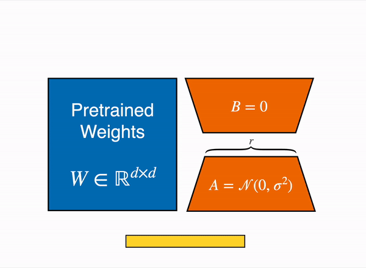

LoRA is not the only option: secrets of fine-tuning large models with Adapters, part 1: overview

Everyone probably already knows LoRA: it is a very popular PEFT method and belongs to the Adapter family. Adapters are a great way to fine-tune large models: they let you add new tasks without changing the parameters of the original model. In this series, we will look at several Adapter variants, including LoRA, QLoRA, AdaLoRA, and others.

Earlier, we covered the Soft Prompts series in PEFT. Now we move to the Adapter series, focusing mainly on LoRA and several of its variants.

## Adapter

Adapter-based methods add extra trainable parameters after the attention layers and fully connected layers of a frozen pretrained model, reducing memory usage and speeding up training. The concrete implementation depends on the Adapter type: it may be a simple added layer, or it may represent the weight update ∆W as a low-rank decomposition of the weight matrix. Either way, adapters are usually small, but they can reach quality comparable to fully fine-tuned models and allow larger models to be trained with fewer resources.

## Common Adapter Methods

### LoRA

LoRA (Low-Rank Adapter) [1](#refer-anchor-1) is one of the most popular PEFT methods. If you are just starting with PEFT, it is a good starting point. LoRA was originally developed for large language models, but because of its efficiency and effectiveness, it has also become a very popular method for training diffusion models.

LoRA represents the weight update ∆W through low-rank decomposition into two smaller matrices, called update matrices. These new matrices can be trained to adapt to new data while keeping the total number of parameters low. The original weight matrix remains frozen and no longer receives updates. To get the final result, the original weights are combined with the additionally tuned weights. Also, adapter weights can be merged into the base model to remove inference latency.

### QLoRA

QLoRA (Quantized Low-Rank Adaptation) [2](#refer-anchor-2) is a newer fine-tuning method for large language models (LLMs) that reduces memory usage while preserving model quality. This technique was proposed by the University of Washington and mainly solves the problem of huge memory requirements: it makes it possible to fine-tune a 65-billion-parameter model on a single 48 GB GPU while preserving the quality of full 16-bit fine-tuning.

QLoRA works by first quantizing the pretrained language model to 4 bits, greatly reducing model memory usage, and then applying low-rank adapters (LoRA) to the quantized model for fine-tuning. This approach not only reduces model size and improves speed, but also preserves most of the accuracy of the original pretrained language model.

### AdaLoRA

When you see Ada, remember that it means Adaptive.

AdaLoRA (Adaptive Low-Rank Adapter) [3](#refer-anchor-3) is an efficient fine-tuning method for large pretrained language models. It adaptively allocates the parameter budget based on the importance of weight matrices. This approach parameterizes incremental updates to weight matrices in the form of Singular Value Decomposition (SVD), efficiently prunes singular values of unimportant updates, and reduces their parameter budget while avoiding the expensive computation of exact dense SVD.

AdaLoRA includes two main modules:

- SVD-form parameter update: the incremental matrix Δ is directly parameterized in SVD form, avoiding the resource cost of computing SVD during training.

- Importance-based parameter allocation: the parameter budget is dynamically distributed among incremental matrices based on a new importance metric, controlled through singular values.

## References

[1] [LoRA: Low-Rank Adaptation of Large Language Models](https://arxiv.org/pdf/2106.09685)

[2] [QLORA: Efficient Finetuning of Quantized LLMs](https://arxiv.org/pdf/2305.14314)

[3] [ADALORA: ADAPTIVE BUDGET ALLOCATION FOR PARAMETER-EFFICIENT FINE-TUNING](https://arxiv.org/pdf/2303.10512)

[4] [huggingface: adapter](https://huggingface.co/docs/peft/conceptual_guides/adapter)

## Follow my GitHub and WeChat channel [The Real Ship of Theseus]: no time to explain, hurry aboard!

[GitHub: LLMForEverybody](https://github.com/luhengshiwo/LLMForEverybody)

The repository has the original Markdown files, and everything is fully open source. Stars and forks are very welcome.
