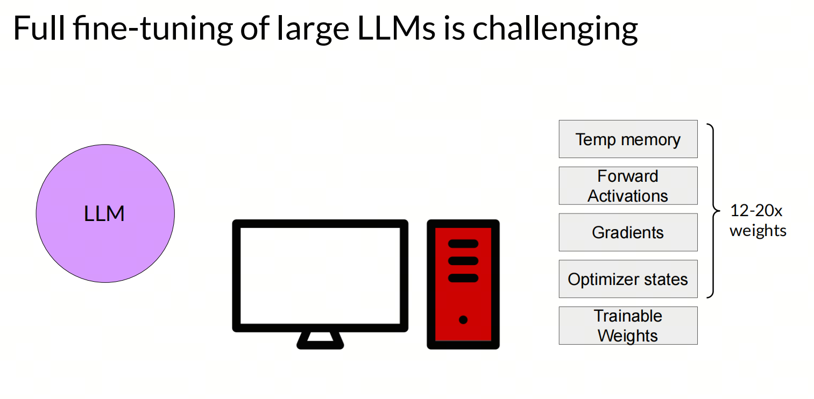
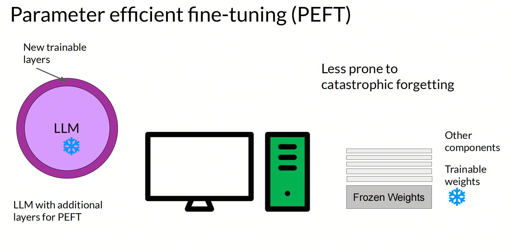
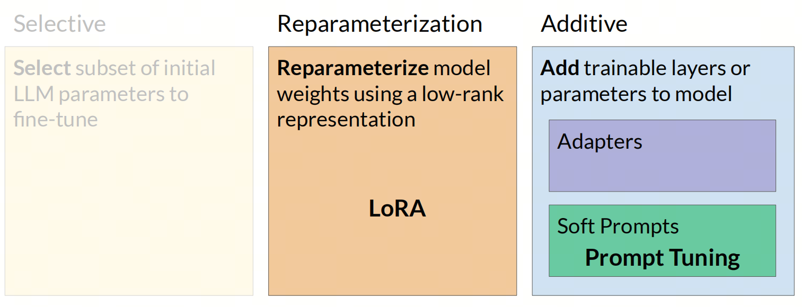
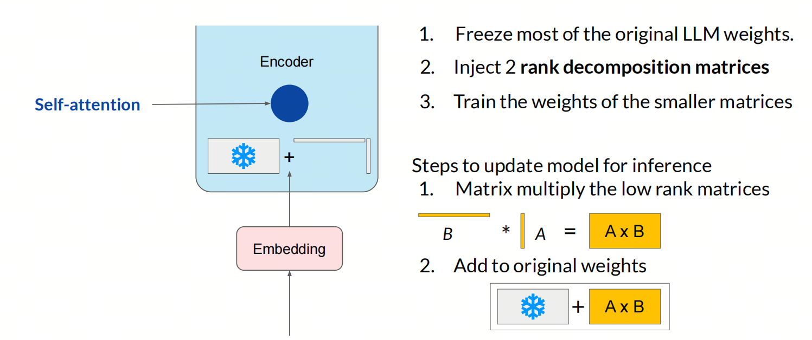
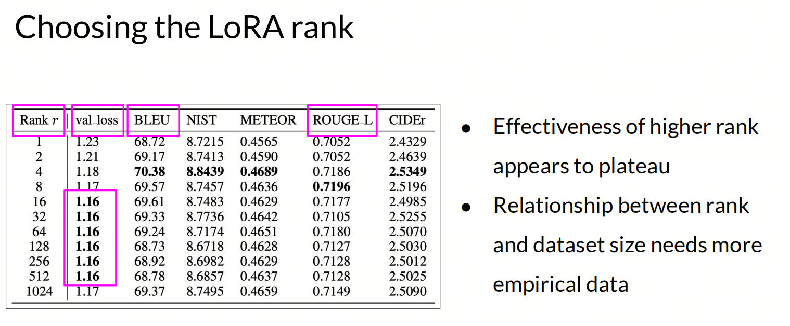
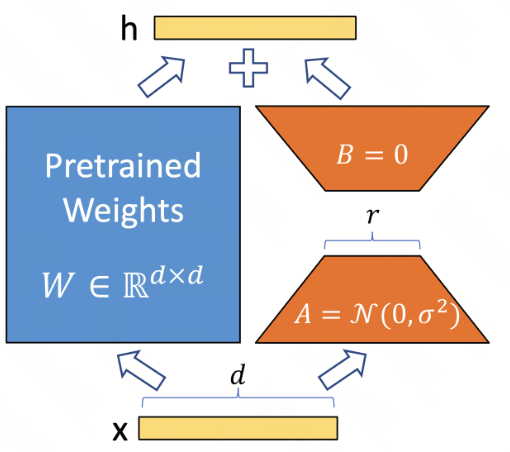
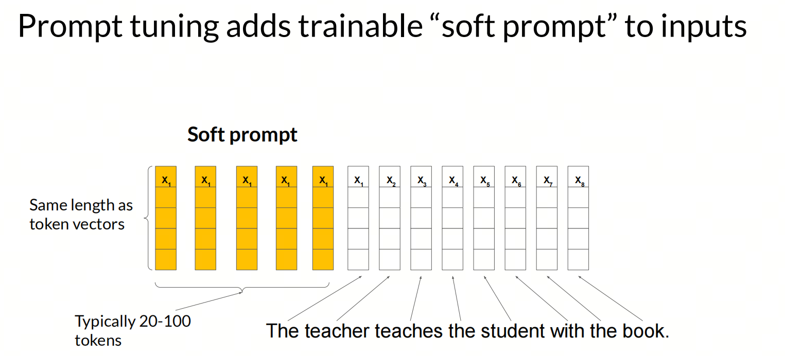

Parameter efficient Fine-tuning (PEFT)
Parameter-efficient fine-tuning for large models (PEFT), LoRA fine-tuning, and other methods

## 1. Fine-tuning

Compared with base large models, whose training can easily require tens of thousands of GPU cards, fine-tuning is probably still one of the few acceptable ways for ordinary people and companies to do post-training for large models.

Fine-tuning means taking a pretrained model and training it further on a small amount of data and compute resources, so it adapts to a specific task or dataset.

Fine-tuning is split into two types: full fine-tuning and parameter-efficient fine-tuning.

- Full fine-tuning: in full fine-tuning, all model parameters are updated. This method usually requires a large amount of data and compute resources, plus a long training time.

## 2. PEFT

Parameter-Efficient Fine-Tuning (PEFT) is a technique for fine-tuning large pretrained models, such as large language models. Its goal is to reduce the number of trainable parameters, lowering compute and storage costs while keeping or improving model quality.

PEFT adapts a model to a specific downstream task by fine-tuning only a small part of the model parameters, rather than the whole model. This approach is especially useful when hardware resources are limited, and also for large models that need to be adapted quickly to many tasks.

PEFT has several common methods:

- Parameter subset selection: choose a small part of the model parameters for fine-tuning, usually parameters in the last few layers.
- Reparameterization: reparameterize model weights with a low-rank representation. A typical example is LoRA.
- Adding parameters: add trainable layers or parameters to the model. A typical example is Prompt-tuning.

## 3. LoRA

LoRA (Low-Rank Adaptation) is a parameter-efficient fine-tuning technique mainly used for fine-tuning large pretrained models. It adapts the model by introducing low-rank matrices into the model's weight matrices, reducing the number of trainable parameters and lowering compute and storage costs.

The key idea of LoRA is that when fine-tuning a large model for a specific task, it is not necessary to update all parameters. Fine-tuning only a small portion of model parameters can greatly reduce required compute resources while preserving or improving model quality.

At the implementation level, LoRA adds a trainable low-rank matrix to the pretrained model's weight matrix. This low-rank matrix is obtained as the product of two smaller matrices. During training, only these two matrices are updated, while the original pretrained weight matrix stays unchanged.

### Q-LoRA

QLoRA (Quantized LoRA) is the quantized version of LoRA. Through quantization, it further reduces model storage requirements, making it possible to train and deploy large models on resource-constrained devices.

### Rank

The rank of a matrix is the maximum number of linearly independent rows or columns in the matrix. In LoRA, introducing a low-rank matrix reduces the number of model parameters, which lowers compute and storage costs.

In practice, rank 4 or 8 usually reduces the number of parameters significantly while preserving model quality.

### LoRA target_modules: target matrices, Q? K? V?

Why is LoRA fine-tuning more often applied to Q and V layers, rather than K? Mainly because of these reasons:

- Parameter efficiency: Q and V layers directly affect attention weight computation and the final output representation. Tuning Q can affect what information the model attends to; tuning V can affect how the model uses that information. So fine-tuning these layers can more directly change model behavior.

- Influence on information selection: the K layer mainly affects how information is matched. In many cases, tuning Q and V is already enough to guide the model's attention toward more useful information.

- Compute efficiency: although LoRA aims to improve parameter efficiency through low-rank updates, applying those updates to all layers still adds extra compute load. Choosing the layers that affect final quality the most gives the largest quality gain with minimal compute increase.

- Experiments and practice: experience and research in real applications show that applying LoRA fine-tuning to Q and V layers usually improves task-specific quality effectively. This may be because these layers play a key role in the model and have a stronger effect on output.

Also, for different LoRA implementations in different models, the `target_modules` parameter can be set depending on the model architecture. For example, for T5 and MT5 models, the default `target_modules` value is `["q", "v"]`, while for BART and GPT-2 it is `["q_proj", "v_proj"]`.

If the model you use is not in the list of large language models defined by the implementation, `target_modules` needs to be specified manually. You can find trainable parameters by printing the names of trainable model parameters.

## 4. Prompt-tuning

Prompt Tuning is a technique for fine-tuning large pretrained models by introducing task-specific prompts at the input layer, without updating all model parameters. The main advantage of this method is parameter efficiency: only a small number of parameters need to be trained, which reduces compute cost and training time.

Main implementation steps for Prompt Tuning:

- Define a task-specific instruction (prompt), which becomes part of the input and guides the model to complete a specific task.
- Combine the instruction with the original input data to form a new input.
- Use the new input to fine-tune the pretrained model. Usually this means training embedding vectors corresponding to prompt tokens, or vectors parameterized by a neural network, while the rest of the pretrained model stays frozen.

## 5. Other PEFT Methods

Besides the most popular methods, LoRA and Prompt-tuning, there are other parameter-efficient fine-tuning methods, such as P-tuning, Prefix-Tuning, and so on. But I have not studied or used them deeply, so I will not describe them in detail here. You can refer to the Hugging Face PEFT documentation.

## References

[1] [deeplearning.ai](https://www.deeplearning.ai/courses/generative-ai-with-llms/)

[2] [HuggingFace:PEFT](https://huggingface.co/docs/peft/package_reference/)

[3] [GitHub: LLMForEverybody](https://github.com/luhengshiwo/LLMForEverybody)
