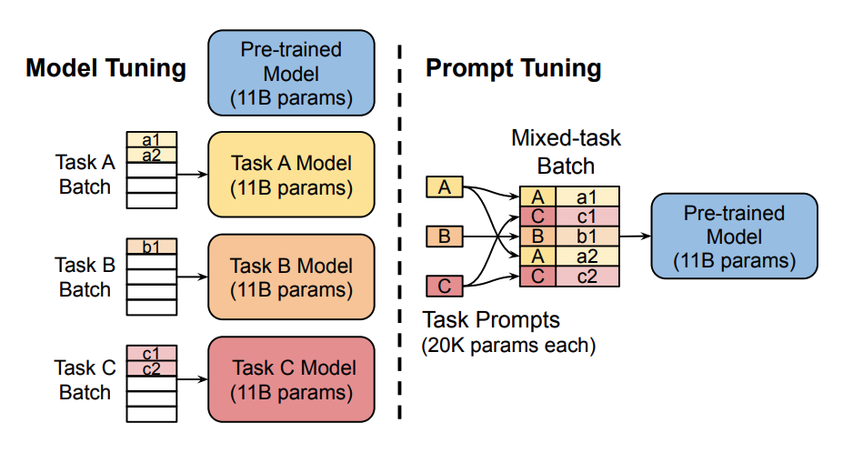
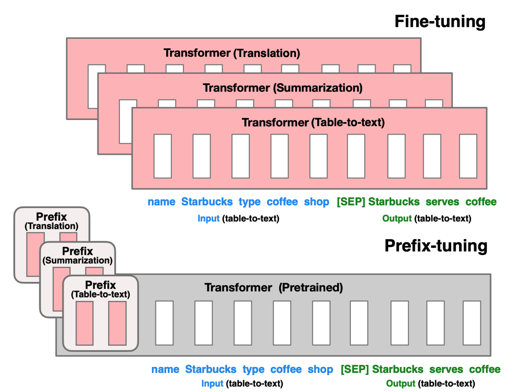
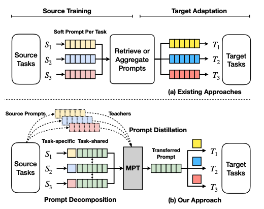

LoRA is not the only option: secrets of fine-tuning large models with Soft Prompts, part 1: overview

## 1. Prompting

Training large pretrained language models takes a lot of time and compute resources. As models scale up, more efficient training methods, such as Prompting, receive more attention. Prompting adapts a frozen pretrained model to a specific downstream task using a textual prompt that describes the task or shows examples of how to do it. With Prompting, we do not need to fully train a separate model for every downstream task. We can use the same frozen pretrained model. This is much simpler: the same model backbone can be applied to different tasks, and training plus storing a small set of prompt parameters is far more efficient than training all model parameters.

## 2. Soft Prompts

Soft Prompts are contrasted with Hard Prompts. Soft prompts are trainable continuous vectors that can be optimized for a specific dataset using gradient-based methods. This approach does not require manual design, can automatically adapt to different tasks, is compute-efficient, and supports multitask learning. However, soft prompts are not readable, so it is impossible to directly explain why these specific vectors were chosen.

The principle of soft prompts is that a trainable projection layer is added at the model input layer, mapping the original input into a semantic space represented by prompt information. The projection-layer parameters are trained on the training data, so the prompt information adapts better to task requirements.

## 3. Main Methods

### 3.1. Prompt Tuning

The key idea of Prompt Tuning [1](#refer-anchor-1) is that prompt tokens have their own parameters, which can be updated independently. This means the pretrained model parameters can stay unchanged, and only the gradients of prompt-token embedding vectors are updated. The resulting performance is comparable to traditional full-model training, and as model size grows, Prompt Tuning quality also improves.

### 3.2 Prefix-Tuning

Prefix-Tuning [2](#refer-anchor-2) is a Prompt Tuning variant that adds trainable prompt vectors at the prefix position of the model input. The advantage is that different prompts can be set for different tasks without changing the model structure.

The main difference between Prefix-Tuning and Prompt Tuning is that prefix parameters in Prefix-Tuning are inserted into all model layers, while Prompt Tuning adds prompt parameters only at the model embedding layer.

### 3.3 P-Tuning

P-tuning [3](#refer-anchor-3) was mainly designed for natural language understanding (NLU) tasks and is another Soft Prompts variant. P-tuning adds a trainable embedding tensor that can be optimized to find a better prompt, and also uses a prompt encoder, a bidirectional long short-term memory network, or LSTM, to optimize prompt parameters.

The special point of P-tuning is that it allows decoder-architecture models to adapt to encoder-architecture tasks, such as NLU tasks.

### 3.4 Multitask Prompt Tuning

Multitask Prompt Tuning (MPT) [4](#refer-anchor-4) is a method that learns one prompt from data that can work for several task types. Then it can be shared and adapted to different target tasks. By contrast, other existing methods train a separate soft prompt for each task, and then those prompts need to be retrieved or aggregated to adapt to the target task.

Put simply: MPT first trains a universal prompt, then adapts it to a specific task.

## References

[1] [The Power of Scale for Parameter-Efficient Prompt Tuning](https://arxiv.org/abs/2104.08691)

[2] [Prefix-Tuning: Optimizing Continuous Prompts for Generation](https://arxiv.org/abs/2101.00190)

[3] [P-tuning: A Simple Method for Prompt Tuning](https://arxiv.org/abs/2103.10385)

[4] [Multitask Prompt Tuning Enables Parameter-Efficient Transfer Learning](https://arxiv.org/abs/2303.02861)

## Follow my GitHub and WeChat channel [The Real Ship of Theseus]: no time to explain, hurry aboard!

[GitHub: LLMForEverybody](https://github.com/luhengshiwo/LLMForEverybody)

The repository has the original Markdown files, and everything is fully open source. Stars and forks are very welcome.
