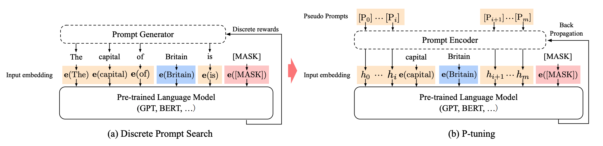

LoRA is not the only option: secrets of fine-tuning large models with Soft Prompts, part 4: P-Tuning

P-Tuning is a Soft Prompts method designed for NLU tasks. P-tuning adds a trainable embedding tensor that can be optimized to find a better prompt, and also uses a prompt encoder, such as BiLSTM+MLP, to optimize prompt parameters.

## Technical Breakdown

P-tuning has two versions: P-tuning v1 (2021) and P-tuning v2 (2023). P-tuning v1 optimizes prompt parameters with a prompt encoder, such as BiLSTM+MLP, but this approach performs poorly on some difficult natural language understanding (NLU) tasks and only works well when the model is large enough.

To solve these problems, P-tuning v2 was proposed. P-tuning v2 improves v1: it adds trainable continuous prompts not only at the input layer, but also into every model layer. Because of this, the method adapts better to different tasks, including difficult NLU tasks. P-tuning v2 optimizes prompt parameters with a multitask learning strategy and a deep prompt encoder, so on models of different sizes it can reach quality comparable to full fine-tuning of all parameters.

## Intuitive Explanation

The main feature of P-Tuning is that by introducing BiLSTM/MLP, the model can better handle NLU tasks. The advantage is that it gives decoder-architecture models some encoder-architecture properties without changing the model structure.

## References

[1] [P-tuning: A Simple Method for Prompt Tuning](https://arxiv.org/abs/2103.10385)

## Follow my GitHub and WeChat channel [The Real Ship of Theseus]: no time to explain, hurry aboard!

[GitHub: LLMForEverybody](https://github.com/luhengshiwo/LLMForEverybody)

The repository has the original Markdown files, and everything is fully open source. Stars and forks are very welcome.

---

## 📚 相关概念

[[concepts/LoRA PEFT 微调|LoRA PEFT 微调]] | [[concepts/模型 压缩 蒸馏|模型 压缩 蒸馏]] | [[entities/Hugging Face|Hugging Face]]

> 📌 来源：[[sources/LLMForEverybody/索引|LLMForEverybody 导航]] · 章节：微调
