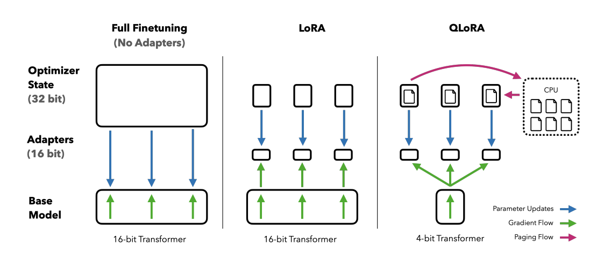

LoRA is not the only choice: what is the secret of fine-tuning large models with Adapters, part 3: QLoRA

## 1. Technical Breakdown

QLoRA (Quantized Low-Rank Adaptation) is an efficient fine-tuning technique for large pretrained language models (LLMs). It combines two technologies: quantization and low-rank adaptation (LoRA). Its goal is to reduce memory usage and compute cost during model fine-tuning while preserving model quality as much as possible.

In QLoRA, model weights are first quantized to 4 bits. This means each model weight is represented by a 4-bit number, which noticeably reduces the memory occupied by the model. Quantized model parameters are stored in the NormalFloat (NF4) data type. This type is especially good for representing normally distributed data and can produce better quantization results than traditional 4-bit integers or floating point numbers.

Then QLoRA uses the LoRA technique: trainable low-rank matrices are added to the model, and the model is fine-tuned through them. These low-rank matrices act as adapters, are added to specific model layers, and during fine-tuning only the adapter parameters are updated, while the original model parameters remain unchanged. The advantage is that model behavior can be adapted to a specific task without the expensive update of the whole model.

QLoRA also uses a technique called double quantization: the scale factors and offsets used during quantization are also quantized again, further reducing memory usage.

Another key QLoRA technique is using NVIDIA unified memory for paged optimization. This approach helps manage memory efficiently, especially when processing long data sequences, and avoids excessive memory spikes.

## 2. Intuitive Understanding

Imagine you have a thick encyclopedia containing all knowledge, like a large pretrained language model. Now you want to update this book for your specific needs, meaning fine-tune the model. But reprinting the whole book is slow and expensive.

QLoRA is like a situation where you do not need to reprint the whole book. You only need to stick a few small notes onto certain pages, meaning low-rank adapters. These notes contain the new information you need, and they are small, so they barely take up space.

1. Quantization: first, you turn some text and images in the encyclopedia into more compact versions, for example replacing color photos with black-and-white ones and reducing their size. This is like 4-bit quantization, which reduces model size.

2. Notes: then you stick notes onto the pages that need updating. These notes contain the newest information. This is like adding low-rank adapters to key parts of the model.

3. Space saving: because the notes are very small, you do not need extra space for the whole book. This is how QLoRA reduces memory requirements during model fine-tuning.

4. Preserving quality: although you updated only a small part of the content, the book is still very useful because most of the knowledge stayed in place. This is how QLoRA preserves model quality while reducing resource usage.

5. Higher efficiency: you do not need to study the whole book again. You only need to look at these notes to quickly find the information you need. This is how QLoRA makes model fine-tuning more efficient.

So QLoRA is a smart way to quickly and cheaply update knowledge without reprinting the whole encyclopedia.

## References

[1] [QLORA: Efficient Finetuning of Quantized LLMs](https://arxiv.org/pdf/2305.14314)

## Welcome to my GitHub and WeChat channel [The Real Ship of Theseus]. No time to explain, come aboard!

[GitHub: LLMForEverybody](https://github.com/luhengshiwo/LLMForEverybody)

The repository has the original Markdown files. The project is fully open source, and stars and forks are very welcome.
