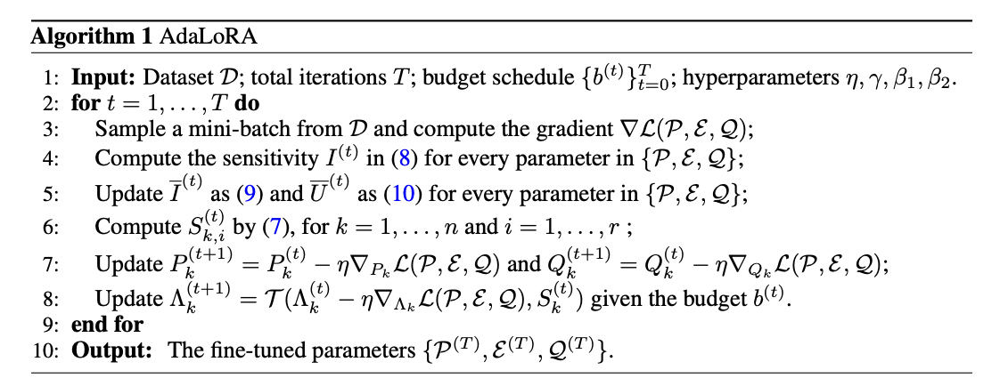

LoRA is not the only choice: what is the secret of fine-tuning large models with Adapters, part 4: AdaLoRA

## 1. Technical Breakdown

AdaLoRA is an improvement over LoRA. Its key idea is to dynamically allocate the parameter budget according to the importance of different weight matrices in the model. In other words, it lets the model decide which parts matter more during fine-tuning, so it can use more parameters to update those parts and reduce the number of updated parameters for less important parts. This improves fine-tuning efficiency and model quality.

AdaLoRA estimates the importance of each matrix using Singular Value Decomposition (SVD). In SVD, a matrix can be decomposed into three special matrices, one of which contains the so-called singular values. These values indicate which parts of the matrix are important. AdaLoRA uses this information to dynamically adjust the rank of each LoRA matrix: matrices with higher rank receive more update parameters, and matrices with lower rank receive fewer.

This AdaLoRA approach allows the model to fine-tune different parts to different degrees while keeping the overall parameter budget unchanged, leading to better performance with limited resources. It is similar to how a teacher, when helping students, allocates tutoring time based on how they are doing in different subjects: subjects where results are weaker get more attention and resources, while subjects that are already going well need less support time.

## 2. Intuitive Understanding

Imagine you are a chef and you have a huge recipe book, like a large language model. The book contains many different recipes, meaning model parameters. Now you want to add new recipes or change old ones so you can cook dishes that better fit a specific taste, meaning fine-tune the model for a new task.

With traditional fine-tuning, you might have to change the book page by page, which is slow and labor-intensive. LoRA is like sticking notes onto some pages of the book and writing the changes there, meaning adding low-rank matrices to the model for updates.

But AdaLoRA is smarter: it not only sticks notes, it also decides how many notes each recipe needs based on its importance. For example, for a very important new dish, you might put more notes on the relevant pages and write more detailed steps and techniques. For a recipe that is already good, one or two small notes may be enough.

AdaLoRA uses a special method, Singular Value Decomposition, to decide which parts matter more, and then applies more parameters, or notes, to update exactly those parts. This is like deciding how much effort to invest in improving recipes based on how often they are used and how well they turn out.

In the end, AdaLoRA lets you avoid changing the whole book, meaning not updating all model parameters, and instead make smart changes in key places. This saves time while preserving dish quality, meaning it improves both model quality and efficiency.

## References

[1] [ADALORA: ADAPTIVE BUDGET ALLOCATION FOR PARAMETER-EFFICIENT FINE-TUNING](https://arxiv.org/pdf/2303.10512)

## Welcome to my GitHub and WeChat channel [The Real Ship of Theseus]. No time to explain, come aboard!

[GitHub: LLMForEverybody](https://github.com/luhengshiwo/LLMForEverybody)

The repository has the original Markdown files. The project is fully open source, and stars and forks are very welcome.
