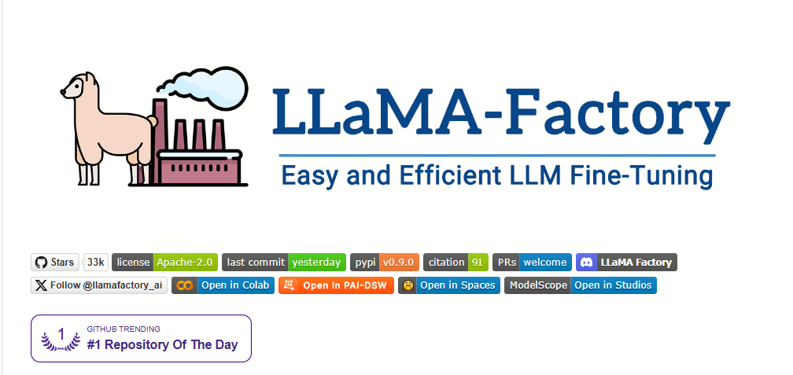
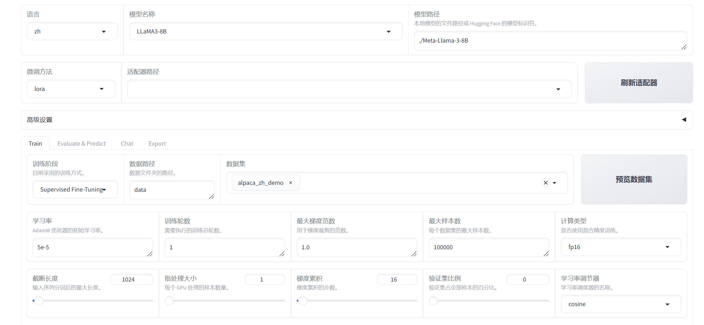

For many people, the first encounter with large-model fine-tuning starts with LoRA in LLaMA-Factory. It is similar to how data scientists used to start with the Kaggle Titanic survival prediction task: LoRA in LLaMA-Factory is a very good starting point.

## 1. Web-UI

LLaMA Factory provides a convenient visual interface (WebUI) that lets users fine-tune large language models without writing code.

**Interface overview**:

- The WebUI in LLaMA Factory mainly consists of four sections: training, evaluation and prediction, chat, and export.

**Training interface**:

- In the training interface, the user can specify the model name and path, training stage, fine-tuning method, training dataset, learning rate, number of epochs, and other training parameters, then start training.
- Resume after interruption is supported; the adapter checkpoint is saved in the `output_dir` directory.

**Evaluation, prediction, and chat interfaces**:

- After model training finishes, the user can specify paths to the model and adapter in the evaluation and prediction interface and run evaluation on a given dataset.
- The user can also chat with the model through the chat interface and observe model quality.

**Export interface**:

- If the user is satisfied with model quality and wants to export it, the export interface allows specifying the model, adapter, shard size, export quantization level, calibration dataset, export device, export directory, and other parameters, then pressing the export button.

**Usage steps**:

- The user can open `http://localhost:7860` in a browser, enter the web interface, choose a model, configure parameters, and track training progress.
- Switching the language to Chinese is supported, which is convenient for users in China.

**Supported models and datasets**:

- LLaMA Factory supports many pretrained models, such as LLaMA, BLOOM, Mistral, and others, and can also automatically download and cache model and dataset resources from the ModelScope community.

**Fine-tuning methods**:

- Different fine-tuning methods are available, including full fine-tuning, freeze fine-tuning, LoRA fine-tuning, and others.

**Parameter configuration**:

- WebUI lets users optimize the model through simple drag-and-drop and parameter adjustment, so even users without programming experience can easily participate in model optimization.

## 2. Beyond LoRA

LLaMA-Factory provides a set of advanced capabilities for complex fine-tuning and large-model deployment scenarios:

**Compatibility with many models**: LLaMA-Factory supports different large language models, such as LLaMA, BLOOM, Mistral, Baichuan, Qwen, ChatGLM, and others.

**Training algorithm integration**: the framework integrates different training algorithms, including incremental pretraining, instruction supervised fine-tuning, reward model training, PPO training, DPO training, KTO training, ORPO training, and others.

**Compute precision and optimization algorithms**: different compute-precision options are available, such as 32-bit full fine-tuning, 16-bit freeze fine-tuning, 16-bit LoRA fine-tuning, and 2/4/8-bit QLoRA fine-tuning based on AQLM/AWQ/GPTQ/LLM.int8. Advanced algorithms such as GaLore, DoRA, LongLoRA, LLaMA Pro, LoRA+, LoftQ, and Agent fine-tuning are also supported.

**Inference engine support**: Transformers and vLLM inference engines are supported, giving users flexible inference options.

**Experiment dashboard integration**: integration with LlamaBoard, TensorBoard, Wandb, MLflow, and other experiment dashboard tools is available, making training easier to monitor and analyze.

**API Server functions**: LLaMA-Factory supports launching an API Server, allowing users to call the model through an API interface and simplifying model integration and application.

**Benchmarks for evaluating large models**: popular benchmark tools for evaluating large models are provided, helping users measure model quality.

**Docker installation and Huawei NPU adaptation**: Docker installation and Huawei NPU support are available, improving framework portability and hardware compatibility.

**Quantization technologies**: PTQ, QAT, AQLM, OFTQ, and other quantization technologies are supported, optimizing deployment efficiency and model performance.

These advanced capabilities allow LLaMA-Factory not only to support basic model fine-tuning, but also to cover more complex research and applied needs, giving users a powerful and flexible toolkit.

## References

[1] [LLaMA-Factory](https://github.com/hiyouga/LLaMA-Factory)

## Follow my GitHub and WeChat channel [The Real Ship of Theseus]: no time to explain, hurry aboard!

[GitHub: LLMForEverybody](https://github.com/luhengshiwo/LLMForEverybody)

The repository has the original Markdown files, and everything is fully open source. Stars and forks are very welcome.

---

## 📚 相关概念

[[concepts/LoRA PEFT 微调|LoRA PEFT 微调]] | [[concepts/模型 压缩 蒸馏|模型 压缩 蒸馏]] | [[entities/Hugging Face|Hugging Face]]

> 📌 来源：[[sources/LLMForEverybody/索引|LLMForEverybody 导航]] · 章节：微调
