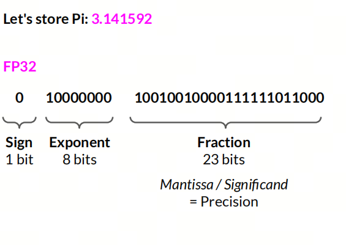
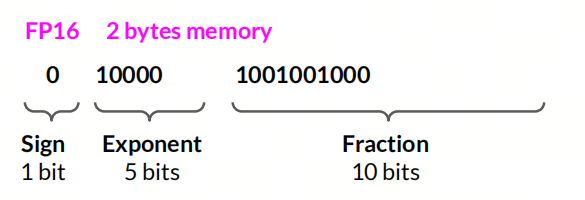
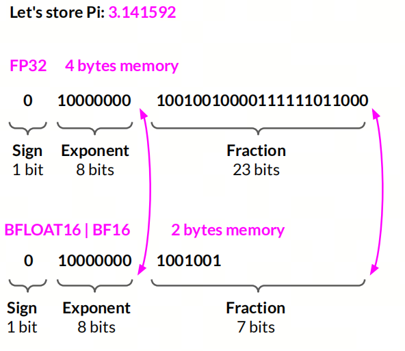
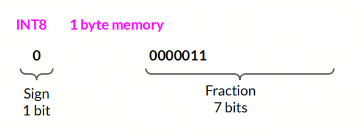
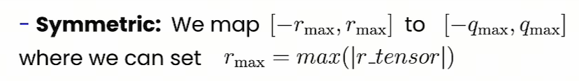
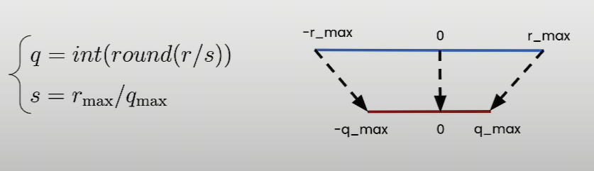
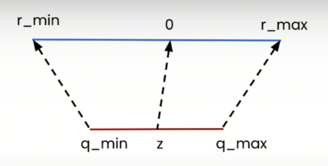
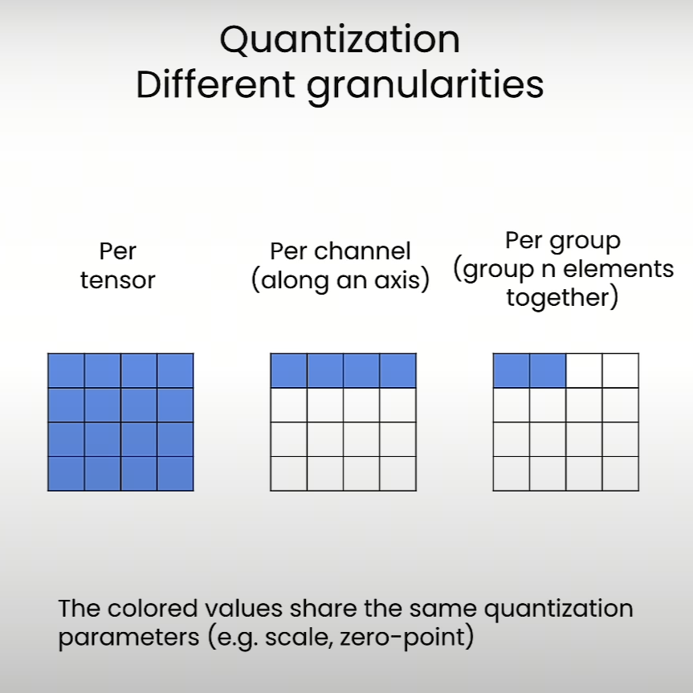
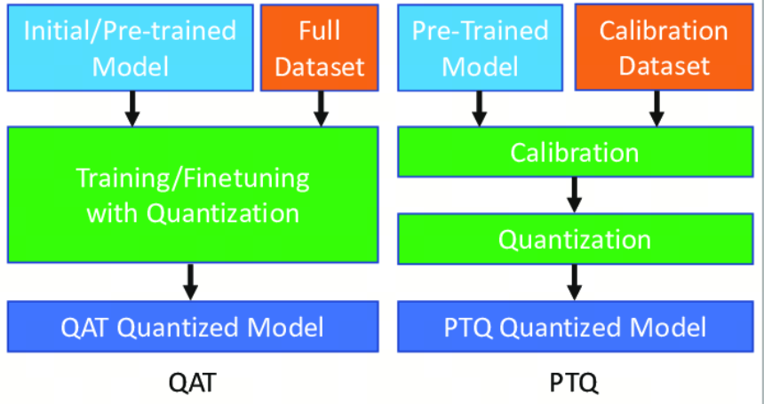

# LLM Quantization in 10 Minutes

## 1. What is quantization?

Quantization is a key technique for large models. It lowers the precision of model parameters by converting floating-point numbers into integers or fixed-point numbers. This lets us compress and optimize the model.

The main goal of quantization is to reduce storage requirements, speed up inference, and lower computational complexity, so LLMs can run more efficiently on resource-limited devices such as phones, embedded systems, and similar environments.

## 2. Precision

First, let's look at a few basic ideas about how data is stored.

- `bit` is the smallest unit of data in a computer. It can store only two states: `0` or `1`.

- `byte` is a common unit of data made of 8 `bit`.

- `float` is a data type for representing real numbers. It is usually stored as a 32-bit or 64-bit binary number. A 32-bit `float` is called single precision, and a 64-bit one is called double precision.

- `integer` is a data type for representing whole numbers. It is usually 8-bit, 16-bit, 32-bit, or 64-bit. An 8-bit integer is often called a byte, a 16-bit integer a short integer, a 32-bit integer an integer, and a 64-bit integer a long integer.

**FP32**

A 32-bit floating-point number, usually used for single precision. The sign takes 1 bit, the exponent takes 8 bits, and the mantissa takes 23 bits. The precision is about 7 significant digits.

**FP16**

A 16-bit floating-point number, usually used for half precision. The sign takes 1 bit, the exponent takes 5 bits, and the mantissa takes 10 bits. The precision is about 3 significant digits.

**BF16**

A 16-bit floating-point number, often used in mixed precision. The sign takes 1 bit, the exponent takes 8 bits, and the mantissa takes 7 bits. The precision is about 2 significant digits.

**INT8**

An 8-bit integer, usually ranging from -128 to 127.

## 3. Types of quantization

By method, quantization can be divided into linear quantization, nonlinear quantization such as logarithmic quantization, and other forms. In practice, linear quantization is the most common. Linear quantization can then be split into symmetric and asymmetric quantization.

### Symmetric linear quantization

The key feature of symmetric quantization is that the zero point after quantization must correspond to zero in the original values. In other words, the zero point of the quantization operation is fixed.

Usually, the range is defined by two parameters: the minimum and maximum quantized values. This range is symmetric around zero.

### Asymmetric linear quantization

Asymmetric quantization does not require the zero point after quantization to match zero in the original data. To map original values to quantized values, it uses three parameters: the minimum quantized value, the maximum quantized value, and `zero-point`. This means the quantization operation can have an arbitrary zero point, mapped to some integer value inside the quantization range.

Asymmetric quantization is especially useful when the data distribution is not symmetric around zero, for example when the data contains many positive or negative values. It can set the quantization range more flexibly based on the actual data distribution, reduce quantization error, and improve model quality after quantization.

## 4. Quantization granularity

`Quantization Granularity` is an important concept. It defines how fine-grained the quantization operation is. It affects how quantization parameters are divided and reused, meaning the scale and scope where quantization applies. Different granularities create different tradeoffs between accuracy and efficiency.

Quantization granularity has several common forms:

- `Per-tensor`: the entire tensor or layer uses the same quantization parameters (`scale` and `zero-point`). The upside is high storage and compute efficiency. The downside is possible accuracy loss, because one fixed parameter set may not cover the full dynamic range of the data well.
- `Per-channel`: each channel or axis has its own quantization parameters. This is more accurate because each channel can have its own dynamic range, but it requires more memory and makes computation more complex.
- `Per-group`: the data is split into blocks or groups, and each group has its own quantization parameters.

The choice of granularity depends on model requirements and the target hardware platform. Finer granularity usually gives higher accuracy, but it can increase model size and inference latency. For example, in `TensorRT`, activations use `Per-tensor` quantization by default while weights use `Per-channel` quantization. That choice comes from many experiments.

## 5. Weight packing

`Weight packing` means packing multiple weight parameters into one quantized block. In quantization, it is used to reduce memory usage and improve compute efficiency.

Weight packing techniques can be used together with quantization. They compress the model further by reducing the number of parameters or the way they are represented, while trying to preserve quality. Usually, this is done by splitting the weight matrix into smaller blocks, then applying quantization and encoding to those blocks.

## 6. PTQ and QAT

### Post Training Quantization

`Post Training Quantization` (`PTQ`) is applied after model training is complete. Its goal is to reduce model size and speed up inference while preserving quality as much as possible. `PTQ` is especially useful for deployment on resource-limited devices such as phones and embedded devices. In `PTQ`, quantization can be applied to model inputs, weights, and activations.

### Quantization Aware Training

`Quantization Aware Training` (`QAT`) introduces quantization operations during the training of a deep learning model. The goal is to reduce model size and improve runtime efficiency while minimizing the accuracy loss caused by quantization.

Unlike traditional post-training quantization, `QAT` simulates the effect of quantization during training. This helps the model adapt to information loss from quantization and keep better performance when real quantization is applied.

## 7. Quantization in other fields

The word `quantization` can mean different things depending on the context. A few common meanings:

- Quantization in mathematics and statistics: turning qualitative descriptions into quantitative ones expressed as numbers. For example, vague ideas like `many` and `few` can become precise numerical measures such as `10 objects` and `2 objects`.
- Quantization in finance: in the financial industry, `Quantitative`, shortened to `Quant`, usually means using mathematical models and computational methods to analyze markets and securities, and to design and implement trading strategies. Quantitative analysis relies on large amounts of historical data and complex algorithms to find patterns in prices and market behavior. Quant investing uses these techniques for asset allocation and trading decisions.
- Quantization in scientific research: obtaining numerical results from experiments or observations through measurement and computation. Usually this means converting an observed phenomenon into numbers that can be processed through calculation and statistical analysis.
- Quantization in computer science: sometimes it means `quantization error`, an approximation error that appears when data is converted from a continuous range, such as real numbers, into a finite range, such as integers.
- Quantization in other fields: converting hard-to-measure properties or characteristics into measurable form, so they can be analyzed and managed more precisely.

## References

[1] [quantization-fundamentals](https://learn.deeplearning.ai/courses/quantization-fundamentals/)

[2] [quantization-in-depth](https://learn.deeplearning.ai/courses/quantization-in-depth/)

[3] [deeplearning.ai](https://www.deeplearning.ai/courses/generative-ai-with-llms/)

## Author's GitHub and WeChat

[GitHub: LLMForEverybody](https://github.com/luhengshiwo/LLMForEverybody)
