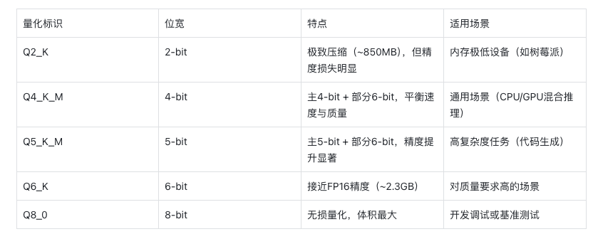
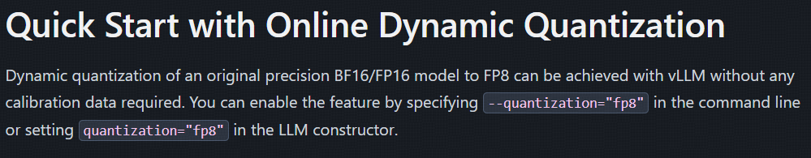

# Three Levels of Understanding LLM Quantization

In real large model engineering, quantization has become an important practical technique. People in different roles need different levels of understanding. In my view, the "three levels of understanding quantization" help practitioners build a technical picture that matches their job.

The first level is technical literacy for application developers: know what it is. For people building applications through API calls, the understanding of quantization should focus on the technical idea and business value. You need to know the basic principle by which quantization lowers inference cost, for example VRAM optimization with INT8 quantization. You also need a feel for how quantization affects inference speed and model accuracy, plus the scenarios where different quantization schemes, such as dynamic or static quantization, make sense. The main point at this stage is to connect quantization with business metrics: response latency, service cost, and a reasonable ROI estimate for a quantization scheme in a specific business scenario.

The second level is engineering practice for deployment engineers: be able to walk the path. Once you move into model deployment and operations, you need deeper hands-on knowledge of the quantization toolchain. Key points include using quantization interfaces in popular frameworks, understanding calibration during model conversion, and knowing how to serve quantized models, including VRAM allocation optimization and mixed precision inference. Typical examples are deploying a fine-tuned model with 4-bit quantization through `llama.cpp`, or running online inference for a business model after quantization with `AutoGPTQ`. At this level, the important thing is engineering control over the whole quantization process. You should understand the path from the original model to the quantized result.

The third level is the theoretical breakthrough level for algorithm researchers: understand why it works. Researchers working on foundation models and algorithmic innovation need to understand the mathematical nature of quantization algorithms. This includes quantization sensitivity analysis based on the Hessian matrix, which is the core of GPTQ, quantization parameter optimization based on optimal transport theory, and joint design of quantization and model architecture, for example quantization details in MoE architectures. Breakthroughs at this level often change the technical paradigm. For example, researchers may improve the clustering algorithm used for quantization and get 3x higher compression at the same accuracy, or design distributed quantization schemes for trillion-parameter models.

## 1. First level: technical literacy for application developers (know what it is)

For most application developers, it is enough to understand the basic principle behind how quantization reduces inference cost. These basics include:
what quantization is, why we quantize, quantization methods, quantization granularity, quantization targets, and so on.

### What is quantization?

Quantization is a key technology in large models. It lowers the precision of model parameters by converting floating-point numbers into integers or fixed-point numbers, which compresses and optimizes the model. The main goal is to reduce model storage requirements, speed up inference, and lower computational complexity, so large models can run more efficiently on resource-limited devices such as phones, embedded systems, and similar environments.

### Why quantize?

To reduce VRAM usage and improve inference speed without obvious quality loss.

### Quantization methods

`Post Training Quantization` (`PTQ`) is applied after model training has already finished. Its goal is to reduce model size and speed up inference while preserving model quality as much as possible. `PTQ` is especially suitable for deployment on resource-limited devices such as phones and embedded devices. In `PTQ`, quantization operations can be applied to model inputs, weights, and activations.

`Quantization Aware Training` (`QAT`) introduces quantization operations during deep learning model training. The goal is to reduce model size and improve runtime efficiency while minimizing accuracy loss caused by quantization. Unlike traditional post-training quantization, `QAT` simulates the effect of quantization during training, so the model can adapt to information loss from quantization and keep better quality when real quantization is applied.

Right now, the quantization we usually use is mainly `PTQ`.


### Quantization granularity

`Quantization Granularity` is an important concept in quantization. It defines how fine-grained the quantization operation is. Granularity affects how quantization parameters are shared, meaning the scale and scope of quantization. Different granularities create different tradeoffs between accuracy and efficiency.

There are several common forms of quantization granularity:

- `Per-tensor`: the whole tensor or the whole layer uses the same quantization parameters (`scale` and `zero-point`). The upside is high storage and compute efficiency. The downside is that it can lose accuracy, because one fixed parameter set may not cover the full dynamic range of the data.
- `Per-channel`: each channel or each axis has its own quantization parameters. This quantizes data more accurately, because each channel can have its own dynamic range, but storage requirements and compute complexity go up.
- `Per-group`: during quantization, the data is split into blocks or groups, and each block or group has its own quantization parameters.


### Quantization targets

- `Weights`, weight-only quantization, for example AWQ and GPTQ
- `Activations`, quantizing weights and activations together, for example SmoothQuant
- KV Cache

### Quantization types

Symmetric linear quantization. The key feature of symmetric quantization is that the zero point after quantization must correspond to zero in the original values. In other words, the zero point of the quantization operation is fixed. Usually, two parameters define the quantization range, the minimum and maximum quantized values, and the range itself is symmetric around zero.


Asymmetric linear quantization. Asymmetric quantization does not require the zero point after quantization to correspond to zero in the original data. To map original values to quantized values, it uses three parameters: the minimum quantized value, the maximum quantized value, and the zero point. This means the quantization operation can have an arbitrary zero point mapped to some integer value inside the quantization range. Asymmetric quantization is especially suitable when the original data distribution is not symmetric around zero, for example when the dataset contains many positive or negative values. It can set the quantization range more flexibly based on the real data distribution, reduce quantization error, and improve model accuracy after quantization.


### Static and dynamic quantization

- Static quantization: quantization parameters are obtained offline in advance using calibration data.
- Dynamic quantization: quantization parameters are computed dynamically during online inference.

## 2. Second level: engineering practice for deployment engineers (be able to walk the path)

In real use, we can apply static or dynamic quantization.

For static quantization, we load an already quantized model or quantize the original model in some way.

For dynamic quantization, during inference we load the original model and quantize it in real time.

The second level means we can perform these operations with specific open source frameworks and solve a concrete problem.

All of this involves model files, so we first need to know the common model formats and post-quantization formats.

### 2.1 Model formats

TensorFlow and PyTorch used to be the two most popular deep learning frameworks, but now PyTorch has basically taken the dominant position. Below, we look at model formats in the PyTorch ecosystem.

If you look at model files on Hugging Face, you will usually see types such as `.pt`, `.bin`, `.safetensors`, and `.GGUF`. This more or less covers the main model formats.

***PyTorch format (`.pth`/`.pt`)***

Features: the default PyTorch format. It supports saving the full model structure or only weight parameters (`state_dict`), and it is highly flexible.

Advantages: seamless integration with the PyTorch ecosystem, suitable for research, fine-tuning, and debugging.

Limitations: depends on Python `pickle` serialization, which creates security risks. Loading is also relatively slow.

***Universal binary format (`.bin`)***

Features: pure binary storage without framework binding. Metadata has to be managed manually.

Use cases: lightweight deployment or custom model storage.

***Safetensors: a balance of safety and efficiency***

Features: developed by the Hugging Face team. It uses a binary format, supports memory mapping (`mmap`), and avoids the code execution risk that exists in traditional serialization formats, for example `.pt` in PyTorch because of Pickle.

Advantages: very fast loading, especially for large models. The file structure is simple, compatibility across frameworks such as PyTorch and TensorFlow is supported, and security is high because there is no risk of malicious code execution.

Use cases: sharing in the open source community, inference services that need fast loading.

Representative models: most models in the Hugging Face ecosystem support this format.

***GGUF: the preferred format for high-performance local running***

Features: developed by Georgi Gerganov, the author of `llama.cpp`. It is an updated version of the GGML format, optimized specifically for local inference. It uses binary encoding, supports memory mapping, and enables one-file deployment, noticeably reducing resource usage.

Advantages: fast loading and low memory use. It supports quantization techniques such as 4-bit and 5-bit quantization, compresses model size, and works across different hardware, including CPU and GPU.

Use cases: deployment on edge devices and local applications with low latency requirements, for example local inference with Llama-family models.

The evolution of Hugging Face model formats reflects the balance between safety, efficiency, and compatibility:

Early stage: `.pt`/`.pth` were the main formats, but they had security risks.

Middle stage: `.bin` improved efficiency, and `.safetensors` solved the security problem.

Recent stage: `gguf` has become a trend for local large model running because of quantization and one-file deployment.

### 2.2 Understanding GGUF

GGUF (`GPT-Generated Unified Format`) is a binary file format created specifically for large language models. It was proposed by Georgi Gerganov, the author of `llama.cpp`, to optimize model loading speed, resource usage, and cross-platform compatibility.

When deploying locally through Ollama, you often see model files named something like **Q4_K_M**. What does this naming style mean?

The quantization tag in a GGUF filename, for example `Q4_K_M`, follows standardized naming rules. The combination of letters and digits directly reflects quantization parameters, optimization method, and quality level. Here is a detailed breakdown.

Example structure: `Q4_K_M`

This tag can be split into three key parts:

1. Main bit width (`Main Bit Width`): `Q4` means the main quantization width is `4-bit`, so most model weights are stored in 4 bits. Common values:

- `Q2` (`2-bit`), `Q3` (`3-bit`), `Q4` (`4-bit`)
- `Q5` (`5-bit`), `Q6` (`6-bit`), `Q8` (`8-bit`)

2. Optimization method tag (`K-Quant`): `_K` means block-wise quantization (`Block-wise Quantization`) and the `K-Quant` algorithm are used. This dynamically adjusts the quantization strategy for different tensors, balancing accuracy and size. For example:

- `Q4_K_M` uses higher precision (`6-bit`) for some tensors, such as `attention.wv`, and `4-bit` for the rest.

3. Quality level (`Quality Level`): `_M` means medium quality. Other options:

- `_S` (`Small`): smaller size, but more noticeable accuracy loss
- `_M` (`Medium`): a balance between size and accuracy
- `_L` (`Large`): closer to original model accuracy, with a larger file size



### 2.3 Static quantization

With static quantization, we load or deploy an already quantized model, or quantize the original model in some way.

**Deploying an already quantized model**

Deploying an already quantized model is straightforward. If you need to experiment with models, you can load it through Hugging Face `transformers`. For local deployment on a personal PC or Mac, you can use Ollama. For private deployment, you can use vLLM or SGLang.

**Quantizing a model yourself**

Usually, community models already provide quantized versions. Unless you are one of the first people working with a model (Respect!!!), there is usually no need to quantize an open source LLM yourself.

But if you fine-tuned a large model yourself, or trained your own large model and want to quantize it, you can do that with different frameworks, such as AWQ, GPTQ, `llama.cpp`, and others. For the exact code, check the documentation of the relevant framework.

### 2.4 Dynamic quantization

We can also compute quantization parameters dynamically during online inference, without pre-quantizing the model and loading the quantized result. To be honest, I still do not quite understand which scenarios this feature is meant for.

For example, when deploying through vLLM:

```python
from vllm import LLM
import torch
model_id = "huggyllama/llama-7b"
llm = LLM(model=model_id, dtype=torch.bfloat16, trust_remote_code=True, \
quantization="bitsandbytes")
```

> Note: in the vLLM docs, dynamic quantization appears in two places. In the `quantization/bnb` section, they call it Inflight quantization. In the `quantization/fp8` section, they call it Dynamic Quantization. Judging by the code example, it looks like the same thing. I think the two documentation sections may have been written by different people. Or maybe the papers on bnb and FP8 quantization name it that way?




## 3. Third level: theoretical breakthroughs for algorithm researchers (understand why it works)

What does a quantization algorithm do?

If you have already mastered the first level, you know that the core of a quantization algorithm is to build a linear mapping from floating-point numbers to integers. Building a linear mapping sounds like a fairly simple task. So why are there so many papers, algorithms, and frameworks around it?

Below are two typical quantization algorithms.

**Intuitive understanding of GPTQ**

Because GPTQ uses an approximation of the Hessian matrix, it comes from the OBS algorithm. The learning curve for GPTQ is steep. For an algorithm researcher, there is no shortcut here, you have to work through the details step by step. For an application developer who only wants a general picture, an intuitive understanding is enough.

First: choose samples and run a trial pass.

Let the original model "show" its inference process on 100 to 200 texts (calibration data), and record the outputs of each neural network layer.

Second: careful layer-by-layer pruning.

Starting from the first neural network layer, handle it like tidying a closet:

Grouping: split the weight matrix of each layer into small packets of 128 elements.

Weighting and cost estimation: assign different "shipping rates" (quantization parameters) to each group of packets. Important groups are packed more precisely (`4-bit`), ordinary groups more simply (`2-bit`).

Third: chained error compensation.

Quantization is like cutting a cake: crumbs are inevitable. GPTQ compensates for this in a clever way:

When a piece of cake is cut off (some weight is quantized), the size of neighboring pieces is adjusted immediately (the not-yet-quantized weights are updated).

A mathematical formula (the Hessian matrix approximation) is used to calculate the best compensation plan, so the whole cake still looks complete.

**Intuitive understanding of AWQ**

Compared with the GPTQ paper, which uses the Hessian matrix, AWQ is fairly easy to understand:

The intuition behind AWQ is: "protect the big stuff, let the small stuff go."

Identify key weights through activation values and protect them more strongly, reducing relative error.

Avoid hardware adaptation problems through mathematically equivalent scaling.

In the end, reach a balance between making the model lighter and preserving accuracy.

This idea applies beyond large models too. It maps to a common principle in data compression, image processing, and other fields: preserve key information, compress redundant details.

# Summary

The depth of technical understanding should match the role. Application developers do not need to dive deeply into matrix operations inside the OBS algorithm, just as algorithm researchers do not need to obsess over deploying a quantization service in a Docker environment.

I suggest that practitioners build their understanding with the Pareto principle: use the key 20% of knowledge to solve 80% of work tasks, then keep going deeper at the intersection of their own skill boundaries and business value. Only when technical understanding resonates with role requirements can it create real value.

## References

[1] [Classic PTQ methods for large model quantization, overview](https://zhuanlan.zhihu.com/p/704280420)

[2] [Revealing the secrets of Hugging Face model formats: from PyTorch to GGUF, all in one article!](https://mp.weixin.qq.com/s?__biz=MzI2Mzc3OTcyNw==&mid=2247486230&idx=1&sn=8b00b599d49fe22beab60eb1fe337f08&chksm=eb6e8a10980e7680044b3ba09c43518e7ee8beef38673eaf9cea0c48977a9541315c4f1b8636#rd)

[3] [Qwen doc](https://qwen.readthedocs.io/zh-cn/latest/quantization/llama.cpp.html)

[4] [vllm: BitsAndBytes](https://docs.vllm.ai/en/latest/features/quantization/bnb.html)


---

## 📚 相关概念

[[concepts/模型 压缩 蒸馏|模型 压缩 蒸馏]] | [[concepts/分词器 LLM|分词器 LLM]]

> 📌 来源：[[sources/LLMForEverybody/索引|LLMForEverybody 导航]] · 章节：量化
