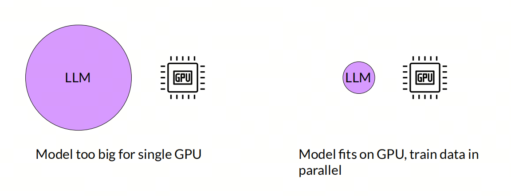
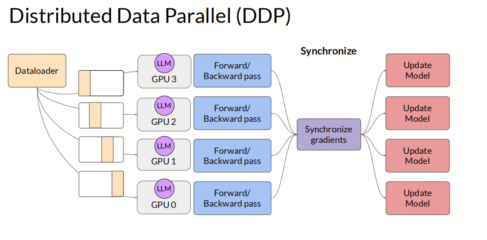
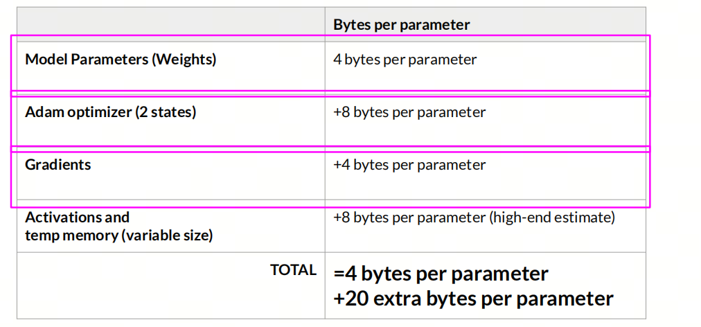
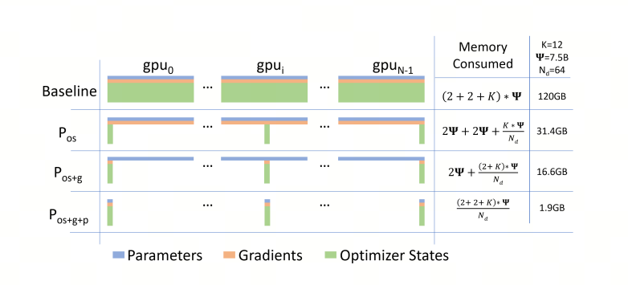

# How GPU Parallelism in Transformer Differs from Earlier NLP Algorithms

## 1. What is parallel computing on GPU?

Parallel computing on GPU is a technique that uses a graphics processing unit (`GPU`) for massively parallel data processing. Compared with a traditional central processing unit (`CPU`), a GPU has far more cores and can process thousands of threads at the same time. Because of that, GPUs are very well suited to highly parallel tasks. In deep learning, GPU parallel computing is widely used when training neural networks, and it speeds up the model training process.

Before 2017, researchers in natural language processing (`NLP`) usually trained models from scratch, and just being able to use a GPU for training already counted as a fairly advanced setup. Some researchers had multiple GPUs, but they often did not spend much effort implementing parallel computing. The models at that time were relatively small and training was relatively fast, so the extra engineering cost of parallelism did not always feel worth it.

Over time, though, large language models (`LLM`) started to become the main direction. These models have huge numbers of parameters, and training became a long and complex process. To handle these challenges efficiently, multi-GPU training became common practice, and parallel computing became necessary. Because Transformer models have their own architectural traits, traditional parallel computing methods also needed corresponding changes and optimizations to fit this new kind of model.

## 2. Types of parallel computing

In deep learning, GPU parallel computing is mainly divided into two types: data parallelism and model parallelism.

- ***Distributed Data Parallel (DDP)*** Data parallelism means the model is not too large and can fit fully into the memory of one GPU. To speed up training, the data is split into multiple parts and loaded onto different GPUs. Model parameters are the same on each GPU. Each batch is computed on different GPUs, then gradients are aggregated to update the parameters.

- Model parallelism means the model is too large to fit fully into the memory of one GPU. So the model is split into multiple parts and loaded onto different GPUs. Model parameters on each GPU are different. Each batch is computed across different GPUs, then gradients are aggregated to update the parameters.

## 3. What needs to be loaded into GPU memory?

For large models, the following parts mainly need to be loaded:

- Model parameters
- Model optimizer state, including forward and backward pass states
- Model gradients
- Other intermediate model states

One important note: the diagram below uses FP32 as the example. In real training, we may use mixed precision, for example FP16 for model parameters and FP32 for gradients. Some articles and benchmarks do not explicitly say whether mixed precision is used, so memory share calculations may differ.

## 4. FSDP

***Fully Sharded Data Parallel (FSDP)***

FSDP (`Fully Sharded Data Parallel`) is an advanced data parallelism technique that lets us train large models efficiently on multiple GPUs. FSDP was first proposed in FairScale-FSDP and later integrated into PyTorch 1.11. It is similar to the ZERO-3 stage of the ZERO algorithm in Microsoft DeepSpeed.

In traditional data parallelism (`DDP`), each GPU stores all model parameters, gradients, and optimizer state. The dataset is then split into several shards, and each GPU trains on its own part. After gradients are computed, they are merged through an all-reduce operation.

The core idea of FSDP is to shard model gradients, optimizer state, and parameters, so each GPU stores only part of the parameter information. The key is to decompose the all-reduce operation in DDP into reduce-scatter and all-gather operations. During the forward pass in FSDP, each GPU uses all-gather to obtain the full parameter set, performs computation, and then drops parameters from other shards. During the backward pass, it also needs all-gather to obtain the full parameter set and compute gradients for the local batch. Finally, reduce-scatter averages and shards the gradients across devices, and each device updates only its own parameter shard.

FSDP has four modes:

- stage0: degenerates into DDP
- stage1: only the model optimizer state is sharded
- stage2: model gradients and optimizer state are sharded
- stage3: model gradients, optimizer state, and parameters are sharded

## 5. Offload

Offload is a technique for moving part of the model parameters from GPU memory to CPU memory. When training large models, the huge number of parameters can sometimes exhaust GPU memory. To solve this, Offload can move some parameters from GPU memory to CPU memory, freeing GPU memory and allowing the model to continue training.

The Offload technique in FSDP can move part of the model parameters from GPU memory to CPU memory.

## 6. Summary

One of the big advantages of Transformer is that it makes good use of GPU parallel computing. When training large models, we need to consider the number of model parameters and the limits of GPU memory. In those cases, techniques such as FSDP and Offload are needed to optimize the training process and make it more efficient.

## References

[1] [ZeRO: Memory Optimizations Toward Training Trillion Parameter Models](https://arxiv.org/abs/1910.02054)

[2] [pytorch_FSDP_tutorial](https://pytorch.org/tutorials/intermediate/FSDP_tutorial.html)

## Follow my GitHub and WeChat Official Account: no time to explain, come aboard!

[GitHub: LLMForEverybody](https://github.com/luhengshiwo/LLMForEverybody)

The repository has the original Markdown files, all fully open. Stars and forks are very welcome!
