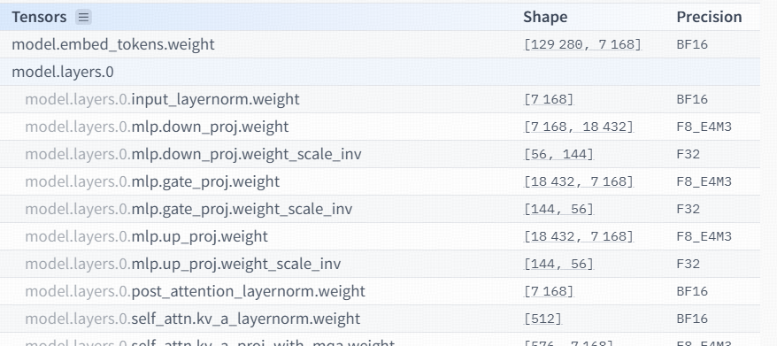
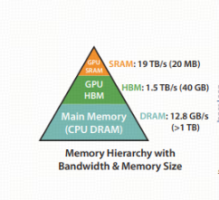

# Three Factors in LLM Deployment: Memory, Compute, and Communication

Last weekend I was invited to give a special training session on large models and intelligent agents (`Agent`) for the technical team of a startup from my village. That made me feel very clearly that this wave of technical change has already reached ordinary teams. From the meeting room to the tea area, people kept talking about private deployment of large models and agent adoption.

When the founder asked what GPU resources would be needed for private deployment of the full DeepSeek-R1, I realized that many people still do not have a complete picture of computing power and GPUs. Unlike the old way of estimating compute resources along a single dimension, in the era of large models we need to evaluate GPU configuration in a three-dimensional system.

## 1. VRAM: the physical boundary of the model carrier

> The full version of DeepSeek-R1 has 671B parameters, which is about 1400GB of data. To download it, you need at least 1.4T of disk space, and after downloading it, running it requires at least 1.8TB of GPU memory.

If the description above was easy to understand, you can skip this section. If some of the English abbreviations looked unclear, it is worth reading the whole section for a more systematic explanation.

### 1.1 The International System of Units and prefixes

The International System of Units (`SI`, Système International d'Unités) is the globally standardized measurement system. Its core purpose is to keep quantities consistent in science, industry, and trade through unified unit definitions: meter (`m`), kilogram (`kg`), second (`s`), and so on.

SI prefixes are standardized prefixes that represent multiples or fractions of units. They scale base units in the decimal system and make very large or very small numbers easier to write, for example `K` in kilogram (`Kg`) or `n` in nanometer (`nm`).

| Multiplier | Common scale | Symbol | English name |
| :--- |:----:| :----: |---: |
| $10^3$ | thousand | k | kilo |
| $10^6$ | million | M | Mega |
| $10^9$ | billion | G | Giga |
| $10^{12}$ | trillion | T | Tera |
| $10^{15}$ | quadrillion | P | Peta |

English counts in thousands.

    1 thousand is often shortened to 1k, and the correct reading is one thousand;

    1 million is shortened to 1M and read as one million;

    1 billion is shortened to 1B and read as one billion;

    1 trillion can be shortened to 1T and read as one trillion.

You may notice that except for `B` for billion, which differs from the SI prefix `G`, the commonly used symbols mostly line up.

When we say a large model has 671B parameters, `B` is used instead of `G` because `G` can easily be confused with `GB`, a storage capacity unit.

671B means the model has 671 billion parameters. How much GPU memory is needed for that many parameters?

### 1.2 Precision

You will see different precision formats, such as BF16, F32, F8_E4M3, and so on. What do they mean?

***Byte and bit***

Programmer friends know that the smallest unit in a computer is the bit. It stores either 0 or 1. Every 8 bits make one byte.

The numbers 16, 32, and 8 in BF16, F32, and F8_E4M3 show how many bits each parameter occupies. For example, BF16 takes 16 bits, which is 2 bytes. If all 671B parameters are represented in BF16, they require 1342B bytes in total.

Of course, we do not write that as 1342BB. We write 1342GB.

So what is E4M3?

***Computer representation of floating-point numbers***

In a computer, a floating-point number (`Float`) is represented in a somewhat special way: it consists of exponent bits and mantissa bits.

Exponent is called `Exponent` in English, and mantissa is called `Mantissa` in English (or Latin??).

For F8_E4M3, 8 bits are used in total: the first bit is the sign bit by default, followed by 4 exponent bits and 3 mantissa bits.

For the 8-bit value 0 101 1011, it means:

The sign bit is 0, so $(-1)^0$ and the number is positive.

The exponent bits are 101, which gives:
$1*2^2+0*2^1+1*2^0 = 5$; subtract the bias 3, and the result is $2^2$, meaning 2 to the second power.

The mantissa bits are 1011, which gives the fractional part $1*2^-1+0*2^-2+1*2^-3+1*2^-4=0.5+0.125+0.0625 = 0.6875$; then add 1 to get 1.6875. The final value is $1.6875*2^5$, with this calculation logic:

$(1+1*2^-1+0*2^-2+1*2^-3+1*2^-4)*(2^(1*2^2+0*2^1+1*2^0-3))$

## 2. Compute power: how to estimate inference time

***The relationship between compute power and inference time***

In essence, model inference time is a dynamic balance between compute demand and hardware compute power. The theoretical relationship can be expressed as:

Inference time ≈ total model computation (`FLOPs`) / theoretical hardware compute power (`FLOPS`)

> It is important to understand that this formula only reflects the theoretical optimum. Real inference time is also affected by memory bandwidth, parallelism efficiency, operator optimization level, and many other factors. Hardware utilization is usually only 30% to 70%.

### 2.1 Precise explanation of key concepts

FLOPs (`Floating Point Operations`)
means the total number of floating-point operations needed by a model for one inference pass. It is a key indicator of model computational complexity.

FLOPS (`Floating Point Operations Per Second`)
means the number of floating-point operations the hardware can execute per second. It reflects theoretical peak performance. For example, the NVIDIA A100 GPU has FP32 performance of 19.5 TFLOPS, meaning 19.5 trillion floating-point operations per second.

TOPS (`Tera Operations Per Second`)
is a unit of compute power for quantization scenarios: 1 TOPS = 10¹² integer operations per second. After INT8 quantization, hardware compute power can increase by 4x, for example A100 INT8 performance reaches 624 TOPS.

MAC (`Multiply-Accumulate`)
is a hardware-optimized operation that combines multiplication and accumulation: 1 MAC = 1 multiplication + 1 addition = 2 FLOPs. In matrix multiplication, more than 90% of computation is MAC.

### 2.2 Quantitative analysis of the main compute modules in large models

The compute load of large language models is mainly concentrated in two types of matrix operations:

***Attention layer***

Computational complexity: O(n²d), where n is sequence length and d is hidden dimension.

Main operation: QKᵀ matrix multiplication and Softmax normalization.

***Feed-forward network (FFN)***

Computational complexity: O(nd²)

Main operation: two matrix transformations in fully connected layers, expansion and compression of the dimension.

### 2.3 Exact derivation of computation for matrix multiplication

For multiplying an M×N matrix by an N×K matrix:

MAC computation = M×N×K

Equivalent FLOPs = 2×M×N×K. The derivation is this: each output element needs N multiply-accumulate (`MAC`) operations, and M×K output elements are produced. For example:
for multiplying 3×3 matrices, we need 27 multiplications + 18 additions = 45 FLOPs, which differs from the formula (2×3×3×3)=54. The reason is that boundary cases can be counted in different ways.

Computation breakdown during inference:

| Stage | Compute characteristics | Computation formula | Optimization strategy |
| :--- |:----:| :----: |---: |
|Prefilling|Parallel processing of all input tokens|FLOPs = 2×s²×d (s: sequence length)|Dynamic block splitting and memory reuse|
|Decoding|Sequential generation of one token|FLOPs/token = 2×s×d²|KV Cache and continuous batching|

## 3. Communication: the performance bottleneck

During GPU computation, data needs to be loaded from global memory (`Global Memory`, meaning HBM, high-speed GPU memory, for example 40GB) into shared memory (`Shared Memory`/L2 cache, for example 20MB of SRAM), and then processed by compute units such as Tensor Cores.

In modern GPU architecture, the imbalance between data transfer bandwidth and compute power has become the central conflict. For example, HBM bandwidth of 1.5TB/s struggles to match the peak power of Tensor Cores, such as 312 TFLOPS FP16 on A100. As a result, compute units often sit idle waiting for data, and actual FLOPS utilization drops noticeably.

***Scaling problems in communication across multiple GPUs:***

Multiple GPUs in one machine:

NVIDIA NVLink 4.0 is used, and the bandwidth of one channel reaches 900GB/s. Through an NVSwitch, a fully connected topology is built, providing non-blocking communication between 8 GPUs, with total bandwidth reaching up to 7.2TB/s.

Multiple GPUs across multiple machines:

This depends on an InfiniBand NDR network, for example the Quantum-2 platform, where the bandwidth of one port reaches 400Gb/s, about 50GB/s. Through a Dragonfly+ topology, interconnection of millions of nodes is supported, but inter-node communication latency is still 1 to 2 orders of magnitude higher than communication inside one machine.

Deployment strategy recommendations:

The principle "if one card is enough, do not scale to multiple cards": a single card avoids communication overhead, but you still need to consider model parameter size, for example storing a 671B model requires 16 cards, and GPU memory optimization techniques such as gradient accumulation and activation recomputation.

The principle of prioritizing communication inside a node: communication between multiple GPUs in one node through NVLink is much more efficient than inter-node communication through InfiniBand. For example, when deploying 16 cards across two nodes, the bandwidth among 8 cards inside a node can reach 7.2TB/s, while inter-node bandwidth is only 400Gb/s.

I will leave two small questions for everyone. I would be happy to see your answers in the comments.

Question 1: when deploying a model at the same price, is it better to choose one card or two?

Question 2: if you need to deploy a 671B model (DeepSeek-R1) on 16 cards across two nodes, what TP and PP values would be best practice?

## References

[GitHub: LLMForEverybody](https://github.com/luhengshiwo/LLMForEverybody)

---

## 📚 相关概念

[[concepts/分布式推理|分布式推理]] | [[concepts/Transformer 架构|Transformer 架构]] | [[entities/Hugging Face|Hugging Face]]

> 📌 来源：[[sources/LLMForEverybody/索引|LLMForEverybody 导航]] · 章节：显卡与并行
