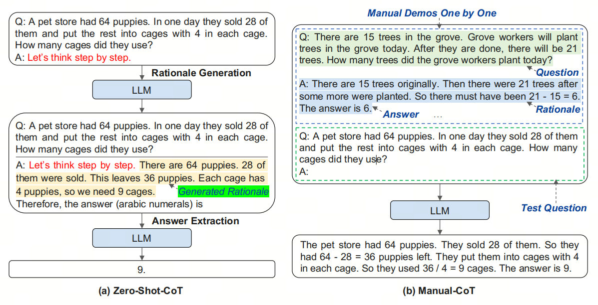
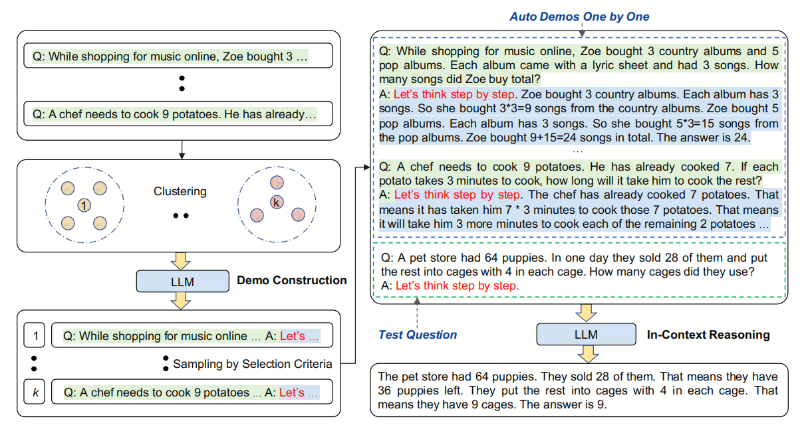
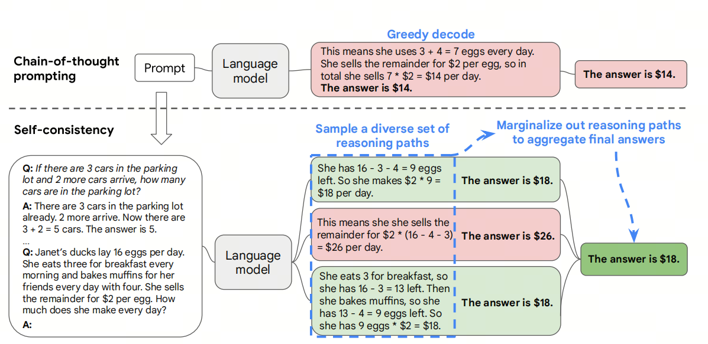
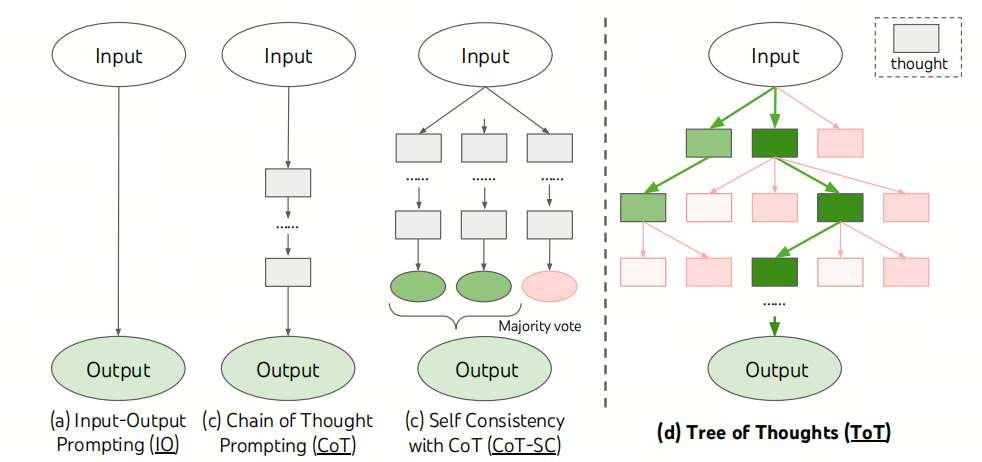
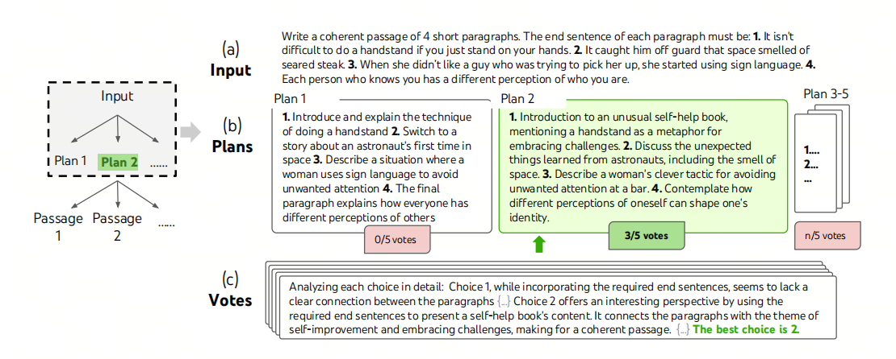
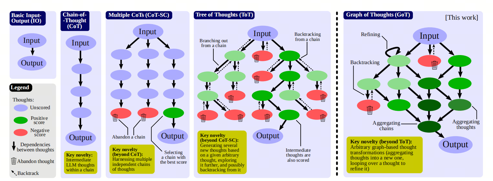

# CoT, ToT, and GoT: What Are Chain-of-Thought, Tree-of-Thought, and Graph-of-Thought?

## 1. Introduction

***hallucinations***

## 1. What are hallucinations?

Hallucinations in large models, to put it plainly, are "talking nonsense."

In the terms of the paper "A Survey on Hallucination in Large Language Models", this is the phenomenon where content generated by a model does not match real-world facts or the user's input.

Researchers divide large model hallucinations into factuality hallucination and faithfulness hallucination.

## 2. Handling hallucinations

In production, we do not like hallucinations. We need accurate and correct answers.

In real production adoption, we usually apply the following strategies step by step to improve accuracy and reduce hallucinations:

| Strategy | Difficulty | Data requirements | Accuracy gain |
| :--- |:----:| :----: |---: |
| Prompt engineering | Low | None | 26% |
| Self-reflection | Low | None | 26-40% |
| Few-shot learning (with RAG) | Medium | Small amount | 50% |
| Instruction Fine-tuning | High | Medium amount | 40-60% |

Now let's look at which Prompt Engineering techniques can improve accuracy.

## 3. CoT: Chain of Thought

CoT helps a model solve problems better by providing a sequence of reasoning steps. The main idea of CoT (`Chain-of-Thought`) is to guide the model to show its reasoning step by step, which improves quality on complex tasks such as math and logical reasoning. CoT can be Few-shot CoT, where several examples of step-by-step reasoning are provided, or Zero-shot CoT, where only a text instruction asks the model to reason step by step.

### Auto CoT

***let's think not just step by step, but also one by one***

You can use an LLM with the prompt "let's think step by step" to automatically generate demonstration reasoning chains one by one. In other words: let's think not just step by step, but also one by one. This removes the manual work needed for Few-shot CoT.

Auto-CoT mainly has two stages:

- Stage 1: question clustering, split the given questions into several clusters.
- Stage 2: demonstration selection, choose a representative question from each group and use Zero-Shot-CoT with simple heuristics to generate its reasoning chain.

### Self-Consistency

One noticeable feature of humans is that people think in different ways. For tasks that require careful solving, there may be several ways to reach the answer. Self-Consistency can imitate this process in a language model by sampling from the language model decoder.

For example, as shown in the figure above, the model can generate several plausible answers for a math problem, and some of them lead to the same correct answer (outputs 1 and 3). Since a language model is not a perfect reasoning machine, it can also produce wrong reasoning paths or make a mistake in one step (for example, output 2), but such a path is less likely to lead to the same final answer. In other words, we assume that correct reasoning processes, even when varied, converge to the same final answer more often than wrong processes do.

> Self-consistency means consistency in the output of the large model: results obtained through repeated sampling match.

## 4. ToT: Tree of Thoughts

ToT (`Tree-of-Thought`) supports a tree of thoughts. Thoughts are coherent language sequences, and each sequence is an intermediate step in solving the task. With this approach, an LM can evaluate intermediate thoughts on its own during a strict reasoning process. The LM combines the ability to generate and evaluate thoughts with search algorithms such as breadth-first search and depth-first search. By systematically exploring thoughts, it can do lookahead and backtracking.

The figure above shows a simple example.

After receiving the input, the LM samples 5 different options, then votes 5 times to decide which option is better. After that, the majority choice is used to write the output paragraph through the same sampling and voting procedure.

## 5. GoT: Graph of Thoughts

The key idea and main advantage of GoT (`Graph-of-Thought`) is that information generated by an LLM can be modeled as an arbitrary graph. In this graph, units of information ("LLM Thoughts") are vertices, and edges represent dependencies between those vertices. This approach allows arbitrary LLM Thoughts to be combined into a joint result, allows the whole network of thoughts to be summarized, and allows thoughts to be strengthened through feedback loops.

## 6. Summary

I think CoT can solve part of the hallucination problem at relatively low cost. But ToT and GoT are too fancy. In my personal view, they are not very suitable for practical use. Instead of such complex prompt engineering, it is usually better to use a stronger model.

## References

[1] [Chain-of-Thought Prompting Elicits Reasoning in Large Language Models](https://arxiv.org/abs/2201.11903)

[2] [Automatic Chain of Thought Prompting in Large Language Models](https://arxiv.org/abs/2210.03493)

[3] [Self-Consistency Improves Chain of Thought Reasoning in Language Models](https://arxiv.org/abs/2203.11171)

[4] [Tree of Thoughts: Deliberate Problem Solving with Large Language Models](https://arxiv.org/abs/2305.10601)

[5] [Graph of Thoughts: Solving Elaborate Problems with Large Language Models](https://arxiv.org/abs/2308.09687v2)

[6] [Prompt Engineering Guide](https://www.promptingguide.ai/zh)

[7] [A Survey on Hallucination in Large Language Models: Principles, Taxonomy, Challenges, and Open Questions](https://arxiv.org/abs/2311.05232)

## Welcome to my GitHub and WeChat account:

[GitHub: LLMForEverybody](https://github.com/luhengshiwo/LLMForEverybody)

---

## 📚 相关概念

[[concepts/提示词 工程 模式|提示词 工程 模式]] | [[concepts/AI 安全 对齐|AI 安全 对齐]]

> 📌 来源：[[sources/LLMForEverybody/索引|LLMForEverybody 导航]] · 章节：Prompt Engineering
