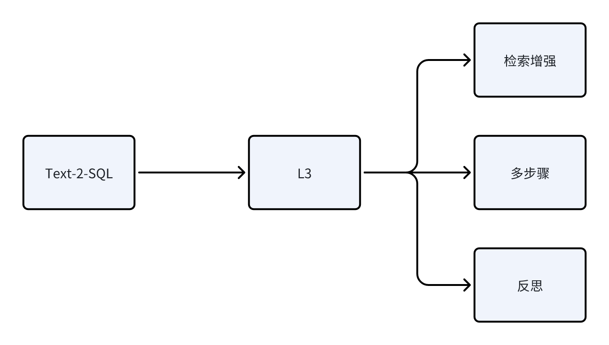
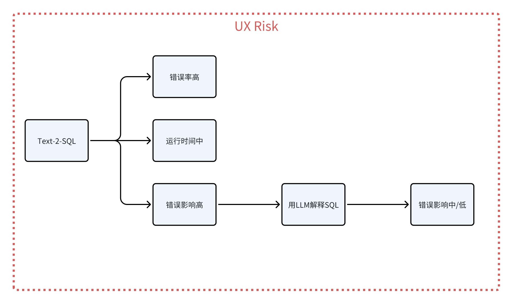
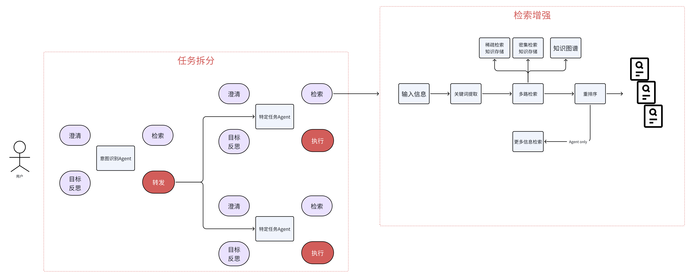
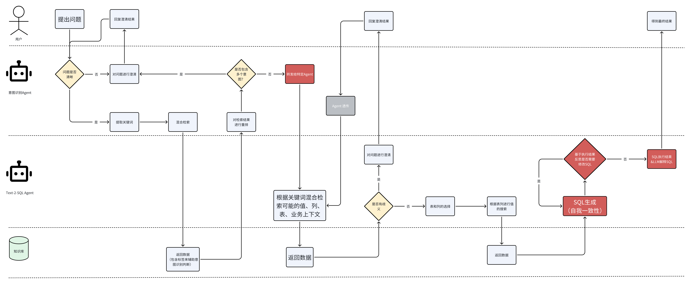
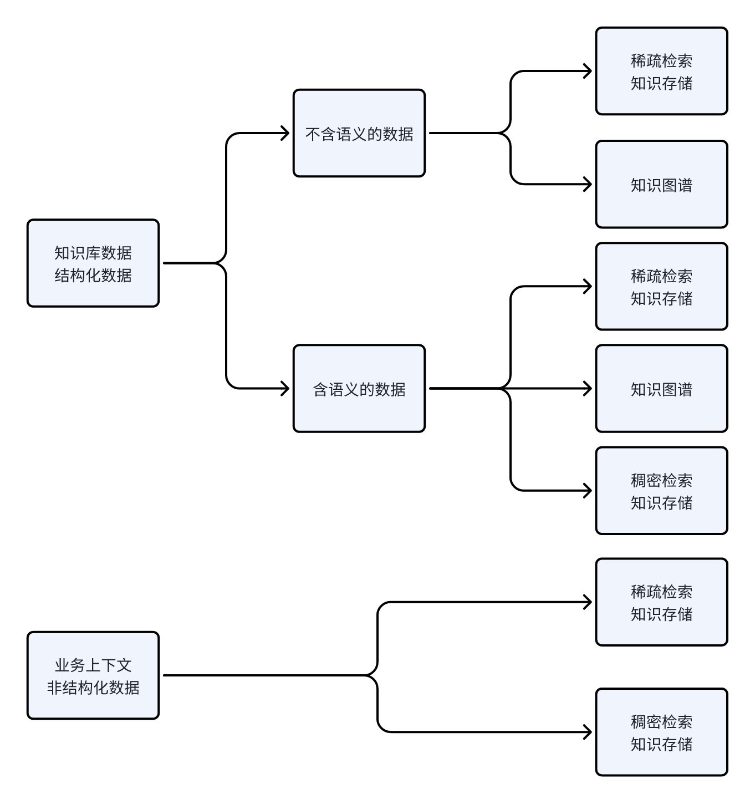

# LLM Application Adoption: Text-to-SQL, Part 3

Starting from Text-2-SQL adoption, let's look at the process of building a Text-2-SQL application.

## 1. Requirements and pain point analysis

The first step is to conduct user interviews and research, then collect user requirements and pain points.

## 2. Application type

Next, analyze the application type. Text-to-SQL belongs to task applications.

## 3. Application complexity

Text-to-SQL involves a large amount of business logic and many concepts. The data is also complex, and there are many custom rules, so its complexity level is defined as L3.

## 4. UX risk

Text-to-SQL errors have high impact because the product is designed for users who are not data developers and do not understand SQL. If the SQL is wrong but returns a value in roughly the same order of magnitude, the user may draw a wrong conclusion, and the business impact can be quite large.

### 4.1 Reducing error impact

- One obvious solution is to ask the LLM to explain the generated SQL. Modern LLMs are fairly good at explaining SQL. This can reduce the overall impact of an error to medium or even low. High error impact only happens when the problem appears in the LLM that explains the SQL.

### 4.2 Reducing error frequency

Text-to-SQL will have high error frequency because of all the complexity discussed above. So the main focus is reducing error frequency. Besides the methods from the previous section, engineering techniques can also be used. For example:

- merge data into one wide table, so the model does not need to perform too many joins;
- replace enum values with Chinese to avoid hallucinations when the model converts enum values;
- precompute some very complex metrics;
- and so on.

## 5. Text-2-SQL architecture

### 5.1 Overall architecture

### 5.2 Text-2-SQL L3 architecture

### 5.3 Architecture breakdown

- Intent recognition Agent
  - Since this is a conversational application, we definitely need an intent recognition Agent:
    - recognize the user's intent and perform routing;
    - at the same time, clarify some ambiguous user questions.
      - Example: "help me find customers who bought product A and product B." This phrase has two interpretations: first, intersection, meaning customers who bought both product A and product B; second, union, meaning customers who bought product A or product B. Here, the Agent should help us clarify the meaning.
  - RAG for the intent recognition Agent
    - Through retrieval augmentation, concrete data is retrieved to help the Agent determine which intent the request belongs to. If the retrieved content shows that both intents are possible, it should ask the user a clarifying question.

- Text-2-SQL Agent
  - Clarification
    - Clarification belongs to the task itself.
      - Example: the user wants to know sales for KFC store XXX, but there may be several stores named XXX: XXX 1, XXX 2. Then the user needs to clarify which store they mean.
      - This kind of clarification is possible only after we understand that this is a Text-to-SQL task, and then discover ambiguity through recall of values from the database.

  - Schema-Linking
    - Select tables and columns, add descriptions, and add candidate values from the database for use in where/having/case when and other expressions.

  - SQL generation
    - self-consistency: self-consistency reduces error frequency;
    - Revise: self-checking fixes syntax errors.

  - SQL translation
    - Ask the Agent to translate SQL into natural language and return this translation together with the SQL execution result.

## 6. Knowledge engineering

Data for a Text-2-SQL application is mainly divided into:

- business context
  - table and column descriptions;
  - default query rules.

- database values
  - enum values.

## 7. Building evaluation metrics

[text](../../../07-第七章-Agent/LLM应用落地之Text-2-SQL（三）.md)

Note: except for several redrawn illustrations, the content of this article is mostly copied from source 1, a Thoughtworks WeChat post.

## References

[1] [Practical guide to LLM application adoption](https://mp.weixin.qq.com/s/t-uYwd9NOxJIAIMAYWEqhg)
