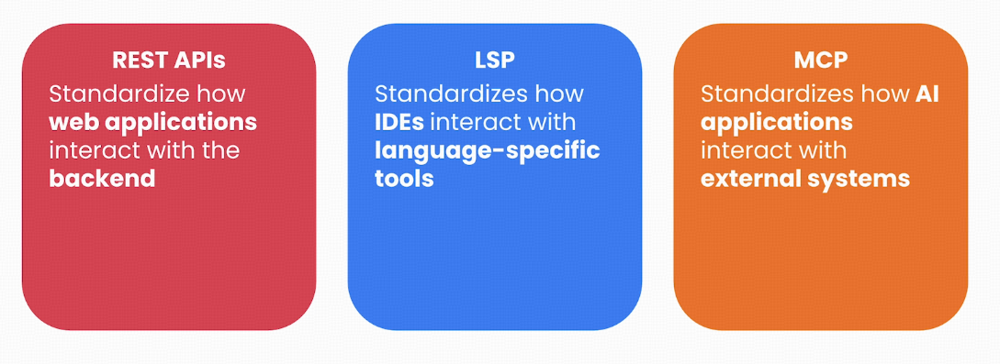
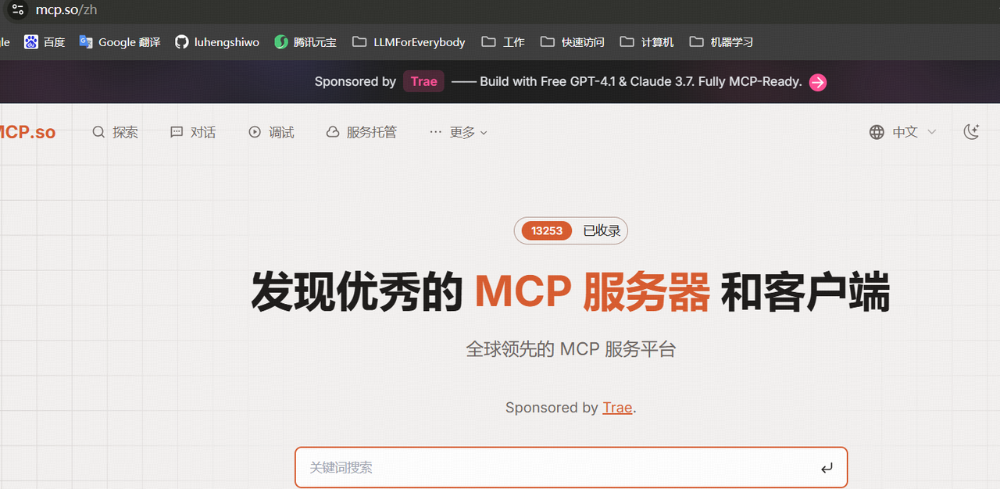
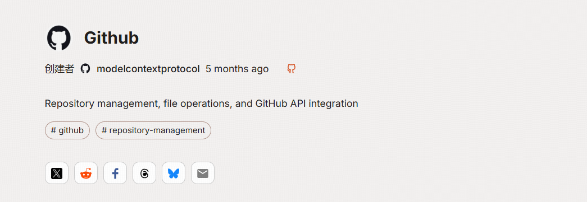
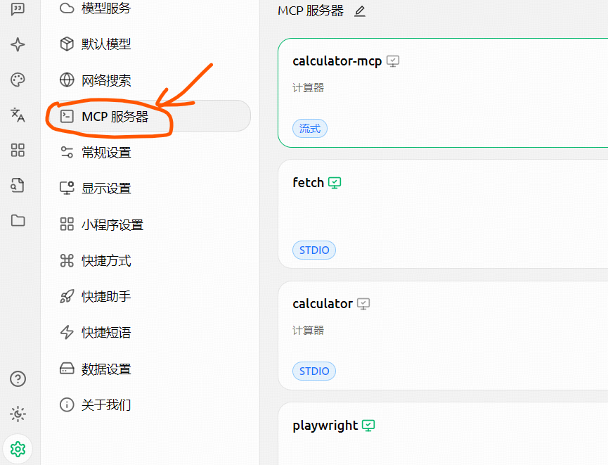
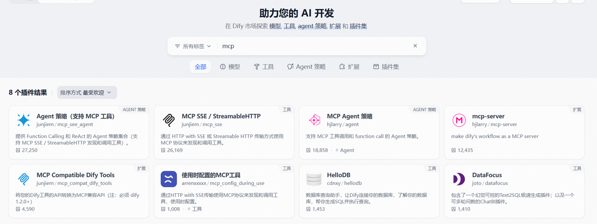
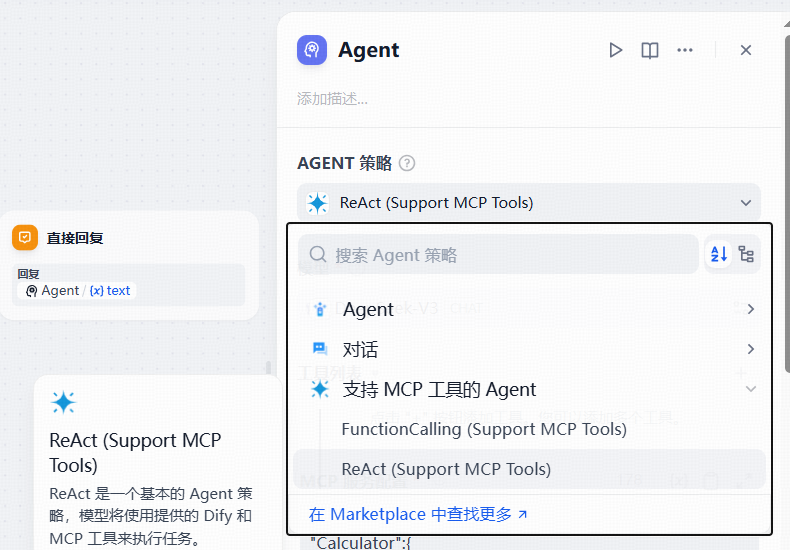
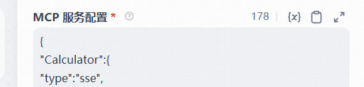
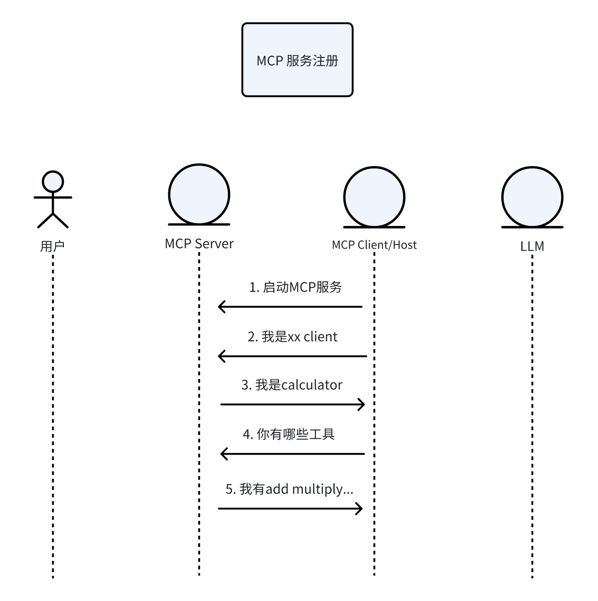
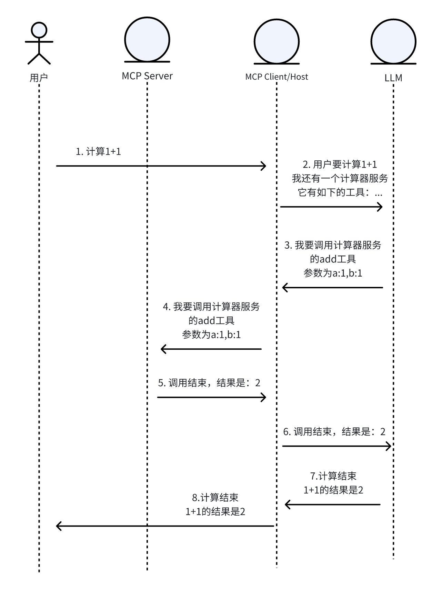

# MCP: Basic Concepts, Quick Start, and Internal Principles

When Claude Desktop automatically formats meeting notes, and a Midjourney plugin reads a local design mockup in real time, are you not curious how these AI tools get out of their "digital cage" and start collaborating with humans?

Behind this is a revolutionary protocol: Model Context Protocol (`MCP`). As a "universal adapter" in AI, MCP reshapes how large models connect with the real world.

This article has three parts:

The first part briefly explains the basic concepts of MCP.

The second part walks step by step from "using existing tools" to "developing your own MCP server."

The third part uses dynamic sequence diagrams to reveal the protocol design philosophy of Anthropic and other leading labs, helping you understand the next-generation AI interaction standard.

## I. Basic concepts

MCP is an open protocol released by Anthropic in 2024. It is designed to standardize communication between large language models (`LLM`) and external data sources/tools, solving the traditional AI problem where isolated data prevents full interaction with the environment. It is like a "universal plug" for AI: through a unified interface, the model can safely access local or remote resources such as databases, APIs, and the file system, dynamically obtain context, and perform operations.



MCP uses a client-server architecture and includes the following key components:

1. MCP Host: for example Claude Desktop or Cursor IDE, provides the user interaction interface.
2. MCP Client: embedded in the Host and responsible for protocol parsing and communication.
3. MCP Server: a lightweight service node that provides three types of capabilities:
- Resources: static data, such as files and database records.
- Tools: executable functions, such as API calls and data analysis.
- Prompts: predefined interaction templates.

Note: MCP basics are not the main focus of this article. But for completeness, I still added this section. If you want to understand MCP basics in more detail, I recommend reading the two articles below:

https://mp.weixin.qq.com/s/5XbO76qCCYrRVaYjTd3BIA

https://mp.weixin.qq.com/s/G2V5VmsjMWs08rUAE8zCuQ

## II. How to use MCP

### 2.0. MCP Server

***Published MCP servers***

There are already many publicly published MCP servers, and several communities have gradually formed around them:

https://mcpmarket.com/

https://smithery.ai/

https://mcp.so/

https://modelscope.cn/mcp

https://actions.zapier.com/mcp

Developers can conveniently search for useful MCP services on these sites.

Below, using mcp.so as an example, we show how to prepare your own MCP service.





You can see that the github server configuration looks like this:

```json
{
  "mcpServers": {
    "github": {
      "command": "npx",
      "args": [
        "-y",
        "@modelcontextprotocol/server-github"
      ],
      "env": {
        "GITHUB_PERSONAL_ACCESS_TOKEN": "<YOUR_TOKEN>"
      }
    }
  }
}
```

This effectively defines how to start this github MCP service. If we need it, we only need to copy this configuration and put it into the chosen Host. If it is not clear yet how to configure this, no problem: in the following sections I will show it step by step.

***Your own server***

We can also create our own MCP server. For this part, we can directly rely on Anthropic's official example: https://modelcontextprotocol.io/quickstart/server

At this point, you have your own server with this configuration:

```json
{
    "mcpServers": {
        "weather": {
            "command": "uv",
            "args": [
                "--directory",
                "/ABSOLUTE/PATH/TO/PARENT/FOLDER/weather",
                "run",
                "weather.py"
            ]
        }
    }
}
```

Next, these servers need to be configured in our Host. In this article, I chose the Cherry Studio client, the LangGraph development framework, and the Dify LLMOps platform to show how to connect MCP Server.

### 2.1. Using MCP Server in Cherry Studio

How to install Cherry Studio is not discussed here. After installation, open MCP Servers in settings and paste the configuration from the previous section.



### 2.2. Using MCP Server in LangGraph

Using an MCP service in LangGraph is also simple. According to the official example https://langchain-ai.github.io/langgraph/agents/mcp/#use-mcp-tools, it is enough to copy the configuration from the previous section into the code.

```python
from langchain_mcp_adapters.client import MultiServerMCPClient
from langgraph.prebuilt import create_react_agent

client = MultiServerMCPClient(
    {
        "math": {
            "command": "python",
            # Replace with absolute path to your math_server.py file
            "args": ["/path/to/math_server.py"],
            "transport": "stdio",
        },
        "weather": {
            # Ensure your start your weather server on port 8000
            "url": "http://localhost:8000/mcp",
            "transport": "streamable_http",
        }
    }
)
## Copy the configuration above into this method

tools = await client.get_tools()
agent = create_react_agent(
    "anthropic:claude-3-7-sonnet-latest",
    tools
)
math_response = await agent.ainvoke(
    {"messages": [{"role": "user", "content": "what's (3 + 5) x 12?"}]}
)
weather_response = await agent.ainvoke(
    {"messages": [{"role": "user", "content": "what is the weather in nyc?"}]}
)
```

### 2.3. Using MCP Server in Dify

Dify currently supports only SSE MCP services. First, make sure your Dify version is above 1.2.0. In the plugin marketplace, search for `mcp`, choose Agent strategy (Support MCP Tool), and install it. Note: you can also try other plugins yourself.



In Agent, choose ReAct (Support MCP Tool), and in the MCP service configuration paste the configuration from the previous section.





## III. How MCP works

To understand what MCP actually does, we can look at sequence diagrams: one for server registration and one for user calls.

### 3.1. Server registration sequence diagram



The step numbers below correspond to the sequence diagram.

Using Cherry Studio as an example: when we register our own `calculator` MCP service, the server and client already exchange several messages before registration succeeds.

1. First, the Client starts the MCP server. Our MCP service uses stdio, so at this step Cherry Studio effectively runs this command:

```bash
uv run calculator.py
```

2. The Client sends information to the server: I am this client.

```bash
{"method":"initialize","params":{"protocolVersion":"2024-11-05","capabilities":{},"clientInfo":{"name":"Cline","version":"3.12.3"}},"jsonrpc":"2.0","id":0}
```

3. The Server replies: I am the calculator service.

```bash
{"jsonrpc":"2.0","id":0,"result":{"protocolVersion":"2024-11-05","capabilities":{"experimental":{},"prompts":{"listChanged":false},"resources":{"subscribe":false,"listChanged":false},"tools":{"listChanged":false}},"serverInfo":{"name":"CalculatorService","version":"1.8.1"}}}
```

4. The Client initializes the service, then asks the server which tools are available.

```bash
{"method":"notifications/initialized","jsonrpc":"2.0"}
{"method":"tools/list","jsonrpc":"2.0","id":1}
```

5. The service replies with tool information, including tool descriptions, input parameters, and output parameters.

```bash
{
        "jsonrpc": "2.0",
        "id": 1,
        "result": {
                "tools": [{
                        "name": "add",
                        "description": "Perform floating-point addition",
                        "inputSchema": {
                                "properties": {
                                        "a": {
                                                "title": "A",
                                                "type": "number"
                                        },
                                        "b": {
                                                "title": "B",
                                                "type": "number"
                                        }
                                },
                                "required": ["a", "b"],
                                "title": "addArguments",
                                "type": "object"
                        }
                },
                {
                        "name": "subtract",
                        "description": "Perform floating-point subtraction",
                        "inputSchema": {
                                "properties": {
                                        "a": {
                                                "title": "A",
                                                "type": "number"
                                        },
                                        "b": {
                                                "title": "B",
                                                "type": "number"
                                        }
                                },
                                "required": ["a", "b"],
                                "title": "subtractArguments",
                                "type": "object"
                        }
                },
                {
                        "name": "multiply",
                        "description": "Perform floating-point multiplication",
                        "inputSchema": {
                                "properties": {
                                        "a": {
                                                "title": "A",
                                                "type": "number"
                                        },
                                        "b": {
                                                "title": "B",
                                                "type": "number"
                                        }
                                },
                                "required": ["a", "b"],
                                "title": "multiplyArguments",
                                "type": "object"
                        }
                },
                {
                        "name": "divide",
                        "description": "Perform floating-point division\n    Args:\n        b: divisor (must be non-zero)\n    ",
                        "inputSchema": {
                                "properties": {
                                        "a": {
                                                "title": "A",
                                                "type": "number"
                                        },
                                        "b": {
                                                "title": "B",
                                                "type": "number"
                                        }
                                },
                                "required": ["a", "b"],
                                "title": "divideArguments",
                                "type": "object"
                        }
                },
                {
                        "name": "power",
                        "description": "Calculate a power operation",
                        "inputSchema": {
                                "properties": {
                                        "base": {
                                                "title": "Base",
                                                "type": "number"
                                        },
                                        "exponent": {
                                                "title": "Exponent",
                                                "type": "number"
                                        }
                                },
                                "required": ["base", "exponent"],
                                "title": "powerArguments",
                                "type": "object"
                        }
                },
                {
                        "name": "sqrt",
                        "description": "Calculate a square root",
                        "inputSchema": {
                                "properties": {
                                        "number": {
                                                "title": "Number",
                                                "type": "number"
                                        }
                                },
                                "required": ["number"],
                                "title": "sqrtArguments",
                                "type": "object"
                        }
                },
                {
                        "name": "factorial",
                        "description": "Calculate an integer factorial",
                        "inputSchema": {
                                "properties": {
                                        "n": {
                                                "title": "N",
                                                "type": "integer"
                                        }
                                },
                                "required": ["n"],
                                "title": "factorialArguments",
                                "type": "object"
                        }
                }]
        }
}
```

At this point, server registration is complete.

### 3.2. User call sequence diagram



The step numbers below correspond to the sequence diagram.

1. The user sends a request to the Host, for example calculating `1+1`: in Cherry Studio, they type `1+1` and press Enter.

2. Cherry Studio sends this request together with information about the configured MCP server to the LLM in the form of a prompt/function call. The prompt has already agreed on the format to use if the MCP server needs to be called.

3. After reasoning, the large model understands that it needs to call the `add` tool from the calculator MCP server, and according to the agreement returns the call method in MCP format. Here the response looks like this:

```bash
{"method":"tools/call","params":{"name":"add","arguments":{"a":1.0,"b":1.0}},"jsonrpc":"2.0","id":4}
```

4. The Client forwards the request and calls the server.

5. The Server returns the result.

```bash
{"jsonrpc":"2.0","id":4,"result":{"content":[{"type":"text","text":"2.0"}],"isError":false}}
```

6. The Client forwards the result to the LLM, together with historical context.

7. The large model receives the result and makes the final summary, returning the final answer to the client.

8. The Client receives the result and sends it to the user.

### 3.3. Model Context Protocol

For the term Model Context Protocol, remember this: the protocol only regulates interaction between Client and Server. It does not regulate how the Client interacts with the LLM. Different clients implement that in their own ways.

For a large model, context is the environment. Model context means what environment the model is in, meaning which tools it can access.

In essence, MCP is a protocol that lets a model perceive the external environment.

## References

<div id="refer-anchor-1"></div>

[1]https://mp.weixin.qq.com/s/5XbO76qCCYrRVaYjTd3BIA

https://mp.weixin.qq.com/s/G2V5VmsjMWs08rUAE8zCuQ

https://mcpmarket.com/

https://smithery.ai/

https://mcp.so/

https://modelscope.cn/mcp

https://actions.zapier.com/mcp

https://modelcontextprotocol.io/quickstart/server

https://langchain-ai.github.io/langgraph/agents/mcp/#use-mcp-tools

https://www.deeplearning.ai/short-courses/mcp-build-rich-context-ai-apps-with-anthropic/?utm_campaign=anthropicC2-launch&utm_medium=headband&utm_source=deeplearning-ai
