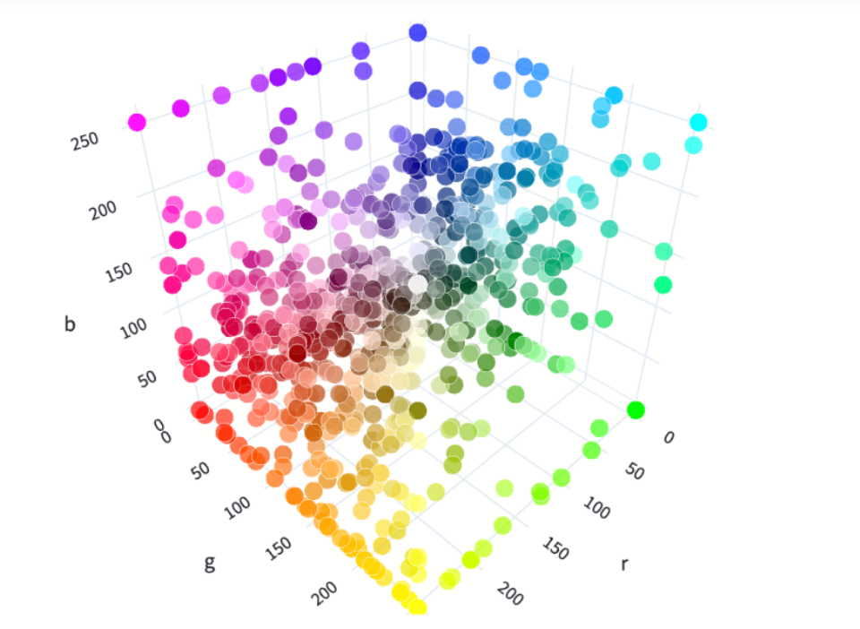
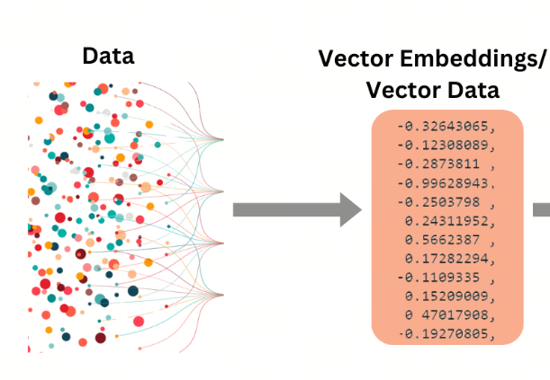
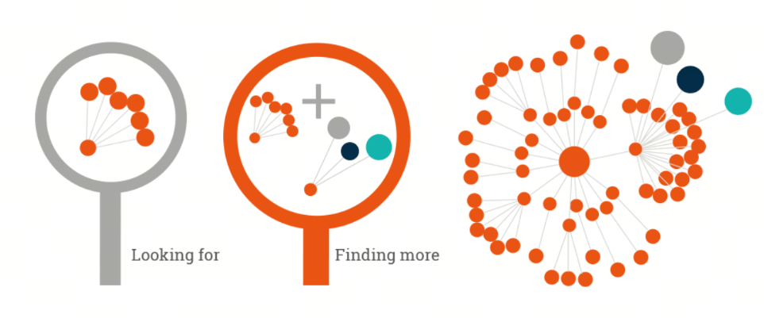

# Vector Databases and LLMs

## 1. Why vector databases are needed

A vector database is a database system designed specifically for storing and querying vector data. It has clear advantages when handling large-scale high-dimensional data. The key advantage of a vector database is that it can efficiently perform similarity search and data analysis, which is often hard to achieve in traditional relational databases. A vector database converts unstructured data, such as text, images, audio, and so on, into vector form for storage, so similarity search and analysis can be performed quickly over that data.

The rise of vector databases is closely connected to the needs of the large model era. They provide large models with support from an external knowledge base, strengthen generative ability, support vector embeddings, and help solve data limitation problems. With vector databases, companies can build intelligent services such as legal tech services, intelligent customer support, and so on, providing more professional and up-to-date services.

## 2. What is a vector?

A vector is an important concept in mathematics. It is an ordered sequence of numbers that can represent a point in space or a direction. In machine learning and deep learning, vectors are usually used to represent data features, such as text, images, audio, and so on. Once data is converted into vector form, it is convenient to compute and analyze, and also efficient to store and retrieve.

## 3. What is semantic search?

Semantic search is a search technology based on semantic understanding. It understands the user's query intent and returns more accurate and relevant results. Traditional search technologies mainly rely on keyword matching, while semantic search focuses more on semantic relevance, better satisfying user needs. Semantic search is widely used in natural language processing, information retrieval, recommendation systems, and other areas. It improves search efficiency and accuracy and improves the user experience.

## 4. Application of vector data: RAG

Retrieval-Augmented Generation (`RAG`) improves the accuracy and relevance of generated text by combining a Large Language Model (`LLM`) with an information retrieval system. This approach lets the model first retrieve relevant information from an authoritative knowledge base before generating an answer, which keeps the result current and professional without retraining the model itself.

RAG matters because it solves several key LLM problems, such as producing false information, generating outdated information, relying on non-authoritative sources, and giving inaccurate answers because of mixed-up terminology. Introducing RAG allows information to be retrieved from authoritative and predefined knowledge sources, strengthens control over generated text, and also increases user trust in AI solutions.

## 4. Vector database comparison

How do you choose the right vector database? In real business scenarios, many factors usually have to be considered: availability, scalability, vector database security, whether the code is open source, whether the community is active, and so on.

At the time this article was written, September 18, 2024, the following vector database options were available:

| Vector database | URL| GitHub Star|Language|
| :--- |:----:| :----: |---: |
| chroma|https://github.com/chroma-core/chroma|14.4k| Python  |
| milvus|https://github.com/milvus-io/milvus| 29.2k|Go/Python/C++ |
| pinecone|https://www.pinecone.io/|closed source|none |
| qdrant|https://github.com/qdrant/qdrant|19.7k|Rust|
|typesense|https://github.com/typesense/typesense|20.3k|C++|
|weaviate|https://github.com/weaviate/weaviate|10.7k|Go|
|faiss|https://github.com/facebookresearch/faiss|30.3k|C++/Python/Cuda|

## 5. Long Context vs. RAG

When comparing large models' ability to handle ultra-long sequential input with Retrieval-Augmented Generation (`RAG`), we can see that both approaches have their own advantages and challenges when working with long text data.

The ability to process ultra-long sequential input is an important development direction for Large Language Models (`LLMs`). As technology develops, some models can already process text much longer than previous limits, making them more effective for long text data. Improvements in this ability help LLMs capture long-range dependencies better during text understanding and generation, improving coherence and logic. However, processing such ultra-long context also increases compute cost and creates challenges for memory requirements during model training and inference.

On the other hand, RAG improves model quality by combining two steps: retrieval and generation. Before generating an answer, RAG retrieves relevant information from a broad document base, then uses that information to guide the generation process. This approach effectively reduces hallucinations that the model may produce, speeds up knowledge updates, and improves traceability of generated content. RAG shows higher efficiency and accuracy when working with domain-specific knowledge, especially in scenarios that need the latest information and professional expertise.

In practical applications, the choice between ultra-long sequential input and RAG depends on concrete business requirements and resource limits. If the task requires the model to understand and generate a large amount of text at once, and high compute cost is acceptable, ultra-long sequential input may be the better choice. If the task needs fresh external knowledge or the amount of data to process is very large, RAG may be more suitable because it can dynamically obtain fresh information through retrieval and control total compute cost by optimizing the retrieval step.

## References

[1] [Vector databases | A comprehensive overview of vector database concepts, principles, algorithms, and selection](https://cloud.tencent.com/developer/article/2312534)

## Welcome to my GitHub and WeChat account: no time to explain, come aboard!

[GitHub: LLMForEverybody](https://github.com/luhengshiwo/LLMForEverybody)

The repository has the original Markdown files, and the project is fully open source. Stars and forks are very welcome!
