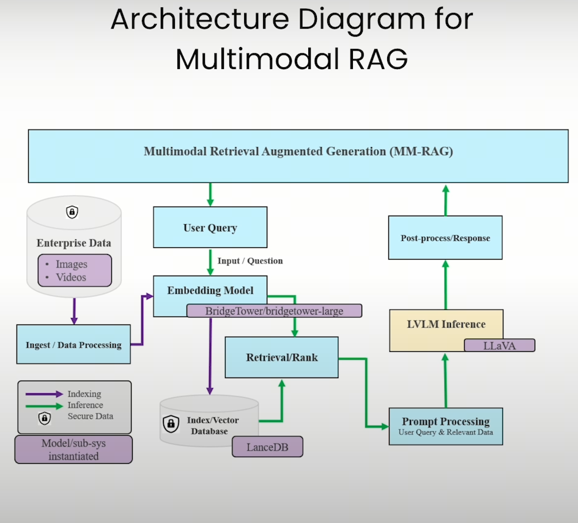
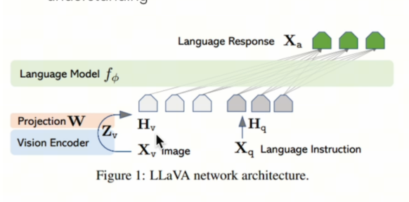
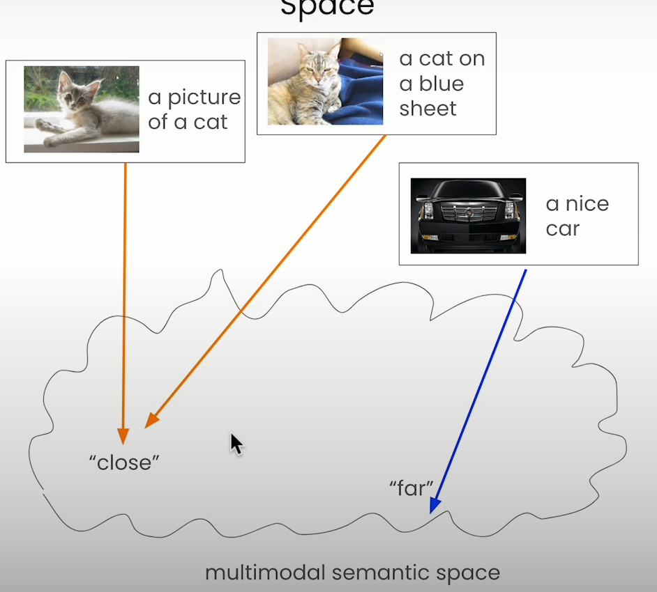
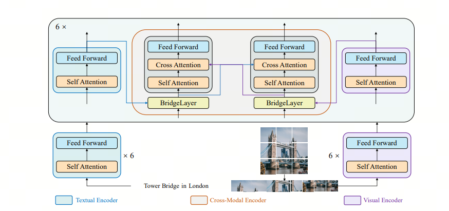
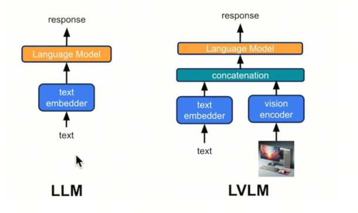

# Multimodal RAG in 10 Minutes

Can you only build RAG over documents? In 10 minutes, let's figure out how to build multimodal RAG.

- Reading note: this article requires a basic understanding of RAG. If you are not familiar with RAG, you can refer to my previous article.

Many RAG systems are built around text, but in real scenarios we have many images and even videos. Sometimes we also want to build multimodal RAG for images and videos, so we can ask questions about them.

## 1. Architecture

A video can be treated as a set of many image frames, so let's start with images.

Pay attention to the diagram above: purple shows the Vector DB construction process, and blue shows the inference process. The whole multimodal architecture looks like this:

1. Process multimodal data: get an image-text pair.
2. Convert the image-text pair into an embedding and store it in the Vector DB.
3. Convert the query into an embedding and retrieve from the Vector DB.
4. Combine the returned image-text pair with the query and get an answer from the LVLM model.

You can see that this architecture is almost identical to traditional RAG. The only difference is that the inputs and outputs at each step are different.

## 2. Data processing

We need to process data into image-text pairs, so they can be conveniently passed into an embedding model.

For video, there are 3 possible cases:

- case1: the video has subtitles
- case2: the video has no subtitles
- case3: the video has no subtitles, and subtitles cannot be generated, for example a silent film or a video with only background music

For images, there are two possible cases:

- the image contains explanatory text
- the image does not contain explanatory text

Video processing methods:

1. case1: use tools such as CV2, split the video by time, select suitable images, and match subtitles to the suitable images.
2. case2: first use a speech-to-text tool such as Whisper to generate subtitles, then apply the case1 scheme.
3. case3: generate images using the case1 method, then use a Large Vision-Language Model (`LVLM`) to generate subtitles.

Image processing methods:

1. case1: no action is needed.
2. case2: use a Large Vision-Language Model (`LVLM`) to generate a description.

## 3. Embedding

We can pass the image-text pairs described above into a specialized embedding model, such as BridgeTower. This gives us an embedding for the pair, which is convenient for later retrieval. For more about BridgeTower, see this paper: [bridge tower](https://arxiv.org/abs/2206.08657)

## 4. Retrieval, prompt process, and response

After retrieval by the user query, we get an image-text pair. Then we process the query, text, and image, feed them into the LVLM mentioned above, and get a response.

LLaVA is a commonly used LVLM. See https://arxiv.org/pdf/2304.08485.

You can see that multimodal RAG tries to get close to traditional RAG. It just uses multimodal embedding and a multimodal LM for answer generation.

## References

[1] [bridge tower](https://arxiv.org/abs/2206.08657 )

[2] [LlaVA](https://arxiv.org/pdf/2304.08485 )

## Welcome to my GitHub and WeChat account [The Real Ship of Theseus]: no time to explain, come aboard!

[GitHub: LLMForEverybody](https://github.com/luhengshiwo/LLMForEverybody)

The repository has the original Markdown files, and the project is fully open source. Stars and forks are very welcome!
