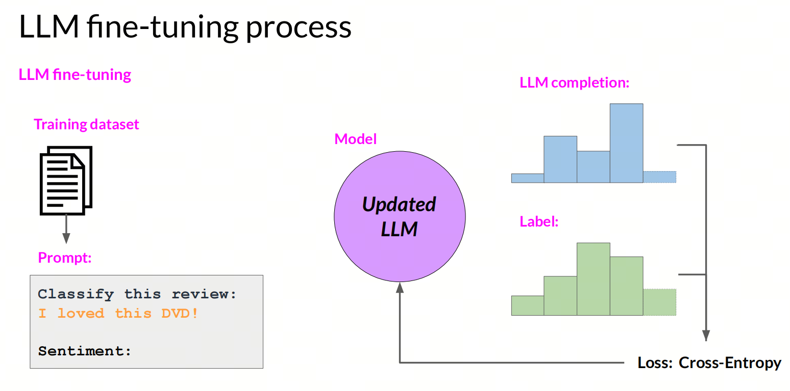

# Develop LLMs or Use LLMs?

Recently, OpenAI is expected to release a new AI model this fall, code-named "Strawberry." From math-focused tasks to handling subjective marketing strategies, Strawberry shows a surprising variety of capabilities.

Large model updates keep flashing before our eyes one after another, but in the whole large model ecosystem, the division of labor is actually quite clear. Most people working with large models use large models, rather than developing foundation models.

## 1. Increasingly expensive pre-training

The cost of pre-training large models is multifaceted and includes GPU, data, storage, and other aspects. These sides are broken down below:

**GPU cost**:

Training large models requires huge GPU resources. For example, training a large model with hundreds of billions of parameters may require thousands of NVIDIA A100 GPUs, and each GPU costs about 10,000 US dollars. At that scale, GPU cost alone can reach hundreds of millions of dollars.

**Data cost**:

Training large models requires massive amounts of data. Data collection, cleaning, annotation, and storage all cost money. For example, a pre-training dataset may go through many preliminary stages, including data crawling, cleaning, conversion, and so on. These stages involve many experiments, and the amount of processed data is usually more than 100 times larger than the formal training dataset.

**Storage cost**:

The balance between storage system performance and cost is an important factor. High-performance file systems such as GPFS and Lustre usually depend on all-flash (`NVMe`) and high-performance networks, so they are expensive. Object storage is cheaper, but may require extra labor and time for data synchronization, migration, consistency management, and other tasks.

**Data center cost**:

Data center operating costs include electricity, cooling, maintenance, and so on. These costs grow as the number of GPUs and the scale of the data center grow.

**Personnel cost**:

Training large models requires a professional team of engineers and scientists, including data engineers, AI researchers, software engineers, and other specialists. Salaries and benefits for these people are another important cost factor.

## 2. Do you really have a chance to work on large model pre-training?

The absolute majority of large model practitioners will not develop foundation models.

You may have seen many pre-training technologies in technical blogs, and interviewers may have asked you about them, but you may never use them in real work. Because pre-training is too expensive, and many companies simply do not need it.

Most large model practitioners use large models, rather than developing foundation models.

If we divide large model applications by complexity, we basically get five directions:

| Strategy | Difficulty| Data requirements|
| :--- |:----:| :----: |
| Prompt Engineering|low|none|
| Self-Reflection |low| none|
| RAG|medium|small amount|
| Agent|medium|small amount|
| Fine-tuning |high|medium amount|

## 3. Prompt Engineering

Prompt Engineering is the art and science of optimizing prompts to get effective output. It includes designing, writing, and changing prompts to guide an AI model toward high-quality, relevant, and useful answers.


## 4. Self-Reflection

In real work, I have noticed that many colleagues do not realize the importance of Self-Reflection. In fact, Self-Reflection is a simple but very useful strategy.

Let's show it with an NL2SQL example:

### First interaction

```python
question = ''
prompt = f'{question}'
plain_query = llm.invoke(prompt)
try:
    df = pd.read_sql(plain_query)
    print(df)
except Exception as e:
    print(e)
```

After receiving an error, we can use reflection on the error to improve our question until we get the answer we need.

### Reflection

```python
reflection = f"Question: {question}. Query: {plain_query}. Error:{e}, so it cannot answer the question. Write a corrected sqlite query."
```

### Second interaction

```python
reflection_prompt = f'{reflection}'
reflection_query = llm.invoke(reflection_prompt)
try:
    df = pd.read_sql(reflection_query )
    print(df)
except Exception as e:
    print(e)
```

## 5. RAG

Retrieval-Augmented Generation (`RAG`) improves the accuracy and relevance of generated text by combining a Large Language Model (`LLM`) with an information retrieval system. This approach lets the model first retrieve relevant information from an authoritative knowledge base before generating an answer, which keeps the result current and professional without retraining the model itself.

RAG matters because it solves several key LLM problems, such as producing false information, generating outdated information, relying on non-authoritative sources, and giving inaccurate answers because of mixed-up terminology. Introducing RAG allows information to be retrieved from authoritative and predefined knowledge sources, strengthens control over generated text, and also increases user trust in AI solutions.


## 6. Agent

An Agent is a system that can perceive the environment and make decisions based on the perceived information to achieve a specific goal. With support from large models, Agent has become more visible than ever before.

### LangChain

Agent frameworks led by LangChain are currently the most widely used open source frameworks in China. The original design idea of LangChain was to represent a workflow as a DAG (`directed acyclic graph`), which is where Chain came from.

As the Multi-Agent idea spreads and the Agent paradigm gradually settles, Agent workflows become more complex: loops and other conditions appear. That requires a Graph approach, and LangGraph appeared for this reason.

## 7. Fine-tuning

Compared with the cost of training a base large model, where the count can easily reach tens of thousands of cards, fine-tuning may be one of the few post-training methods for large models that ordinary people or companies can access.

Fine-tuning means taking a pre-trained model and further training it with a small amount of data and compute resources, so it adapts to a specific task or dataset.



Fine-tuning is divided into two types: full fine-tuning and parameter efficient fine-tuning.

- Full fine-tuning: in full fine-tuning, all model parameters are updated. This method usually requires a large amount of data and compute resources, as well as longer training time.

### PEFT

Parameter-Efficient Fine-Tuning (`PEFT`) is a fine-tuning technique for large pre-trained models, such as large language models. Its goal is to reduce the number of trainable parameters, thereby lowering compute and storage costs while maintaining or improving model quality.

PEFT adapts the model to a specific downstream task by training only a small part of the model parameters, rather than the whole model. This approach is especially useful when hardware resources are limited and when a large model needs to adapt quickly to many tasks.


PEFT has several common methods:

- selecting a subset of parameters: choose a small part of model parameters for fine-tuning, usually parameters in the last few layers;
- reparameterization: use a low-rank representation to reparameterize model weights. A typical representative is LoRA;
- adding parameters: add trainable layers or parameters to the model. A typical representative is Prompt-tuning.


## Summary

Large models have already entered the application adoption stage. At this point, large model practitioners should focus more on using large models, rather than developing foundation models.

## References

<div id="refer-anchor-1"></div>

[2] [improving accuracy of llm applications](https://learn.deeplearning.ai/courses/improving-accuracy-of-llm-applications/lesson/4/create-an-evaluation)

## Welcome to my GitHub and WeChat account:

[GitHub: LLMForEverybody](https://github.com/luhengshiwo/LLMForEverybody)
