# Agent Design Paradigms and Common Frameworks

## 1. What is an Agent?

An Agent is a system that can perceive its environment and make decisions based on the perceived information to achieve a specific goal. With support from large models, Agent has become more visible than ever before.

**The essence of Agent is still prompt engineering.**

## 2. Agent design paradigms

"Agent paradigm" refers to different methods and techniques used in artificial intelligence, especially in the design and development of intelligent agents (`Autonomous agents`, or simply Agents). An intelligent agent is a system that can perceive the environment, reason, and act to complete a specific task. In the context of large language models (`LLMs`), the Agent paradigm usually describes how to use these models to strengthen an agent's planning, decision-making, and action capabilities.

There is no single unified Agent design paradigm yet, but there are several common patterns. Here we look at several design paradigms mentioned by Andrew Ng:

- Reflection
- Tool use
- Planning
- Multi-agent collaboration

## 3. Agent paradigm 1: Reflection

Reflection is the ability of an Agent to reason about and analyze its own actions and decisions. This ability helps the Agent better understand its actions and decisions, then use that information more effectively in future decisions.

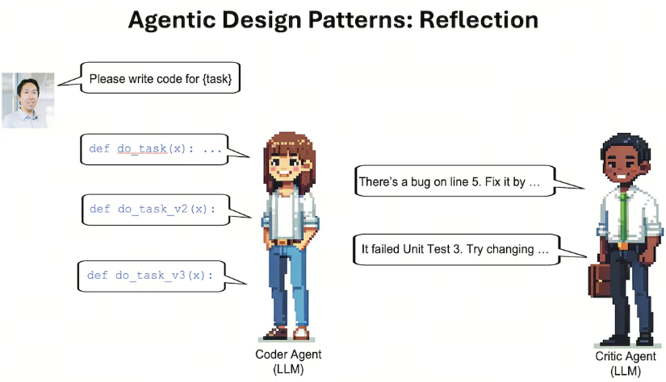

How can self-reflection be embedded into a workflow? Let's look at an NL2SQL example:

### First interaction

```python
question = ''
prompt = f'{question}'
plain_query = llm.invoke(prompt)
try:
    df = pd.read_sql(plain_query)
    print(df)
except Exception as e:
    print(e)
```

### reflection

```python
reflection = f"Question: {question}. Query: {plain_query}. Error:{e}, so it cannot answer the question. Write a corrected sqlite query."
```

### Second interaction

```python
reflection_prompt = f'{reflection}'
reflection_query = llm.invoke(reflection_prompt)
try:
    df = pd.read_sql(reflection_query )
    print(df)
except Exception as e:
    print(e)
```

Through reflection, we can keep improving our question until we get the answer we need.

## 4. Agent paradigm 2: Tool use

Just as humans use tools to complete tasks, an Agent can also use tools to handle tasks. This Agent paradigm describes how an Agent uses external tools and resources to strengthen its decision-making and action capabilities.

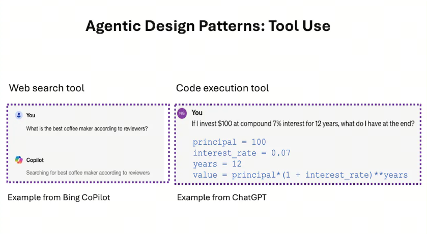

For example, an external calculator or Wikipedia can be used to solve a task.

```python
from langchain.agents import load_tools, initialize_agent
from langchain.agents import AgentType
from langchain_openai import ChatOpenAI
llm = ChatOpenAI(temperature=0, model=llm_model)
tools = load_tools(["llm-math","wikipedia"], llm=llm)
agent= initialize_agent(
    tools,
    llm,
    agent=AgentType.CHAT_ZERO_SHOT_REACT_DESCRIPTION,
    handle_parsing_errors=True,
    verbose = True)

```

## 5. Agent paradigm 3: Planning

Planning is a key design pattern for Agent AI. We use large language models to autonomously determine which steps are needed to solve a larger task. For example, if we ask an Agent to do online research on a given topic, we can use an LLM to break the goal into smaller subtasks: study specific subtopics, summarize research findings, and write a report.

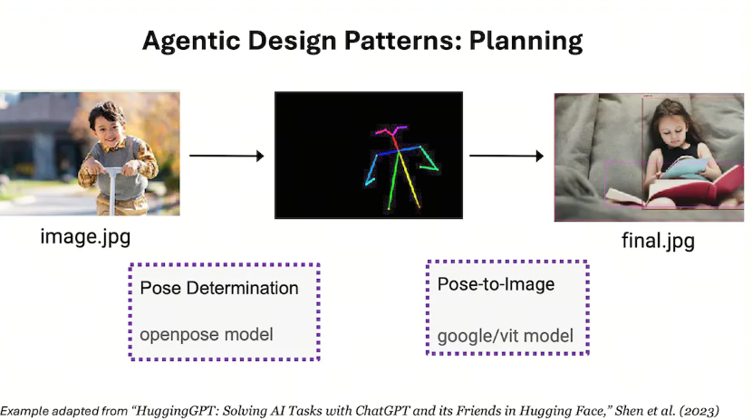

## 6. Agent paradigm 4: Multi-agent collaboration

Multi-agent collaboration is the last of the four key AI Agent design paradigms. For complex tasks such as writing software, the Multi-Agent approach splits the task into subtasks for different roles, such as software engineer, product manager, designer, QA engineer, and so on, and assigns different agents to complete different subtasks.

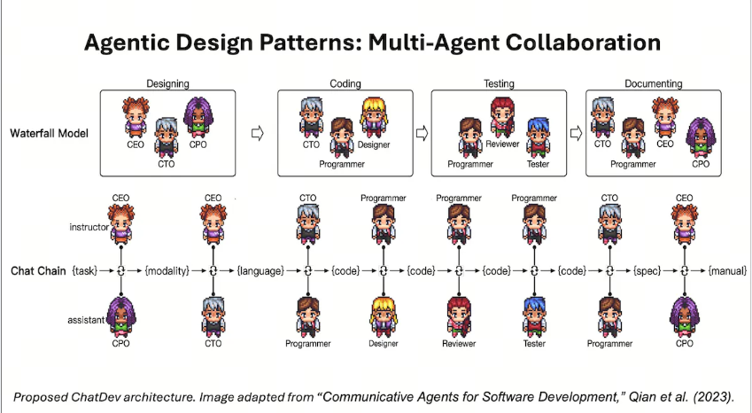

## 7. Other design paradigms

The main difference in other design paradigms is whether Memory is treated as a separate element. You may have seen a diagram like this in different places:

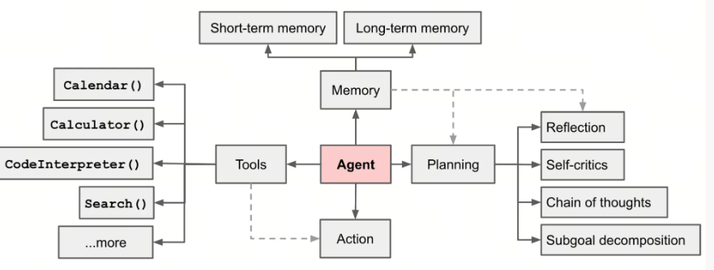

The difference from Andrew Ng's approach is whether Memory is mentioned explicitly. But this does not block understanding, because Memory is an important part of Agent.

Memory can be divided into Short-term memory and Long-term memory. This is a little like the human memory system.

- Short-term memory: use of context
- Long-term memory: use of an external knowledge base; a typical example is RAG

## 8. Advanced Agent design paradigms

### 8.1. ReAct

Reasoning and Action is a design paradigm where an Agent reacts to changes in the environment. It describes how an Agent adjusts its decisions and behavior based on environmental changes.

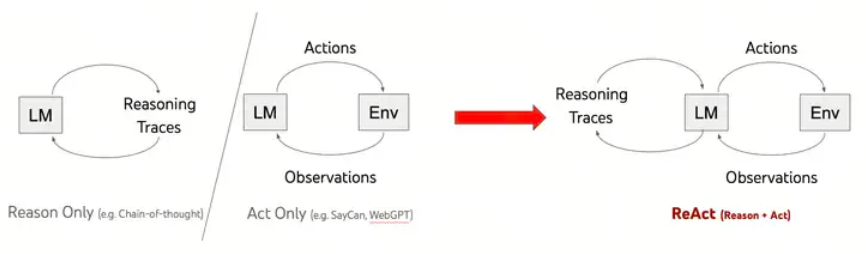

### 8.2. Planning & Execute

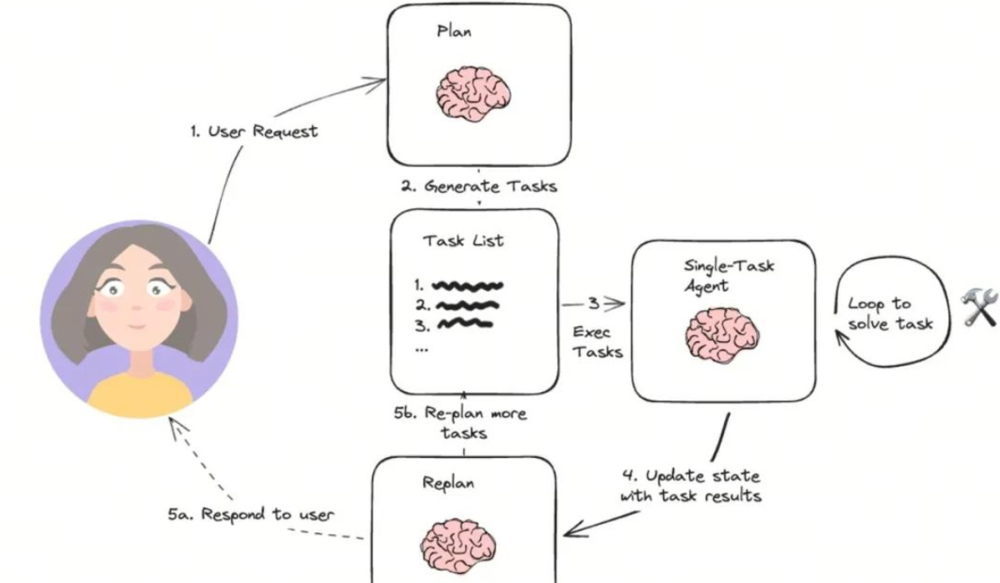

### Difference between them

- ReAct: move step by step and see what happens next
- Planning & Execute: make a plan in advance, though of course it can later be iterated based on feedback

***Planning vs. ReAct***

- Planning: the Agent autonomously decides which steps to complete for a larger task
- ReAct: the Agent reacts to changes in the environment

## 9. Frameworks for Multi-Agent collaboration

### 9.1. LangGraph

Agent frameworks led by LangChain are currently the most widely used open source frameworks in China. The original design idea of LangChain was to represent a workflow as a DAG (`directed acyclic graph`), which is where Chain came from.

As the Multi-Agent idea spreads and the Agent paradigm gradually settles, Agent workflows become more complex: loops and other conditions appear. That requires a Graph approach, and LangGraph was developed for this reason.

### 9.3. AutoGen

AutoGen designs Multi-Agent collaboration from the perspective of communication organization and mainly divides it into four strategies:

- two agents
- sequential agents
- Group agents
- Nested agents

### 9.4. two agents

This is like two people working together on a task. It is the simplest collaboration mode.

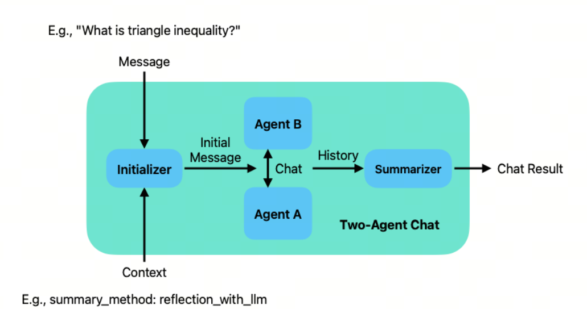

### 9.5. Sequential agents

Sequential Agents means a task arrives, agentA asks other agents, and each time brings both the question and the results of communication with previous participants, so a final solution can be obtained.

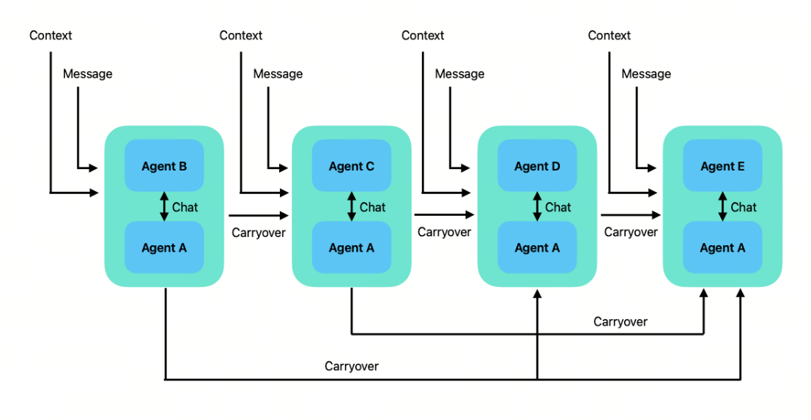

### 9.6. Group agents

This is like a company or team: a task arrives and is passed to the manager. The manager is responsible for assigning tasks to different agents, collecting feedback, sending it out, and choosing the next agent.

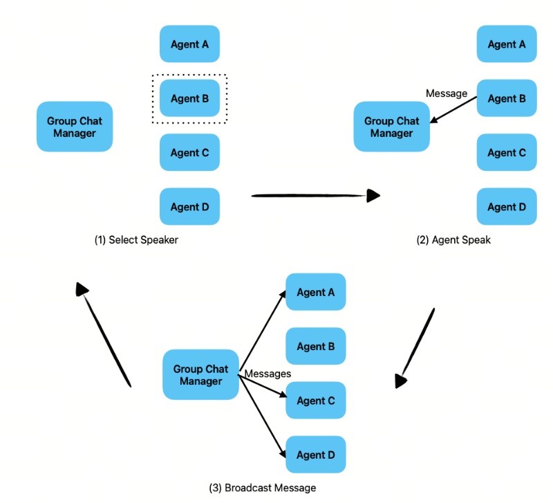

### 9.7. Nested agents

Nested agents means there is another agent inside one agent. This is the most complex collaboration mode. In AutoGen, Nested agents expose an interface outward for communication with a human, while multiple agents interact inside.

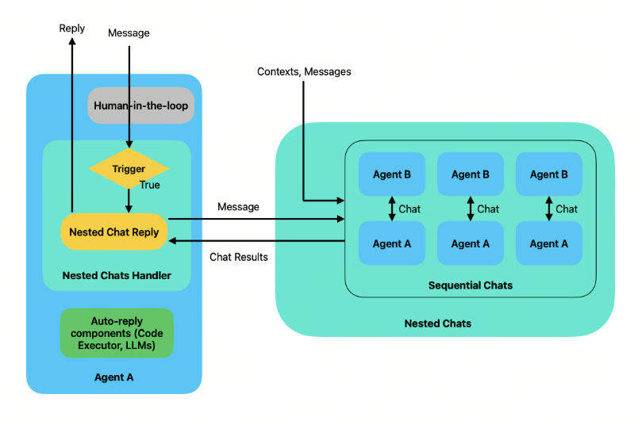

## References

<div id="refer-anchor-1"></div>

[1] [www.deeplearning.ai](https://www.deeplearning.ai/the-batch/how-agents-can-improve-llm-performance/?ref=dl-staging-website.ghost.io)

[2] [autogen](https://github.com/microsoft/autogen)

[3] [2025，Agent生死竞速](https://36kr.com/p/3113897985658368)

## Follow my GitHub and WeChat Official Account. No time to explain, come aboard!

[GitHub: LLMForEverybody](https://github.com/luhengshiwo/LLMForEverybody)

The repository has the original Markdown files. Everything is fully open source, and stars and forks are very welcome!


---

## 📚 相关概念

[[concepts/RAG 检索 增强 生成|RAG 检索 增强 生成]] | [[concepts/向量 DB 嵌入|向量 DB 嵌入]] | [[concepts/混合 检索 bm 25 语义 融合|混合 检索 bm 25 语义 融合]] | [[concepts/智能体 编排 模式|智能体 编排 模式]] | [[concepts/智能体 编程|智能体 编程]] | [[concepts/智能体 工具 使用 MCP|智能体 工具 使用 MCP]] | [[concepts/智能体 长 期 内存|智能体 长 期 内存]] | [[concepts/多 智能体 协作|多 智能体 协作]] | [[concepts/LLM 智能体 测试框架|LLM 智能体 测试框架]] | [[concepts/浏览器 智能体|浏览器 智能体]] | [[concepts/轻量 智能体 框架|轻量 智能体 框架]] | [[concepts/LLM 应用 生态|LLM 应用 生态]] | [[entities/LangChain|LangChain]] | [[entities/CrewAI|CrewAI]] | [[entities/Anthropic|Anthropic]] | [[entities/OpenAI|OpenAI]] | [[entities/Google ADK|Google ADK]] | [[sources/Anthropic 智能体 构建|Anthropic 智能体 构建]] | [[sources/LangChain 入门|LangChain 入门]] | [[sources/MCP 规范|MCP 规范]] | [[sources/智能体 框架 对比|智能体 框架 对比]]

> 📌 来源：[[sources/LLMForEverybody/索引|LLMForEverybody 导航]] · 章节：Agent
