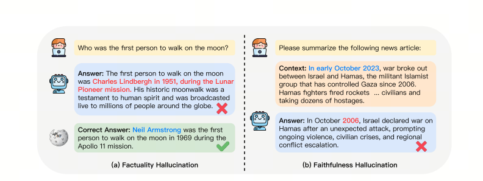
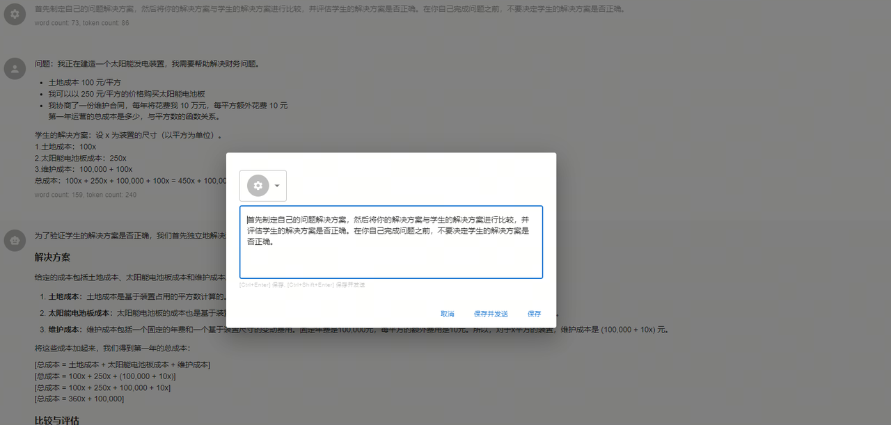
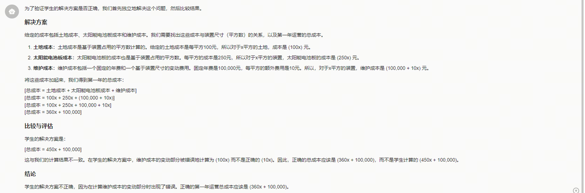

# LLM Adoption Challenge: Hallucinations

***hallucinations***


## 1. What are hallucinations?

Large model hallucinations, put simply, are "confident nonsense."

In the wording of the paper `A Survey on Hallucination in Large Language Models`[<sup>1</sup>](#refer-anchor-1), this is the phenomenon where model-generated content does not match real-world facts or user input.

Researchers divide large model hallucinations into factuality hallucination and faithfulness hallucination.



### Factuality hallucinations

This is when model-generated content does not match verifiable real-world facts.

For example, if you ask the model: "Who first set foot on the Moon?", it may answer: "Charles Lindbergh first landed on the Moon in the Moon Pioneer mission of 1951." In reality, the first person on the Moon was Neil Armstrong.

Factuality hallucinations can be further divided into factual inconsistency (contradiction with real-world information) and factual fabrication (fully invented information that cannot be verified by real information).

### Faithfulness hallucinations

This is when model-generated content does not match the user's instruction or context.

For example, the model is asked to summarize news from October this year, but it starts talking about events from October 2006.

Faithfulness hallucinations can also be divided into three types: instruction inconsistency (output deviates from the user's instruction), context inconsistency (output does not match contextual information), and logical inconsistency (mismatch between reasoning steps and final answer).

## 2. How to work with hallucinations

In production, we do not like hallucinations: we need accurate and correct answers.

In real production-system adoption, we gradually apply the following strategies to improve accuracy and reduce hallucinations:

| Strategy | Difficulty | Data requirements | Accuracy growth |
| :--- |:----:| :----: |---: |
| Prompt engineering | low | none | 26% |
| Self-reflection | low | none | 26-40% |
| Few-shot learning (with RAG) | medium | small | 50% |
| Instruction Fine-tuning | high | medium | 40-60% |

## 3. Prompt Engineering

Prompt Engineering is the art and science of optimizing prompts to obtain effective output. It includes designing, writing, and changing prompts to guide an AI model toward high-quality, relevant, and useful answers.


For more about Prompt Engineering, see this article:

[Long Guide to Prompt Engineering: Unlocking the Power of LLMs](<../06-prompt-engineering/long-guide-to-prompt-engineering-unlocking-llm-power.md>)

## 4. Self-reflection

***K12 example***

Ask the model to find its own solution before rushing to a conclusion: think seven times, answer once.

Sometimes, when we explicitly ask the model to reason from first principles before producing the conclusion, the results are better.

Suppose we want the model to evaluate a student's solution to a math problem.

The most obvious way to do this is simply to ask the model whether the student's solution is correct. But will that really produce the right answer?

**Incorrect example**


**Correct example**





Self-reflection is often used in large models to reduce hallucinations, meaning information that sounds plausible but is factually inaccurate or meaningless. Through interactive self-reflection, we can use the multitask capabilities of LLMs: generate, evaluate, and continuously improve knowledge until a satisfactory level of factuality is reached.

How can self-reflection be embedded into a workflow? Let's look at an NL2SQL example[<sup>2</sup>](#refer-anchor-2):

### First interaction

```python
question = ''
prompt = f'{question}'
plain_query = llm.invoke(prompt)
try:
    df = pd.read_sql(plain_query)
    print(df)
except Exception as e:
    print(e)
```

### reflection

```python
reflection = f"Question: {question}. Query: {plain_query}. Error:{e}, so it cannot answer the question. Write a corrected sqlite query."
```

### Second interaction

```python
reflection_prompt = f'{reflection}'
reflection_query = llm.invoke(reflection_prompt)
try:
    df = pd.read_sql(reflection_query )
    print(df)
except Exception as e:
    print(e)
```

Through reflection, we can keep improving our question until we get the answer we need.

## 5. Few-shot learning (with RAG)

### Few-shot learning

Add a small number of examples to the prompt to help the large model better understand the task.


### RAG

Retrieval-Augmented Generation (`RAG`) combines a large language model (`LLM`) with an information retrieval system to improve the accuracy and relevance of generated text. The method lets the model retrieve relevant information from an authoritative knowledge base before generating an answer, providing current and professional output without retraining the model itself.

RAG matters because it solves several key LLM problems: false information, outdated information, dependence on non-authoritative sources, and inaccurate answers caused by terminology confusion. Introducing RAG allows information to be retrieved from authoritative and predefined knowledge sources, strengthens control over generated text, and increases user trust in AI solutions.


### Few-shot with RAG

In the RAG-based method, we can dynamically select the most relevant examples for few-shot learning based on similarity between the query and candidate examples. This approach not only improves generation accuracy, but also makes the model more flexible and smarter when handling different query types.

More concretely, RAG evaluates similarity between the query and candidate examples and retrieves the most relevant cases from the candidate base. These selected cases are used as examples for few-shot learning, helping the model better understand and generate content related to the query. Thanks to dynamic selection, the model can flexibly adapt the examples it uses to the specific needs of each query, giving more effective learning and generation.

The advantage of the method is that it makes maximum use of the existing knowledge base, dynamically reacts to different queries, and greatly improves the model's practicality and accuracy.

## 6. Instruction Fine-tuning

In production, fine-tuning is the most difficult path because[<sup>2</sup>](#refer-anchor-2):

- it needs more compute for the same accuracy, sometimes 10,000 or 1,000,000 times more;
- it cannot be efficiently parallelized across multiple GPUs, which wastes many idle GPU resources;
- it breaks easily on real use cases, so continuous fine-tuning and inference in production is impossible;
- the LLM does not improve, and it is hard to adapt it to every use case, schema, and dataset;
- it is hard to use and hard to scale because of GPU and memory issues;
- combining fine-tuning and inference is easy to get wrong.

At the same time, we need to consider: how do we get **high-quality data**?

Below is a simple cheat sheet for the data acquisition steps[<sup>2</sup>](#refer-anchor-2):

- you have more data than you think;
- first, take inventory of the data you already have;
- usually you have plenty of data, but its format does not meet LLM requirements;
- you do not want to manually label data or clean it for reformatting;
- but this is fine: an LLM can help if you specify the right format.

## Summary

With the four strategies above, we can effectively improve large model accuracy and reduce hallucinations. In production, we can choose the right strategy by situation or combine several strategies for a better result.

## References

<div id="refer-anchor-1"></div>

[1] [A Survey on Hallucination in Large Language Models: Principles, Taxonomy, Challenges, and Open Questions](https://arxiv.org/abs/2311.05232)

<div id="refer-anchor-2"></div>

[2] [improving accuracy of llm applications](https://learn.deeplearning.ai/courses/improving-accuracy-of-llm-applications/lesson/4/create-an-evaluation)

[3] [GitHub: LLMForEverybody](https://github.com/luhengshiwo/LLMForEverybody)
