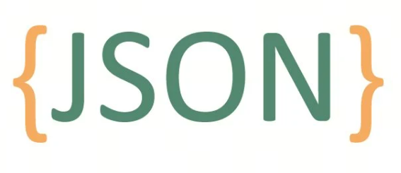

# LLM Adoption Challenge: Structured Output

## Applications first

At the 2023 World Artificial Intelligence Conference (`WAIC`), the key theme was the "battle of a hundred models"; this year, WAIC's keyword is "applications first." If you look at this year's hot forum topics, whether embodied intelligence or AI Agent, they all point toward vertical applications of AI technologies led by large models in different scenarios.

If we look at model **output**, large model applications have two paradigms:

***Output as unstructured data***: QA bots, intelligent customer support, or upstream input for another large model belong to this paradigm. The technical architecture is domain LLM + RAG, and there are no output format requirements.

***Output as structured data***: when a large model needs to be embedded into a workflow, especially an existing workflow, the model has to interact with existing workflow components. In this situation, we expect structured output from the large model, such as JSON.

## How to output JSON

You need to tell the large model in the prompt. A concrete prompt looks like this:

>Wrap the output in json tags.
 The output should be formatted as a JSON instance that conforms to the JSON schema below.
As an example, for the schema {"properties": {"foo": {"title": "Foo", "description": "a list of strings", "type": "array", "items": {"type": "string"}}}, "required": ["foo"]}
the object {"foo": ["bar", "baz"]} is a well-formatted instance of the schema. The object {"properties": {"foo": ["bar", "baz"]}} is not well-formatted.
Here is the output schema:

## JSON output in OpenAI

At last year's DevDay, OpenAI introduced JSON Schema, a tool created for developers to help them build more reliable applications. Although JSON Schema improves the accuracy of generating valid JSON output, it does not guarantee that the response fully matches a specific schema. To overcome this limitation, OpenAI later released structured outputs in the API, which guarantee exact compliance with the JSON Schema provided by the developer.

Converting unstructured input into structured data is one of the key uses of large models (`LLMs`). Developers use the OpenAI API to build powerful intelligent assistants: through function calling, they can obtain data, answer questions, extract structured data for data entry, and build multi-step agent workflows, allowing LLMs to perform real tasks.

Previously, developers handled the limits of LLMs in generating structured data through open source tools, carefully written prompts, and many trial requests, so the model output could connect smoothly with their systems.

Now structured outputs solve these problems: they force the model to follow the developer-specified schema and additionally train the model to better understand complex schemas.

## Corner/Edge Case

### Why edge cases matter

Considering edge cases is key to system reliability. In tasks like LeetCode, completeness separates a good solution from an ordinary one. Likewise, when integrating a large model into a workflow, all possible exceptions need to be anticipated and handled in advance.

### The probabilistic nature of large models

Even if a large model reaches 99.99% accuracy, probability theory says that as the number of runs grows, even a tiny failure probability will eventually cause a failure. Over ten thousand runs, at least one failure is almost inevitable.

### Expectations for large model output

In our scenario, we rely on the large model to output data matching a predefined JSON Schema. Any unexpected result may interrupt the workflow and affect the stability and efficiency of the whole system.

### Error types

Error types can vary. Mainly, pay attention to these cases:

- JSON validity: an invalid JSON structure may cause a parsing error and affect later data processing.

- JSON nesting levels: the large model may sometimes add or remove a nesting level without explicit instruction, breaking the expected data structure.

- JSON key problems: a result key may not match the agreement, or when a value is missing, the corresponding key may unexpectedly disappear too.

- JSON key-value matching errors: when keys are similar, a key-value mismatch can happen, meaning a value is incorrectly associated with the wrong key.

### Solution

All of these situations can break the workflow. So a good method is to perform reflection before returning the result, and a more reliable method is to add validation.

- reflection: before model output, reflection can check the output structure and make sure it matches the expected JSON Schema. This method fits scenarios without strict latency requirements.

- hard code validation: after model output, validation can check the output structure and make sure it matches the expected JSON Schema. This method fits scenarios with stricter latency requirements.

## Follow my GitHub and WeChat Official Account. No time to explain, come aboard!

[GitHub: LLMForEverybody](https://github.com/luhengshiwo/LLMForEverybody)

The repository has the original Markdown files. Everything is fully open source, and stars and forks are very welcome!
