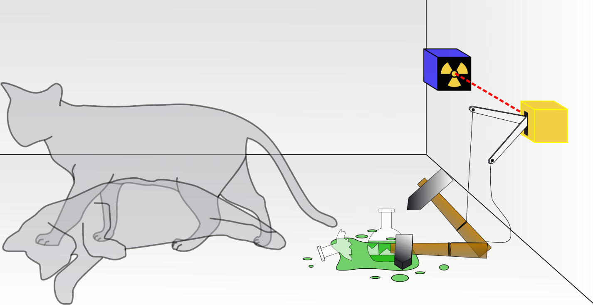
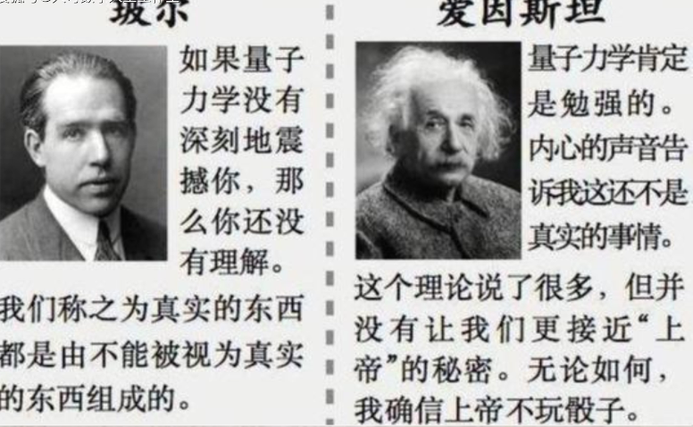
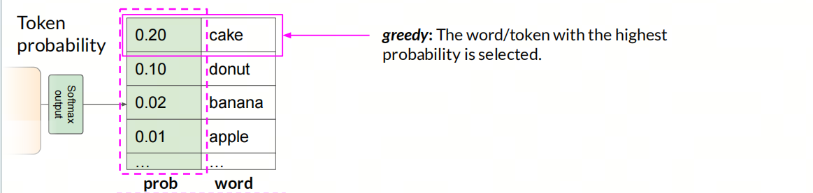
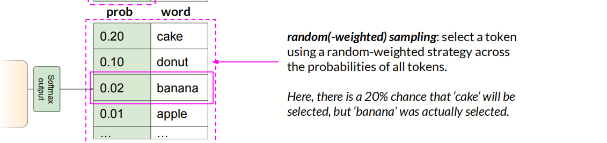
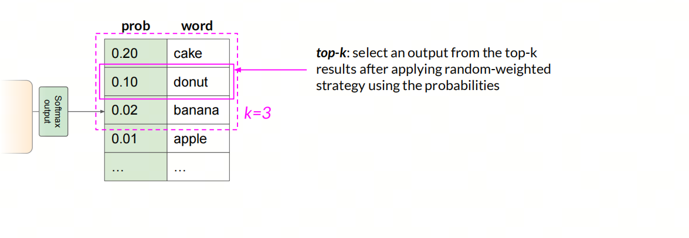
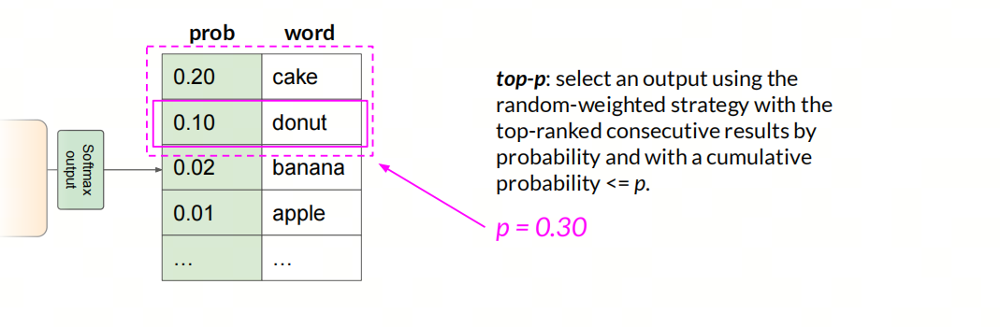

# LLM Adoption Challenge: Output Uncertainty

***Probabilistic vs. Deterministic***

***Uncertainty vs. certainty***

## Quantum mechanics: God plays dice

***Schrödinger's cat***

A cat, a glass flask with hydrogen cyanide gas, and the substance radium-225 are placed in a closed box. When the monitor inside the box detects a decayed particle, it breaks the flask and kills the cat. According to the Copenhagen interpretation of quantum mechanics, after some time in the experiment, the cat is in superposition: both alive and dead. But if the experimenter looks inside the box, they will see either a living cat or a dead one, not a cat in both states at once.

Einstein thought this was wrong and said: "I do not believe that God plays dice."

The main question in this thought experiment is: is the cat's fate already determined before the box is opened, or is it determined only at the moment of opening? Classical physics says that before the box is opened, the cat is already either alive or dead; this is basic intuition. The Copenhagen school says that until the box is opened, the cat is both alive and dead, and its fate is determined only when it is opened; this is a property of microscopic particles.

The Copenhagen school believes the fundamental error of the cat experiment is that people apply common sense from the macroscopic world to properties of the microscopic world.

***Academic conclusion***

- **Microworld**: God plays dice; in the quantum world, randomness and high probability of probabilistic behavior seem to really exist.
- **Macroworld**: God does not play dice; everything is governed by laws, and science is science.

In software development, especially after large models enter workflows, there is also a difference between deterministic and probabilistic.

## Traditional software development: Deterministic

> Note: here we are not considering software with intentionally random output, such as a random number generator.

In the data flow of software development, we usually encounter three types of problems: white hole, black hole, and gray hole. If these three types of problems are solved, the data flow works. But the hidden premise is that a certain input gives a certain output, and software should guarantee **idempotence**: no matter how many times the same input is given, the output should be the same. In real development, lack of **idempotence** means that the input was actually different each time, but you thought it was the same.

For a specific input, software output is determined. This is deterministic.

- White hole: no input, but output exists
- Black hole: input exists, but output does not
- Gray hole: input is insufficient to produce output

## Large model application development: Probabilistic

Large model token generation is probabilistic by nature. Even with fully identical input, the output may differ.

**Greedy**

Large models **do not use** this strategy!

Choosing the word/token with the highest probability is called a greedy algorithm. But a greedy algorithm leads to repeated output, because it chooses only the most probable word and does not consider the probability of other words.

**Sampling**

Large models **use** this strategy!

The random strategy chooses one token from the probability distribution of all tokens. Here the probability of choosing "cake" is 20%, but the actual chosen token is "banana."

***Top-k***

After applying the random strategy, one token is selected from the top k results.

***Top-p***

The random strategy chooses output from a continuous candidate set sorted by probability from high to low, where cumulative probability <= p.

## Bitter Lessons

Uncertainty is a double-edged tool.

On one hand, generation becomes more diverse and to some extent improves output quality: the text becomes richer, more varied, and more interesting.

On the other hand, when strict output such as JSON, SQL, or code is expected, this uncertainty is sometimes unacceptable.

Large model uncertainty is determined by model properties, not implementation bugs. When developing LLM applications, everyone involved in the full process should account for this uncertainty in advance, so edge cases can be handled better.

> FAQ: what type does older machine learning/deep learning belong to?

> In general, their output uses Greedy strategy: the option with maximum probability is selected. For a certain input, there is a certain output. If two outputs differ, then the input at the model level was also different.

## References

[1] [GitHub: LLMForEverybody](https://github.com/luhengshiwo/LLMForEverybody)

[2] [deeplearning.ai](https://www.deeplearning.ai/)
