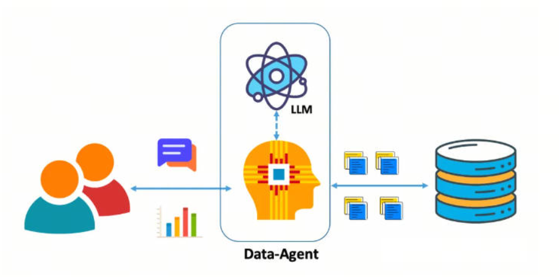
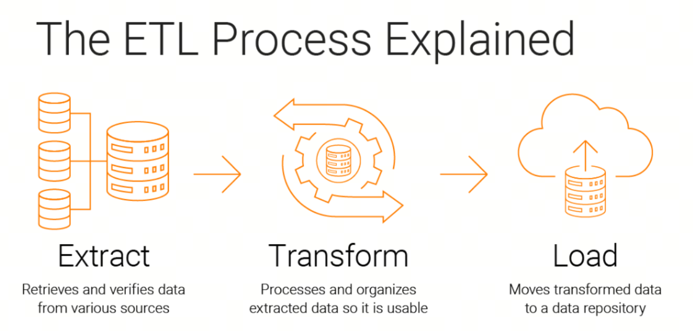
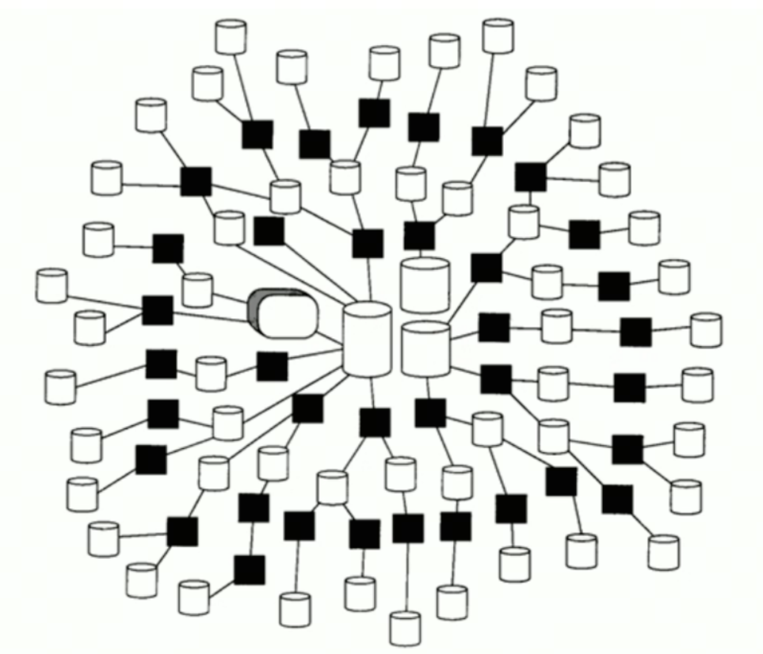
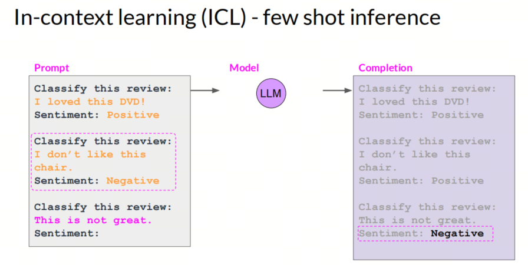
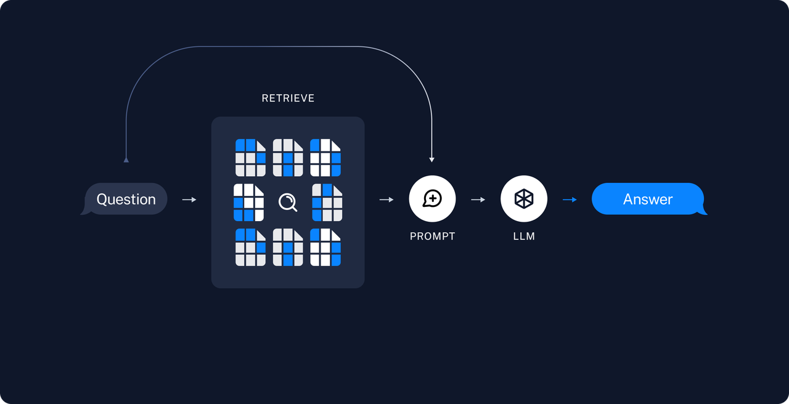

# The End of CRUD/ETL Engineers? From NL2SQL to ChatBI

## 1. Introduction

A few days ago, over dinner with a friend, we discussed his new job: mostly, he writes SQL. So we continued talking about whether AIGC (AI-generated content) can free up his productivity.

In Q2 2024, news about ChatBI adoption by large internet companies started to appear gradually. For example, Alibaba Cloud and FAW jointly implemented a ChatBI reporting system; Volcano Engine released DataWind ChatBI in Feishu, supporting ChatBI capabilities over specified datasets.

What problems can appear when implementing ChatBI, and how can they be solved?



## 2. Terms

Let's quickly go through a few terms. People who already know them can skip this section.

***CRUD***

Create, Delete, Read or query, and Update are a common set of operations in programming languages. Usually, these operations are performed on a specific resource, such as creating data, reading data, and so on.


***ETL***

ETL (`Extract, Transform, Load`) is a data integration technology used to extract data from different sources, clean it, transform and combine it, then load it into a unified store, such as a data warehouse or data lake, to make later analysis and decision support easier.

***NL2SQL***

NL2SQL (`Natural Language to SQL`) is a technology for converting natural-language queries into SQL queries. Its goal is to let users interact with a database in natural language, improving data access efficiency.

***ChatBI***

ChatBI (`Chat Business Intelligence`) is a new type of business intelligence tool. With natural language processing (`NLP`), it lets users interact with a data analysis system conversationally and quickly obtain insights and analysis results. The advantage is that it improves data analysis efficiency and lowers the barrier to entry: even users without a technical background can explore data and get analytical conclusions easily.

Compared with traditional BI tools, ChatBI offers a more natural and intuitive interaction method: the user does not need to learn complex data operations, and everything feels as simple as talking with a friend.



## 3. Challenge one: complex data structures

Data structures in enterprise information systems are much more complex than a few simple Excel files. A large enterprise application may contain hundreds or thousands of data entities.

Current large model capabilities are not enough to handle this many data entities, so in practical ChatBI adoption there are two directions:



***Supporters of large models***

This approach is mainly promoted by large model vendors. Leading players collect large amounts of data and try to handle enterprise complexity by improving the capabilities of large models.


***Supporters of wide tables***

This approach is mainly chosen by small and medium BI vendors. Existing BI companies usually use commercial or open source large models and do not have the resources to improve model capability. So they invest human labor into customizing enterprise multi-table data and turning it into wide tables. In production adoption, this often turns out to be very useful.


## 4. Challenge two: hallucination in large models

Put simply, hallucination in a large model is "talking nonsense."

In the paper "A Survey on Hallucination in Large Language Models"[<sup>1</sup>](#refer-anchor-1), it is defined as the phenomenon where model-generated content does not match real-world facts or user input.

Researchers divide hallucinations in large models into factuality hallucination and faithfulness hallucination.


### Factuality hallucination

This is when content generated by the model does not match verifiable real-world facts.

For example, if you ask the model: "Who was the first person to set foot on the Moon?", the model may answer: "Charles Lindbergh first landed on the Moon during the Moon Pioneer mission in 1951." In reality, the first person on the Moon was Neil Armstrong.

Factuality hallucination can also be split into factual inconsistency (contradicting real-world information) and factual fabrication (something simply does not exist and cannot be verified through real information).

### Faithfulness hallucination

This is when content generated by the model does not match the user's instructions or the context.

For example, if you ask the model to briefly summarize news from October this year, and it starts talking about events from October 2006.

Faithfulness hallucination can also be broken down into instruction inconsistency (the output deviates from the user's instruction), context inconsistency (the output does not match contextual information), and logical inconsistency (a mismatch between reasoning steps and final answer).

## 5. Handling hallucination

In production, we do not like hallucinations: we need accurate and correct answers.

In real production adoption, we gradually apply the following strategies to improve accuracy and reduce hallucination:

| Strategy | Difficulty| Data requirements|Accuracy growth|
| :--- |:----:| :----: |---: |
| Prompt engineering|low|none| 26% |
| Self-reflection |low| none|26-40% |
| Few-shot learning (with RAG)|medium|small amount|50% |
| Instruction Fine-tuning |high|medium amount|40-60%|

## 6. Prompt Engineering

Prompt Engineering is the art and science of optimizing prompts to obtain effective output. It includes designing, writing, and changing prompts to guide an AI model toward high-quality, relevant, and useful answers.


## 7. Self-reflection

Self-reflection is often used in large models to reduce hallucination, meaning cases where the model generates information that sounds plausible but is actually inaccurate or meaningless. Through an interactive Self-reflection method, we can use the multitask capabilities of LLMs to generate, evaluate, and continuously improve knowledge until a satisfactory level of factual accuracy is reached.

How can Self-reflection be embedded into a workflow? Let's look at an NL2SQL example[<sup>2</sup>](#refer-anchor-2):

### First interaction

```python
question = ''
prompt = f'{question}'
plain_query = llm.invoke(prompt)
try:
    df = pd.read_sql(plain_query)
    print(df)
except Exception as e:
    print(e)
```

### reflection

```python
reflection = f"Question: {question}. Query: {plain_query}. Error:{e}, so it cannot answer the question. Write a corrected sqlite query."
```

### Second interaction

```python
reflection_prompt = f'{reflection}'
reflection_query = llm.invoke(reflection_prompt)
try:
    df = pd.read_sql(reflection_query )
    print(df)
except Exception as e:
    print(e)
```

With reflection, we can keep improving our question until we get the answer we need.

## 8. Few-shot learning (with RAG)

### Few-shot learning

The prompt gives a small number of examples to help the large model better understand the task.



### RAG

Retrieval-Augmented Generation, or RAG, improves the accuracy and relevance of generated text by combining a large language model (`LLM`) with an information retrieval system. This method lets the model first retrieve relevant information from an authoritative knowledge base before generating an answer, ensuring current and professional output without retraining the model itself.

RAG matters because it solves some key LLM problems: producing false information, generating outdated information, dependence on non-authoritative sources, and inaccurate answers caused by terminology confusion. With RAG, information can be retrieved from authoritative and predefined knowledge sources, strengthening control over generated text and increasing user trust in AI solutions.



### Few-shot with RAG

In the RAG-based method, we can dynamically choose the most relevant cases as examples for few-shot learning, based on similarity between the query and candidate examples. This approach not only improves model generation accuracy, but also makes the model more flexible and intelligent when handling different types of requests.

More specifically, RAG evaluates similarity between the query and candidate examples, then retrieves the most relevant cases from the candidate example library. These selected cases are used as examples for few-shot learning and help the model better understand and generate content related to the query. With this dynamic selection, the model can flexibly adjust the examples it uses to the specific needs of each request, achieving more effective learning and generation.

The advantage of this method is that it fully uses the existing knowledge base, dynamically reacts to different requests, and significantly improves practical usefulness and accuracy.

Few-shot examples:

```python
examples = [
    {"input": "List all artists.", "query": "SELECT * FROM Artist;"},
    {
        "input": "Find all albums for the artist 'AC/DC'.",
        "query": "SELECT * FROM Album WHERE ArtistId = (SELECT ArtistId FROM Artist WHERE Name = 'AC/DC');",
    },
    {
        "input": "List all tracks in the 'Rock' genre.",
        "query": "SELECT * FROM Track WHERE GenreId = (SELECT GenreId FROM Genre WHERE Name = 'Rock');",
    },
    {
        "input": "Find the total duration of all tracks.",
        "query": "SELECT SUM(Milliseconds) FROM Track;",
    },
    {
        "input": "List all customers from Canada.",
        "query": "SELECT * FROM Customer WHERE Country = 'Canada';",
    },
    {
        "input": "How many tracks are there in the album with ID 5?",
        "query": "SELECT COUNT(*) FROM Track WHERE AlbumId = 5;",
    },
    {
        "input": "Find the total number of invoices.",
        "query": "SELECT COUNT(*) FROM Invoice;",
    },
    {
        "input": "List all tracks that are longer than 5 minutes.",
        "query": "SELECT * FROM Track WHERE Milliseconds > 300000;",
    },
    {
        "input": "Who are the top 5 customers by total purchase?",
        "query": "SELECT CustomerId, SUM(Total) AS TotalPurchase FROM Invoice GROUP BY CustomerId ORDER BY TotalPurchase DESC LIMIT 5;",
    },
    {
        "input": "Which albums are from the year 2000?",
        "query": "SELECT * FROM Album WHERE strftime('%Y', ReleaseDate) = '2000';",
    },
    {
        "input": "How many employees are there",
        "query": 'SELECT COUNT(*) FROM "Employee"',
    },
]
```

Dynamic selection of the most relevant cases:

```python
prompt = FewShotPromptTemplate(
    example_selector=example_selector,
    example_prompt=example_prompt,
    prefix='''You are a SQLite expert. Given an input question, create a syntactically correct SQLite query to run.
              Unless otherwise specificed, do not return more than {top_k} rows.\n\n
              Here is the relevant table info: {table_info}\n\nBelow are a number of examples of questions and their corresponding SQL queries.''',
    suffix="User input: {input}\nSQL query: ",
    input_variables=["input", "top_k", "table_info"],
)
```

Few-shot with RAG:

```python
chain = create_sql_query_chain(llm, db, prompt)
chain.invoke({"question": "how many artists are there?"})
```

## 9. Instruction Fine-tuning

In production, fine-tuning is the most difficult option because[<sup>2</sup>](#refer-anchor-2):

- reaching the same accuracy requires more compute, sometimes 10,000 or 1,000,000 times more;
- it cannot be efficiently parallelized across multiple GPUs, wasting a large amount of idle GPU compute resources;
- it breaks easily in real scenarios, so continuous fine-tuning and inference in production is impossible;
- the LLM does not improve, and it is hard to adapt it to every individual scenario, schema, and dataset;
- it is hard to use and scales poorly (GPU and memory problems);
- combining fine-tuning with inference is easy to get wrong.

At the same time, we need to consider: how do we get **high-quality data**?

Below is a simple cheat sheet showing the steps for obtaining data[<sup>2</sup>](#refer-anchor-2):

- you have more data than you think;
- first, take inventory of the data you already have;
- usually you have plenty of data, but its format does not match LLM requirements;
- you do not want to manually label data or clean it for reformatting;
- but this is not a problem: an LLM can help. You only need to specify the right format.

## Summary

With the four strategies above, we can effectively improve ChatBI accuracy and reduce hallucination. In real production, we can choose the suitable strategy depending on the situation, or combine several strategies to get a better result.

## References

<div id="refer-anchor-1"></div>

[1] [A Survey on Hallucination in Large Language Models: Principles, Taxonomy, Challenges, and Open Questions](https://arxiv.org/abs/2311.05232)

<div id="refer-anchor-2"></div>

[2] [improving accuracy of llm applications](https://learn.deeplearning.ai/courses/improving-accuracy-of-llm-applications/lesson/4/create-an-evaluation)

[1] [GitHub: LLMForEverybody](https://github.com/luhengshiwo/LLMForEverybody)


---

## 📚 相关概念

[[concepts/AI 安全 对齐|AI 安全 对齐]] | [[concepts/LLM 应用 生态|LLM 应用 生态]]

> 📌 来源：[[sources/LLMForEverybody/索引|LLMForEverybody 导航]] · 章节：企业落地
