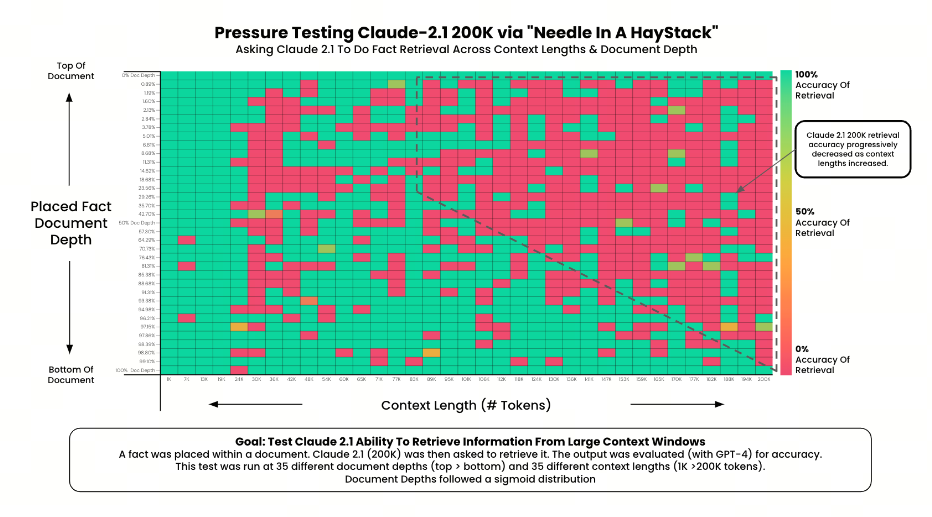

# LLM Evaluation: Needle in a Haystack

## 1. Introduction

Large models compete on context length, or `context length`. But how do they perform when processing long text? And how should that be evaluated?

One [extreme test](https://github.com/gkamradt/LLMTest_NeedleInAHaystack/tree/main) by gkamradt showed that most people use models incorrectly and do not unlock the AI power inside them.

Can AI really find a specific key fact among hundreds of thousands of words? The redder the color, the more mistakes the AI makes.



gkamradt called this test NeedleInAHaystack, literally "needle in a haystack." In Chinese it is rendered as `大海捞针`, meaning "searching for a needle in the sea." In Russian, the closest expression is "searching for a needle in a haystack." This is a method for evaluating large model performance on long text.

In short: key information, the "needle", is hidden inside a long Prompt, the "haystack/sea", and then the large model is asked through a question to find that key information.

Because this test really reflects large model capabilities, it has gradually become a standard evaluation method.

## 2. Briefly about Needle in a Haystack

Kamradt placed the hidden phrase, the "needle", into 15 different positions in the text corpus, the "haystack", from beginning to end. Then he ran 225 experiments (15x15) across 15 evenly distributed corpus lengths from 1K to 128K (200K).

Briefly about Greg Kamradt's "Needle in a Haystack" experiment:

**Haystack**

```Plain Text
218 blog posts by YC founder Paul Graham
```

**Needle**

```Plain Text
The best thing to do in San Francisco is eat a sandwich and sit in Dolores Park on a sunny day.
The best thing to do in San Francisco is eat a sandwich while sitting in Dolores Park on a sunny day.
```

**Question**

```Plain Text
What is the most fun thing to do in San Francisco based on my context? Don't give information outside the document
```

**Expected answer**

```Plain Text
The best thing to do in San Francisco is eat a sandwich and sit in Dolores Park on a sunny day.
```

## 3. Other Needle in a Haystack methods (OpenCompass)

- Single-Needle Retrieval Task (`S-RT`): evaluates an LLM's ability to extract one key piece of information from long text and checks the accuracy of recovering specific details from a broad narrative. This matches the original Needle in a Haystack setup.

- Multi-Needle Retrieval Task (`M-RT`): studies an LLM's ability to extract several related pieces of information from long text, simulating complex queries over compound documents in real scenarios.

- Multi-Needle Reasoning Task (`M-RS`): evaluates long-context LLM capabilities through extracting and using several key pieces of information from long text. The model must comprehensively understand each key information fragment.

- Ancestral Trace Challenge (`ATC`): uses "kinship needles" to test whether an LLM can handle multi-level logical challenges in real long text. ATC uses a series of logical reasoning tasks to check the model's memory and analysis of every detail in long text. This task removes the irrelevant text setup (`Haystack`): the whole text is designed as key information, and the LLM must comprehensively use all long-text content and reasoning to answer accurately.

Next, let's look at the ***Counting Stars*** evaluation scheme.

## References

<div id="refer-anchor-1"></div>

[1] [大海捞针(Needle In A Haystack)实验评估](https://opencompass.readthedocs.io/zh-cn/latest/advanced_guides/needleinahaystack_eval.html)

[2] [AI大模型测评报告：“长文本”和“捞针”成大模型痛点](https://finance.eastmoney.com/a/202407033120965459.html)

## Follow my GitHub and WeChat Official Account. No time to explain, come aboard!

[GitHub: LLMForEverybody](https://github.com/luhengshiwo/LLMForEverybody)

The repository has the original Markdown files. Everything is fully open source, and stars and forks are very welcome!


---

## 📚 相关概念

[[concepts/LLM 评估 基准|LLM 评估 基准]] | [[concepts/智能体 评估 基准|智能体 评估 基准]]

> 📌 来源：[[sources/LLMForEverybody/索引|LLMForEverybody 导航]] · 章节：评估指标
