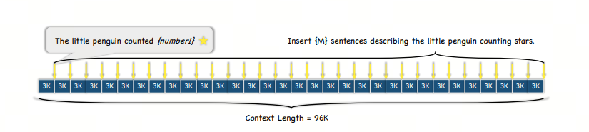
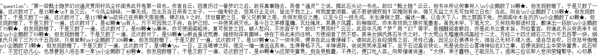
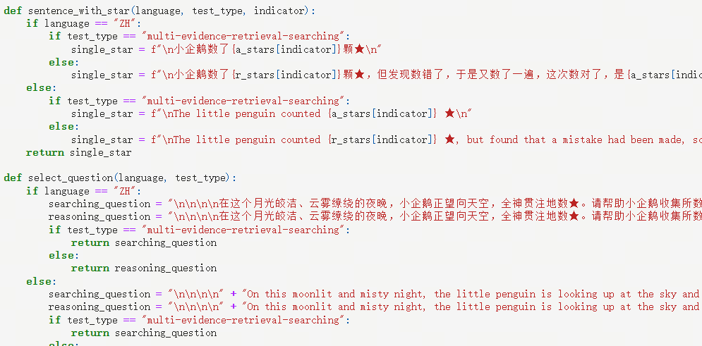

# LLM Evaluation: Counting Stars

## 1. Introduction

NeedleInAHaystack has already become a basic method for evaluating long-context capabilities in large models. The MLPD lab from the "goose factory" came up with a more amusing test: evaluate long-context capabilities by watching a little penguin count stars.

> "Goose factory" means Tencent: a little penguin counts stars. Interesting, if this were DAMO Academy, would it be a honey badger counting cobras?

## 2. Briefly about Counting Stars

In one study, to evaluate language models' ability to handle long texts and long-distance dependencies, researchers designed a test where text length gradually increases until the maximum length reaches 128,000 characters.

In the experiment, researchers used the Chinese classic novel `Dream of the Red Chamber` as the base text and randomly inserted sentences in a specific format: "the little penguin counted x stars", where x is a changing number.

Researchers divided the whole text into N parts and inserted M sentences of that format into these parts.

Then the model's task is to recognize and extract all sentences with numbers and output these numbers in JSON format, with the output containing only the numbers.

After output is complete, researchers compare the numbers recognized by the model with the numbers actually inserted into the text (`Ground Truth`) to calculate model accuracy.

Compared with the traditional Needle in a Haystack test, Counting Stars measures model performance on long texts and long-distance dependencies more precisely. This method gives a deeper understanding of the model's potential in processing complex information and performing detailed tasks.

## Comparison with Needle in a Haystack

In Needle in a Haystack, inserting several "needles" means inserting several clues, after which the large model needs to find them, connect them through reasoning, and get the final answer.

But in a real "multi-needle in a haystack" test, the model does not necessarily need to find all the "needles" to answer the question correctly. Sometimes finding only the last one is enough.

Counting Stars is different: the number of "stars" in each sentence differs, and the model must find all stars to answer correctly.

## References

[1] [Counting-Stars (★): A Multi-evidence, Position-aware, and Scalable Benchmark for Evaluating Long-Context Large Language Models](https://arxiv.org/pdf/2403.11802)

[2] [github：Counting-Stars](https://github.com/nick7nlp/Counting-Stars)

[3] [“大海捞针”out，“数星星”成测长文本能力更精准方法，来自鹅厂](https://36kr.com/p/2715593542842245)

## Follow my GitHub and WeChat Official Account. No time to explain, come aboard!

[GitHub: LLMForEverybody](https://github.com/luhengshiwo/LLMForEverybody)

The repository has the original Markdown files. Everything is fully open source, and stars and forks are very welcome!
