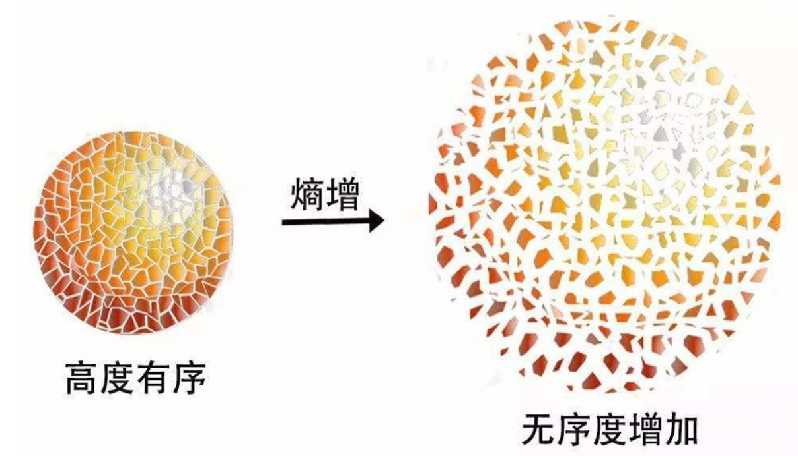
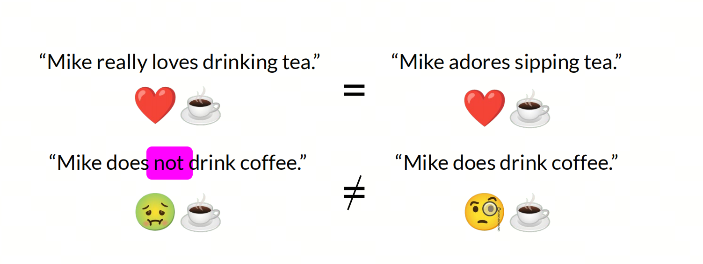
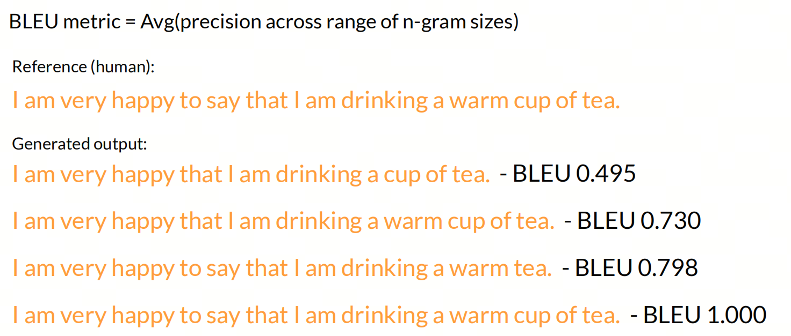
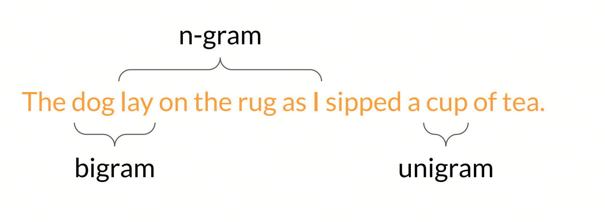
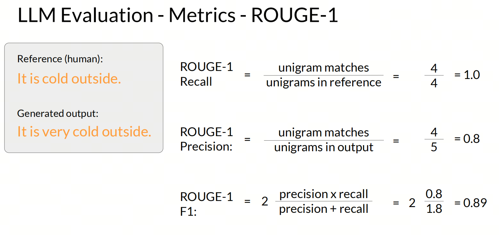
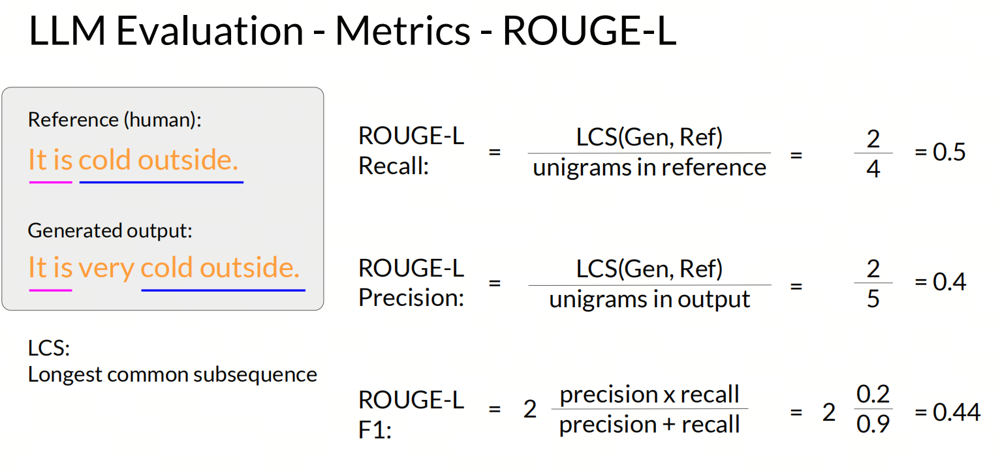
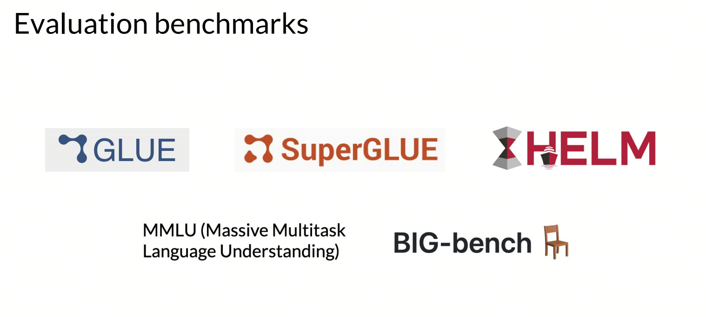
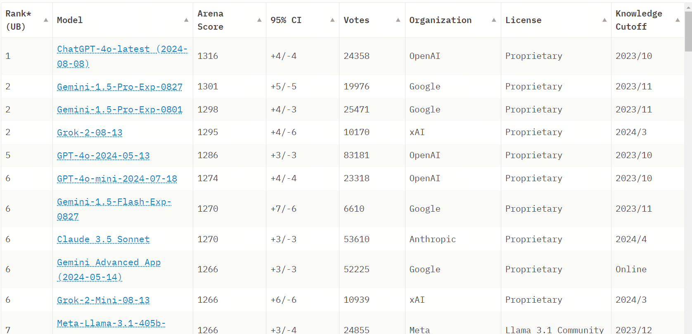

# What Evaluation Metrics Do LLMs Have?

## 1. Introduction

You may have heard that large model A is better than large model B, but do you know how to evaluate such models? In the field of large models, many metrics help evaluate model performance. These metrics let us understand model accuracy, efficiency, and interpretability. In this article, we look at several commonly used metrics and how to apply them to evaluate model performance.

- When training a large model, we need an objective function (loss function) to guide gradient descent.
- After training, we use metrics such as BLEU or ROUGE to evaluate model performance.
- Before official release, we use different Benchmarks to evaluate model performance, such as GLUE, SuperGLUE, SQuAD, CoLA, and so on.
- Finally, we compare the model with other models in Arena to determine its performance.

Below, we look at LLM evaluation metrics from these four sides.

## 2. Cross Entropy

### Entropy

Entropy is a very important concept in physics and information theory. It originally came from the second law of thermodynamics and is used to describe the degree of disorder in a system or the uniformity of energy distribution. In different scientific fields, Entropy has different meanings and applications:

- Entropy in thermodynamics: in thermodynamics, Entropy is a state function that reflects the randomness of energy distribution in a system. Increasing Entropy usually means the system becomes more disordered. The second law of thermodynamics states that Entropy in a closed system always tends to increase until the system reaches thermodynamic equilibrium.

- Entropy in information theory: Claude Shannon introduced Entropy into information theory and defined it as a measure of information uncertainty. In information theory, Entropy is used to quantify the expected value of information: the higher the Entropy of an information source, the less certain the information it contains and the higher the uncertainty of the information content.

- Entropy in statistics and probability theory: in statistics and probability theory, Entropy can be seen as a measure of uncertainty in a random variable. If all possible outcomes of a random variable are equally likely, its Entropy reaches the maximum value.

The mathematical definition of Entropy usually looks like this:

- For a discrete random variable X with probability distribution P(x), Entropy H(X) is defined as:
$H(X) = -\sum_{x} P(x)log_b P(x)$

- For a continuous random variable X with probability density function p(x), Entropy H(X) is defined as:
$H(X) = -\int p(x)log_b p(x)dx$

In these two formulas, b is the base of the logarithm. Base 2 is often used, in which case the unit of Entropy is the bit.

### Entropy in literary works

> A Tianxia Bachang example can be inserted here. Note: on Zhihu you can insert a Tianxia Bachang example; on other platforms, do not insert it.

Many literary works also have a shadow of "Entropy." For example, in Tianxia Bachang's `Underground World`, the main behind-the-scenes Boss is "Entropy." `Underground World` is another large adventure novel series by Tianxia Bachang after `Ghost Blows Out the Light`. It tells the story of an unknown protagonist who, together with an expedition team carrying a mysterious mission, goes deep into the underground world and begins a thrilling deadly journey. Tianxia Bachang is considered one of China's most imaginative writers, with strong market appeal; his stories are engaging, rich in detail, and gripping.

In the 1960s, Sima Hui and Luo Dahai became leaders of factions in the Heiwu area. Later, under the influence and advice of their friend's elder brother, Xia Tedong, they joined the guerrilla force of the Communist Party of Burma. After many years of fighting, the Burmese communist guerrilla fighters led by Sima Hui and Luo Dahai retreated to Mount Yeren and were forced to join an expedition led by Yu Feiyan. To search for a mysterious cargo hidden deep underground, they passed through many dangers and began a thrilling journey on the edge of life and death. The group entered a "ghost highway", was chased by the tropical cyclone "Futu", encountered attacks from giant pythons and blood-sucking leeches, and then fell into a huge rift in Mount Yeren. They were hired by someone, but did not know what cargo the employer was willing to search for at any cost, and unexpectedly discovered under thick fog the Golden City of Spiders, built by the king of Champa and lost for a thousand years...

### Cross Entropy

Cross Entropy is an important concept in machine learning and information theory. It is often used to measure differences between two probability distributions. In classification tasks, Cross Entropy is usually applied to evaluate the difference between model predictions and actual labels.

The Cross Entropy formula is usually written as:

$H(p, q) = -\sum_{i} p(i) \log q(i)$

>where:
p is the actual probability distribution;
q is the predicted probability distribution;
i is the class index.

In a binary classification task, the Cross Entropy loss function can be simplified to:

$H(p, q) = -[p \log q + (1 - p) \log (1 - q)]$

>where:
p is the actual label (0 or 1);
q is the probability predicted by the model.

In a multi-class classification task, the Cross Entropy loss function looks like this:

$H(p, q) = -\sum_{i=1}^{N} p_i \log q_i$

>where:
N is the number of classes.
p_i is the probability of the actual class i (usually 0 or 1).
q_i is the probability of class i predicted by the model.

### perplexity

Perplexity literally means "confusion" and is a metric for measuring language model quality. Its value range is from 1 to the size of the available vocabulary. The meaning of Perplexity is how much the model "hesitates" during next-token prediction. For example, Perplexity=81 means that when predicting the next token, the model has to choose the correct answer from 81 candidates; its degree of "confusion" is 81.

Given a test set W = w1,w2,w3,...wm

Perplexity is defined as the inverse probability of the test set, normalized by the number of words.

$$
\text{Perplexity}(S) = p(w_1, w_2, w_3, \ldots, w_m)^{-1/m} \\
= \sqrt[m]{\prod_{i=2}^{m} \frac{1}{p(w_i \mid w_1, w_2, w_3, \ldots, w_{i-1})}}
$$

The probability of the first word is p(w1), the second is p(w2), and the m-th is p(wm). PP(W) is the geometric mean of the inverse values of these probabilities.

### Another explanation of Perplexity

Suppose I have 1 red ball and 80 black balls. The probability of drawing the red ball is 1/81, which also means needing to find the correct option among 81 (the inverse value); Perplexity is 81.

The 1 red ball represents the correct word, and the 80 black balls represent the model's possibilities. The stronger the model, the better it is at discarding black balls. The strongest model is when there is only one red ball and no black balls: Perplexity is 1.

## 3. BLEU Score & ROUGE Score

In NLP, directly using traditional evaluation metrics such as precision, recall, and F1-score often cannot evaluate generative model performance well, because the output of a generative model is natural-language text. Different texts may use different expressions while carrying the same meaning. So special evaluation metrics are needed for generative models.

BLEU (`Bilingual Evaluation Understudy`) and ROUGE (`Recall-Oriented Understudy for Gisting Evaluation`) are two important metrics in natural language processing, used to evaluate machine translation and text summarization.

BLEU is an n-gram-based evaluation method that evaluates translation quality by comparing overlap between machine translation output and a set of reference translations. The core of BLEU is counting matching n-grams in the candidate and reference translations and giving them higher weight. Its advantage is simplicity and convenience: it can quickly evaluate translated text quality. But BLEU is not very sensitive to semantic similarity in translation and is easily affected by n-gram coverage.

ROUGE is a recall-based evaluation metric, mainly used to evaluate automatic summarization and machine translation quality. ROUGE evaluates generated result quality by comparing n-gram overlap between a generated summary or translation and a reference summary or translation. ROUGE includes several variants, such as ROUGE-N (n-gram-based recall), ROUGE-L (score based on longest common subsequence), and so on. ROUGE's advantage is that it considers semantic similarity more strongly, but its computational complexity is higher during evaluation, and it is quite sensitive to sentence-structure differences.

**N-gram**

N-gram is a common feature representation method in natural language processing. It splits text into continuous subsequences of length N and uses these subsequences as features. N-gram models are usually used in language modeling, text classification, machine translation, and other tasks.

One word is called a unigram, a sequence of two words is a bigram, and a sequence of several words is an n-gram.

**ROUGE-N**

ROUGE-N is calculated based on n-gram overlap, where "N" means the n-gram size, a sequence of N continuous elements (usually words).

The ROUGE-N calculation mainly focuses on recall: how many n-grams from system-generated text also appear in the reference text.

**ROUGE-L**

ROUGE-L is an evaluation method based on longest common subsequence. It considers the longest common subsequence between the system-generated text and the reference text.

## 4. Benchmarks

Large model Benchmarks are standard test sets and metrics used to evaluate and compare the performance of large language models (`LLM`). These benchmarks allow comprehensive evaluation of model capabilities across different domains and tasks, including but not limited to knowledge understanding, logical reasoning, multi-turn dialogue, programming, and so on.

For example, the General Language Understanding Evaluation (`GLUE`) benchmark is a well-known set for evaluating natural language understanding. It includes several tasks and uses different datasets to evaluate how a model performs on texts of different types and difficulty levels.

In the Chinese-language field, there are benchmarks specifically aimed at Chinese large models, such as CMMLU. It includes questions from 67 different disciplines, covering natural sciences, social sciences, engineering disciplines, humanities, and common sense, and its goal is to comprehensively evaluate a model's ability to store Chinese-language knowledge and understand language.

There are also benchmarks focused on specific domains, such as MathEval. This benchmark comprehensively evaluates large models' ability to solve math problems: it includes 20 evaluation sets across mathematical domains and nearly 30K math problems, covering areas from arithmetic to higher mathematics.

## 5. Arena

When Arena is mentioned, what comes to mind first?

Large model Arena is a performance comparison platform for LLMs. It allows large models from different sources to be tested on the same tasks and datasets, so their performance can be evaluated and compared. Such an Arena can give researchers, developers, and end users a clear way to measure and choose the best AI service.

Evaluation rankings such as LMSys Chatbot Arena Leaderboard use a crowdsourced approach to anonymous evaluation of large models: a user enters a question, then one or more anonymous large models return results at the same time, the user votes for the result according to their expectations, and finally crowdsourced evaluation results are formed for different large models.

## References

[1] [LMSYS Chatbot Arena Leaderboard](https://huggingface.co/datasets/lmsys/lmsys-chat-1m)

[2] [deeplearning.ai](https://www.deeplearning.ai/courses/generative-ai-with-llms/)

## Welcome to my GitHub and WeChat official account:

[GitHub: LLMForEverybody](https://github.com/luhengshiwo/LLMForEverybody)
