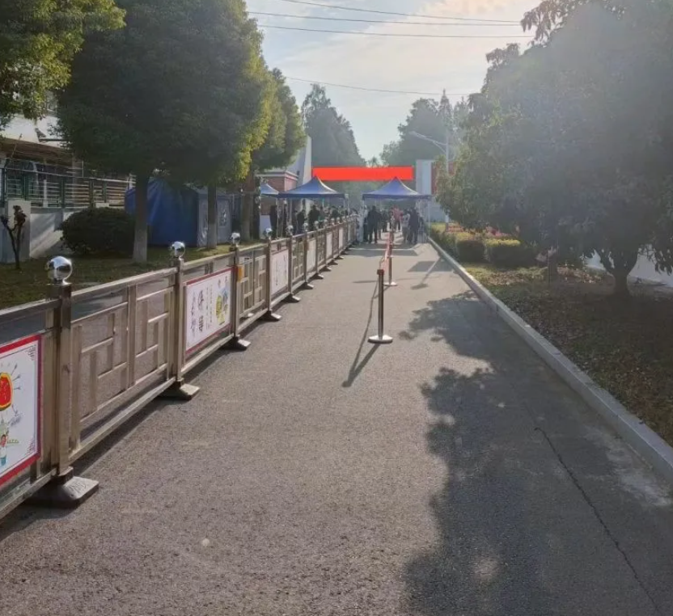
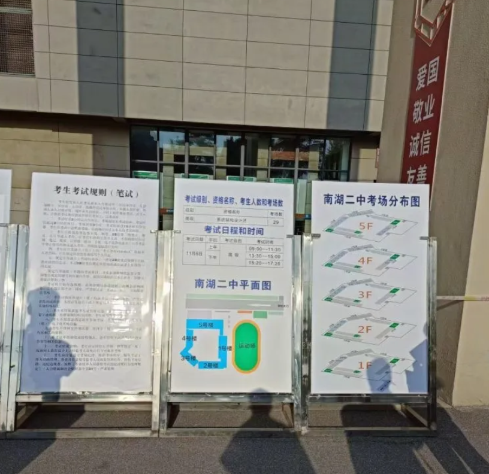
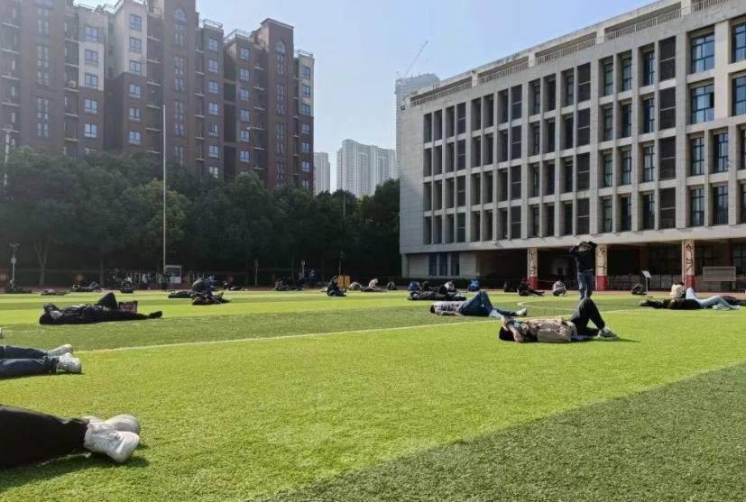
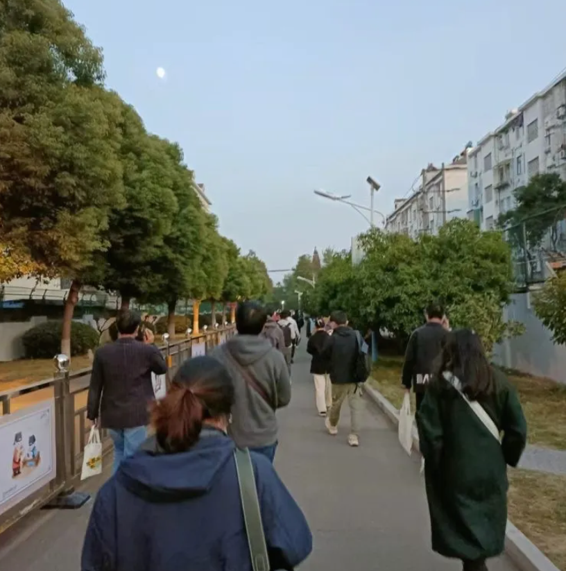
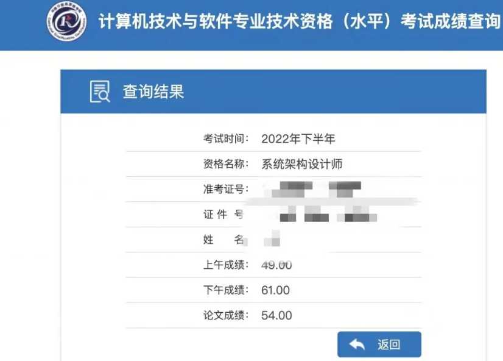

# How I Passed the Advanced Ruankao System Architect Design Exam in the Second Half of 2022

## 1. Motivation

In 2021, my wife planned to study abroad for a year, and at the beginning of the year I started thinking about what I would do in the evenings. After reading a lot of material, I decided to take the Ruankao architect exam: learn by preparing for the exam.

On one hand, the architect role is fairly close to my current work. On the other hand, I wanted to systematically go through the related knowledge. But then my wife became pregnant, and the expected due date was almost at the beginning of November, so I gave up preparation and calmly waited for a new life to arrive.

In May 2022, I started preparing for the exam again. This time I had five months for proper study.

## 2. Preparation

When I started preparing, I realized I had never touched many topics. In both undergraduate and graduate school, I studied mathematics, and I had not taken many basic computer science theory courses. Although I now work in IT, my foundation was still not very solid.

The exam has three parts, and each has its own characteristics. Multiple-choice questions cover a very wide range of knowledge; case analysis is more focused and usually tests several recurring topics; the essay part has no standard answer, so it is hard to know how well you are prepared.

I feel that multiple-choice questions after 2021 differ a lot from earlier ones. On past papers before 2020, I usually scored 60+, but on the 2021 paper I scored a little above 50, and in the 2022 exam I scored 49. My feeling is this: many topics before 2020 are already a bit outdated. If you repeatedly solve old papers, you can understand them well, but they are barely tested now. New cutting-edge things did not appear in earlier papers, so practicing only old exams is not enough.

For case analysis, I mainly prepared with past papers.

For the essay, I prepared one project and analyzed it from different angles: DevOps, microservices, data governance, and so on. I also prepared quality attributes and architecture evaluation.

## 3. The exam

On exam day, when I arrived at the exam center, I realized many people had come for this subject. My center had 29 classrooms, 30 people in each, which means at least about 900 people registered for the architect exam. In the classroom, about half did not show up. Maybe some people could not attend because of the pandemic.

### 3.1. Morning

When I took the first part, the further I went, the more nervous I became. The first questions were mostly on topics I had not reviewed; I could only eliminate 1-2 wrong options. Luckily, key topics I had prepared came later. After the first pass, there was still one hour left. I estimated: I was 100% sure on 40 questions, could eliminate 2 wrong answers on 20 questions, and could eliminate 1 wrong answer on 15 questions. Based on my previous accuracy on questions where I was fully sure, accuracy was around 90%. In the exam room, I estimated the expected result:

E=40*0.9+20*0.5+15*0.333 = 51. I felt a bit calmer. Later, when checking answers, the result was about the same, and the official score was 49, which matched my expectation.

After checking almost everything, when the proctor said we could submit early, I submitted decisively. When I walked out of the room, I saw many people discussing the questions; some directly said they would not come back in the afternoon.

### 3.2. Lunch

At lunch, I found a place to eat, then went to Starbucks, got coffee, drank it, reviewed topics, and dozed a little. Almost everyone sitting in that Starbucks was also taking the exam; some were still discussing the morning questions.

### 3.3. Afternoon

The afternoon case analysis questions were mostly familiar, and I had reviewed them all. After this part, I went to the restroom and saw someone simply leave down the hallway.

When the essay topics were handed out, I panicked a little. The first topic was component-based software development, which I had not done; the second was software maintenance methods, which I had done but not prepared; the third was blockchain, which had appeared before, but I had not done or prepared it; the fourth was lakehouse. There had been data lake and data warehouse before, but I had not studied lakehouse either.

I was nervous and hesitated between the second and fourth topics. In the end, because I work in AI myself, had previously worked with data lake and data warehouse, and had prepared an essay on data governance, I decided to rework my prepared material into an essay about lakehouse.

It took me 10 minutes to think through the essay. The other candidates were already writing hard, and I had not started yet. The proctor came over to see what I was doing and checked my admission ticket. Later I thought maybe he was checking whether I had come to copy the questions.

When I finished, about 10 minutes remained. I reread the essay. It seemed not very good, and I felt anxious.

The moon came out.

## 4. Summary

Based on checking answers, multiple-choice and case analysis were passed, but I was still not sure about the essay and felt nervous. On the afternoon of December 15, when I checked the scores and saw 54 for the essay, the stone finally fell from my heart. Even testing positive for COVID no longer felt that important.

## References

[1] [GitHub: LLMForEverybody](https://github.com/luhengshiwo/LLMForEverybody)

---

## 📚 相关概念

[[concepts/AI 安全 对齐|AI 安全 对齐]]

> 📌 来源：[[sources/LLMForEverybody/索引|LLMForEverybody 导航]] · 章节：热点
