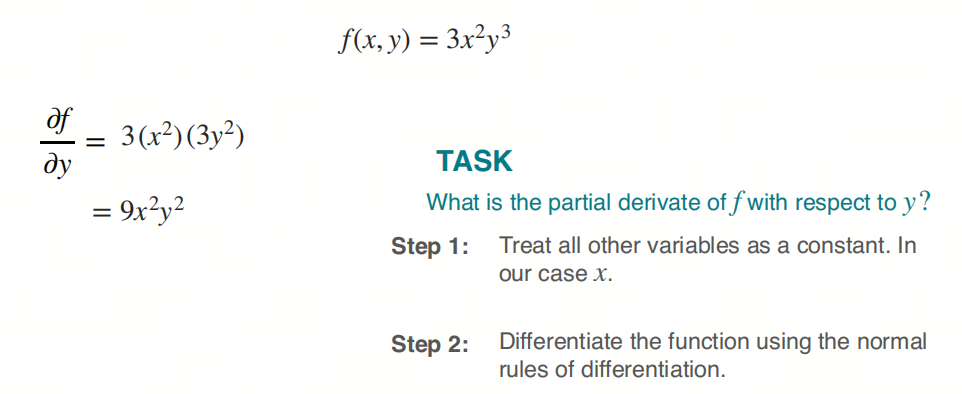
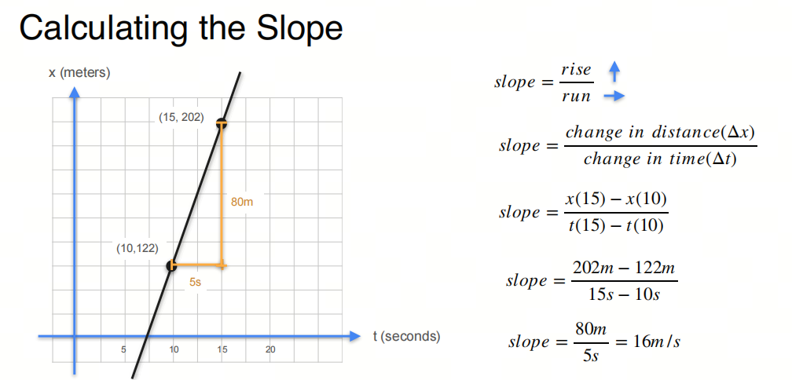
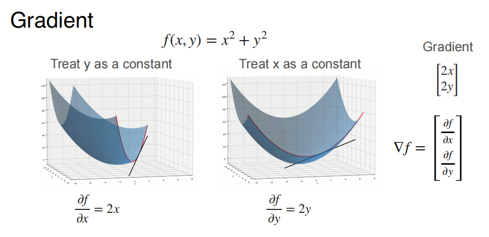
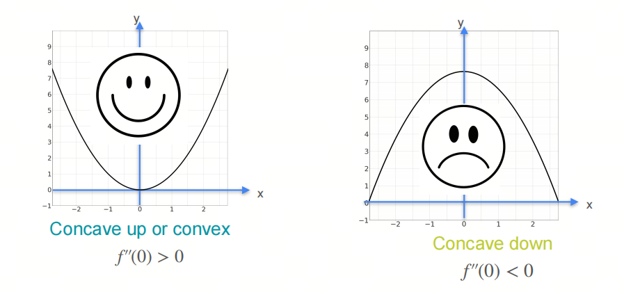
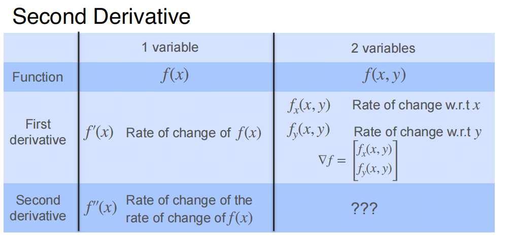
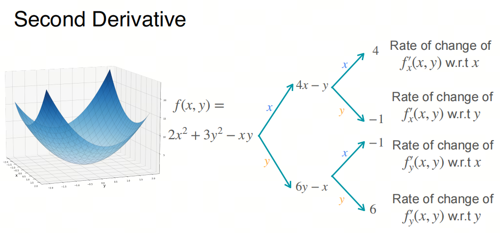
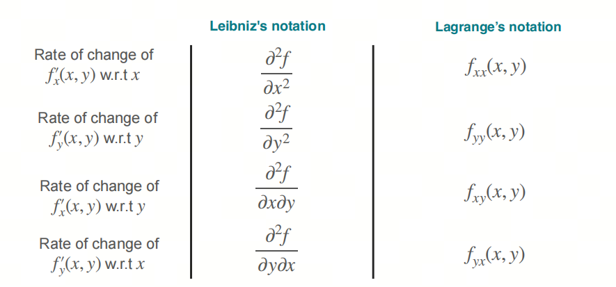
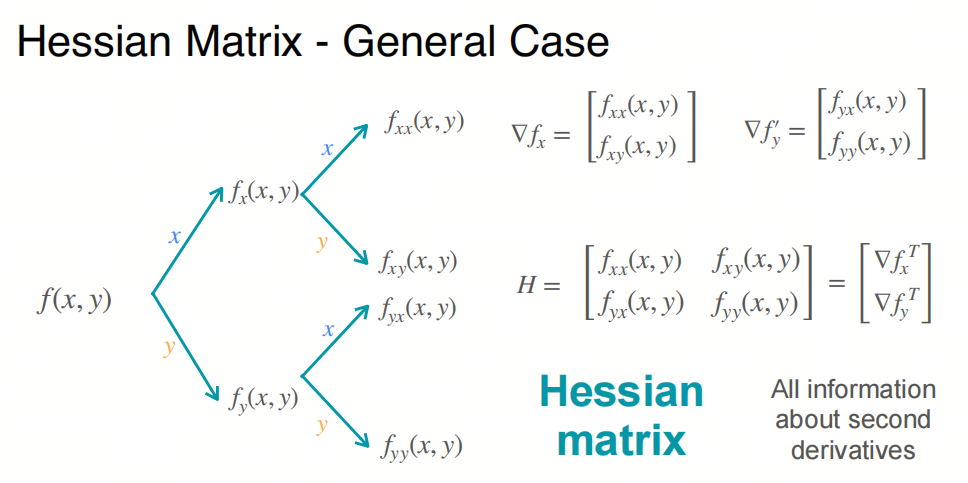
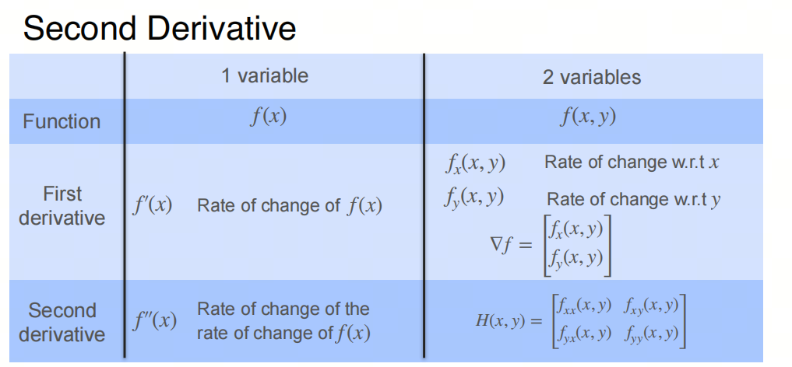

# Mathematics for AI/LLM from Scratch: Calculus, Part 2, Gradient and Gradient Descent

## 1. Introduction to the series

AI is an interdisciplinary field at the intersection of natural sciences and engineering, and a solid mathematical foundation helps you understand the essence of algorithms.

When people talk about the mathematics needed for AI, some remember their university fear of advanced mathematics or wonder whether they need to pull out both volumes of an advanced mathematics course again.

In reality, the basic advanced mathematics needed for AI is mainly calculus, mostly for gradient descent and backpropagation. This knowledge is not difficult: once you understand the basic concepts of calculus, everything else can be worked through.

We will focus on basic concepts and give key mathematical terms their English names to make understanding easier. We will also share some things that are usually not taught at university, to help build an intuitive understanding of calculus.

- Although we talk about calculus, the most important thing in AI mathematics is differentiation, or more precisely, the differential coefficient, meaning the derivative.

## 2. Partial derivative

In functions of several variables, if the derivative is taken only with respect to one variable while the other variables are treated as constants, this derivative is called a partial derivative.

The method for computing a partial derivative is similar to an ordinary derivative. You only need to remember that the other variables are treated as constants.

Partial derivative is usually denoted by the symbol $\partial$. For example, the partial derivative of function $f(x, y)$ with respect to $x$ is written as $\frac{\partial f}{\partial x}$, and with respect to $y$ as $\frac{\partial f}{\partial y}$.

## 3. Gradient

***Slope***

In a function of one variable, there is the concept of slope: it shows the rate of change of the function at a specific point.

***Gradient***

In a function of several variables, there is the concept of gradient: it shows the rate of change of the function at a specific point.

## 4. Gradient descent

Gradient descent is an optimization algorithm for minimizing the value of a function.

Gradient Descent is an iterative optimization algorithm for finding a local minimum of a function. In machine learning and deep learning, it is often used to minimize the loss function and find optimal values for model parameters. The basic steps and concepts of gradient descent:

1. **Objective function**: first, we need an objective function, usually a loss function, that depends on model parameters. The goal is to find parameter values where this function is minimal.

2. **Gradient**: the gradient is a vector made from partial derivatives of the objective function with respect to each parameter. The gradient points in the direction of fastest function increase.

3. **Direction of descent**: to minimize the function, parameters need to be updated in the direction opposite the gradient, meaning the direction of steepest descent.

4. **Learning rate**: learning rate is a positive scalar that determines the step size when moving in the gradient descent direction. If the learning rate is too large, it may overshoot the minimum or even diverge; if too small, convergence will be very slow.

5. **Iterative update**: at each iteration, the algorithm computes the gradient of the current parameters and updates the parameters by moving them in the gradient descent direction. The process repeats until a stopping condition is met, for example the gradient is small enough, the specified number of iterations is reached, or the change in objective function is below a threshold.

6. **Stopping condition**: the gradient descent algorithm needs a condition that determines when to stop iterations. Common conditions: norm of gradient is below a very small positive number, max iterations are reached, or objective function improvement is below a threshold.

A simple update formula for gradient descent:

$\theta_{\text{new}} = \theta_{\text{old}} - \alpha \nabla_\theta J(\theta_{\text{old}})$

Here $\theta$ means model parameters, $\alpha$ is the learning rate, and $\nabla_\theta J(\theta)$ is the gradient of objective function $J$ with respect to parameters $\theta$.

For optimization algorithms currently used in deep learning, see the previous article.

## 5. Second derivative

Intuitively: the second derivative is the derivative of the derivative, meaning the rate of change of the function's rate of change.

In a function of one variable, the second derivative shows curvature: a positive value means the function is concave up, and a negative value means concave down.

In functions of several variables, the second derivative shows the curvature of the function at a specific point, and the Hessian matrix is the matrix form of second derivatives.

## 6. Hessian matrix

For the example in the figure below, we can compute the second derivative for each partial derivative.

Now define second derivative notation:

Now define the Hessian matrix:

So the second derivative form looks like this:

### 7. Calculus summary

Advanced mathematics takes up a large part of university mathematics, but in AI the needed advanced mathematics is mainly concentrated in calculus, mostly for gradient descent and backpropagation. Frameworks such as PyTorch or TensorFlow have already done this work for us: we only need to call the corresponding functions.

## References

[1] [machine-learning-calculus](https://www.coursera.org/learn/machine-learning-calculus/home/module/2)

## Follow my GitHub and WeChat Official Account [The Real Ship of Theseus]. No time to explain, come aboard!

[GitHub: LLMForEverybody](https://github.com/luhengshiwo/LLMForEverybody)

The repository has the original Markdown files. Everything is fully open source, and stars and forks are very welcome!
