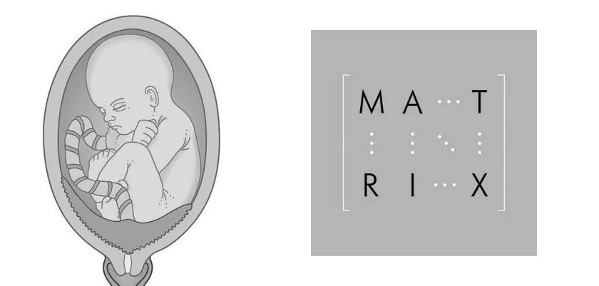
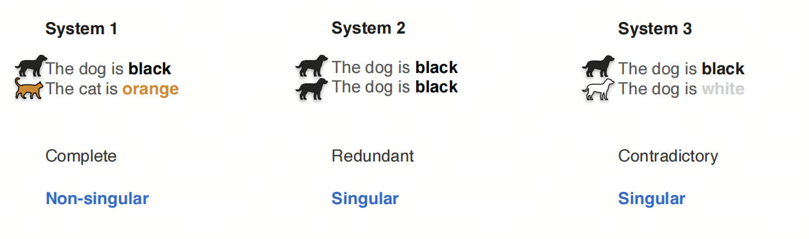
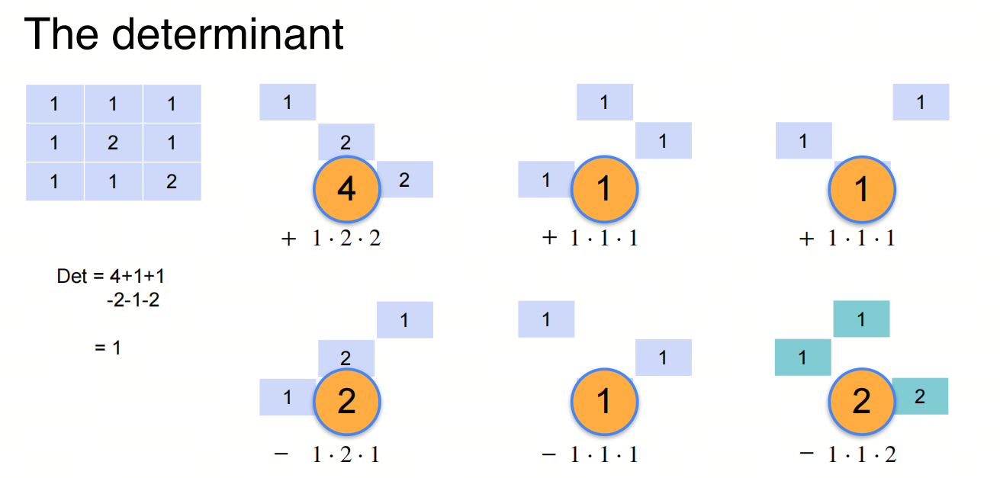
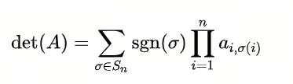
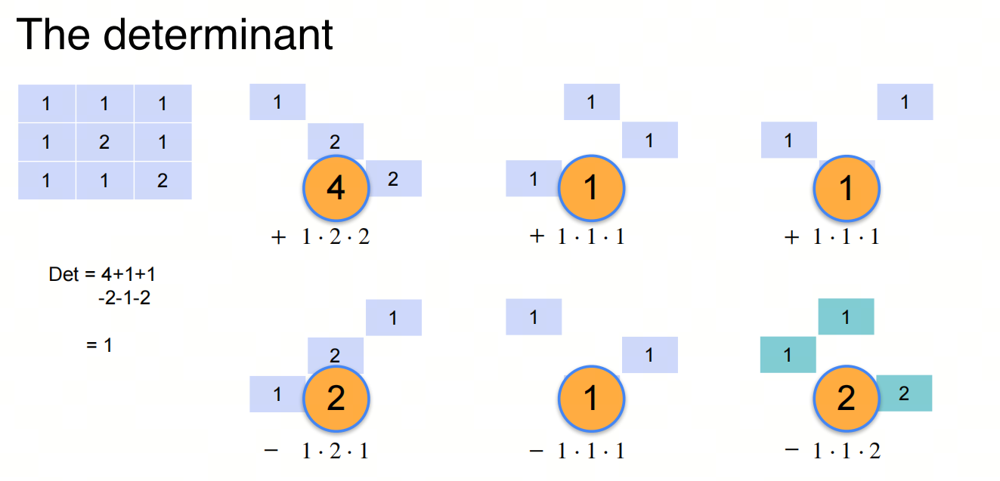

# Mathematics for AI/LLM from Scratch: Linear Algebra, Part 1, Matrix, Singularity, and Determinant

## 1. Introduction to the series

AI is an interdisciplinary field at the intersection of natural sciences and engineering, and a solid mathematical foundation helps you understand the essence of algorithms.

Linear algebra is one of the foundational mathematical areas for AI. Mastering linear algebra is critical for understanding deep learning algorithms and models. In this series, we go through the linear algebra knowledge needed for AI large models, so we can better understand the principles and applications of large models.

We will focus on basic concepts and give key mathematical terms their English names to make understanding easier. We will also share some things usually not taught at university, to help build an intuitive understanding of linear algebra.

## 2. Matrix

For me, the word `Matrix` first came from the movie `The Matrix`. In the movie, Matrix is a virtual world controlled by machines; humans are trapped in it and do not know what the real world looks like.

But `matrix` is only the translated mathematical word. The word `matrix` comes from Latin and meant "womb." A womb is where a child is born, so the word also came to mean the source or place of origin of things. Later it began to be used in different disciplines.

In mathematics, matrix means a set of complex or real numbers arranged in a rectangular array and written in brackets. If different numbers are placed in a square matrix, different array parameters are obtained; these parameters and the corresponding theory are widely used in circuits, mechanics, optics, quantum physics, and computer computation. Sylvester named this `matrix`, and in Chinese the term was translated as "square array". From another perspective, the outer brackets of a matrix surround the inner data, and the shape also resembles a womb where a future child develops.

- Sylvester once wrote that he called a rectangularly arranged sequence `Matrix` because different determinants can be born from it, just as different things are born from one mother's womb.

## 3. Singularity

***singular*** as an adjective in English has two meanings: 1. singular number; 2. special, notable. In the context of linear algebra, we take the second meaning, special and attention-grabbing, and use the stable mathematical term ***singular***.

Accordingly, the noun `singularity` means ***singularity*** or ***singular point***.

If there is ***singular***, then there is also ***non-singular***.

Which matrix is ***singular***? In other words, which matrix ***draws attention***?

Let's use an analogy with several sentences.

### 3.1. Sentence analogy 1

Above are three sentence pairs, with two sentences in each pair:

1. The first pair describes one black dog and one orange cat. We call this group of sentences ***complete***.
2. The second pair describes one black dog and one black dog. We call this group ***redundant***.
3. The third pair describes one black dog and one white dog. We call this group ***contradictory***.

The complete sentence group is non-singular, while the redundant and contradictory groups are singular. This matches real-life logic: good news is quiet, bad news spreads fast. Bad things always draw attention.

### 3.2. Sentence analogy 2

For more sentence groups, their singularity can be seen in the same way.

### 3.3. Mathematical thinking

A complete system of linear equations has a unique solution; a redundant system has infinitely many solutions; a contradictory system has no solution. This is the same logic as the sentence analogy above.

## 4. Determinant

How do we know whether a matrix is singular or non-singular? For that, we need the concept of determinant.

In English, `determinant` means "deciding factor." In the context of linear algebra, determinant decides whether a matrix is singular or non-singular. That is, it shows whether the corresponding augmented matrix has a solution and whether that solution is unique.

- If you do not know what an augmented matrix is, do not worry: we will look at it in the next article.

- About the origin of the Chinese term for determinant: matrix used to be called rows and columns, so the formula that determined the singularity of those rows and columns was called a row-column formula; later rows and columns were renamed matrix, but the determinant name remained.

### 4.1. Computing determinant

The determinant of a square matrix $A$ of order $n$ can intuitively be defined like this:

Here $S_{n}$ is the set of all permutations on the set $\{ 1,2,...,n \}$, meaning the set of all bijections from $\{1,2,...,n\}$ to itself.

If you do not want to study linear algebra deeply, you do not need to know this definition. It is enough to understand the intuitive logic of determinant computation.

## References

[1] [machine-learning-linear-algebra](https://www.coursera.org/learn/machine-learning-linear-algebra/home/week/1)

[2] [Matrix和《黑客帝国》](https://www.sohu.com/a/297701917_120051601)

[3] [wiki:矩阵](https://zh.wikipedia.org/wiki/%E7%9F%A9%E9%98%B5)

[4] [wiki:西尔维斯特](https://zh.wikipedia.org/wiki/%E8%A9%B9%E5%A7%86%E6%96%AF%C2%B7%E7%B4%84%E7%91%9F%E5%A4%AB%C2%B7%E8%A5%BF%E7%88%BE%E7%B6%AD%E6%96%AF%E7%89%B9)

## Follow my GitHub and WeChat Official Account [The Real Ship of Theseus]. No time to explain, come aboard!

[GitHub: LLMForEverybody](https://github.com/luhengshiwo/LLMForEverybody)

The repository has the original Markdown files. Everything is fully open source, and stars and forks are very welcome!
