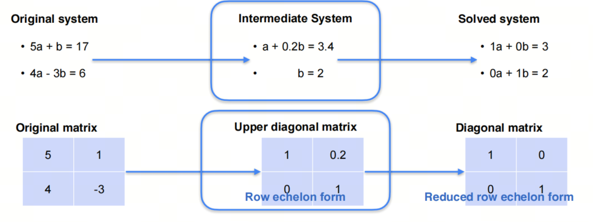
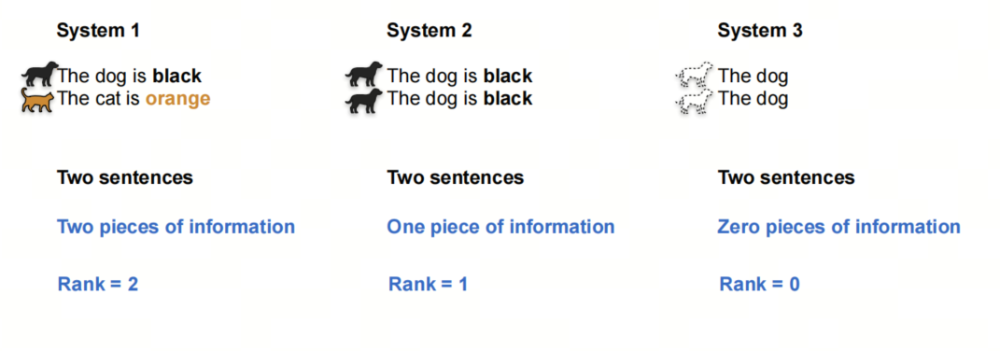
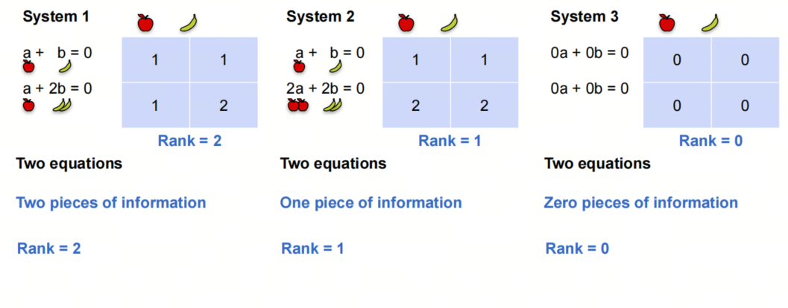
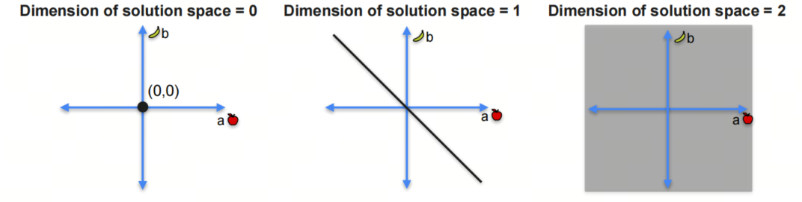
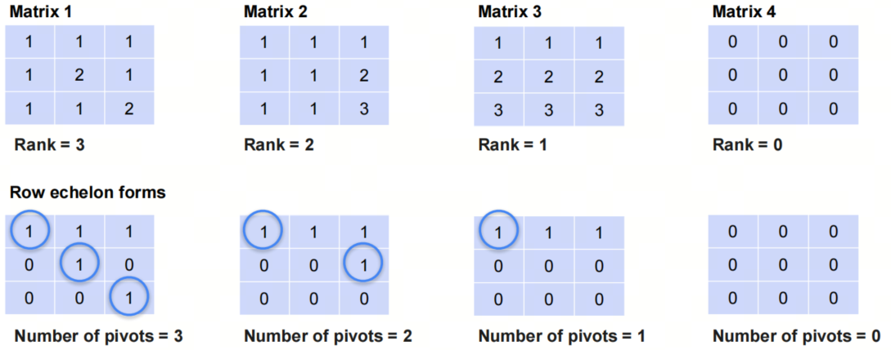
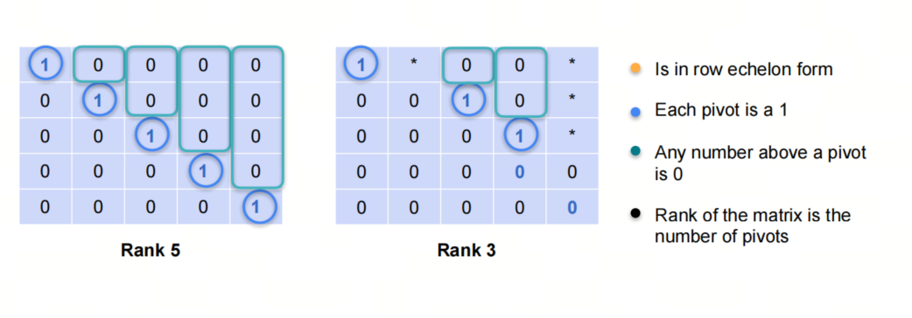
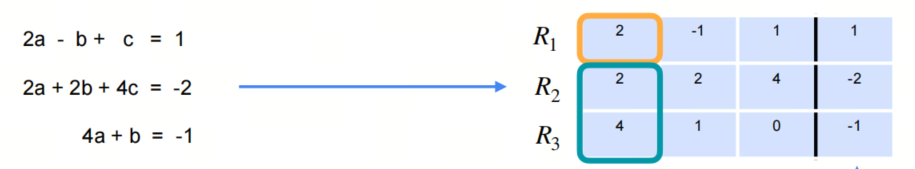
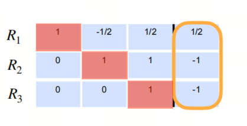
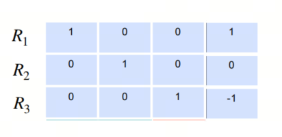

# Mathematics for AI/LLM from Scratch: Linear Algebra, Part 2, Matrix Row Reduction, Rank, and Row Echelon Form

## 1. Introduction to the series

AI is an interdisciplinary field at the intersection of natural sciences and engineering, and a solid mathematical foundation helps you understand the essence of algorithms.

Linear algebra is one of the foundational mathematical areas for AI. Mastering linear algebra is critical for understanding deep learning algorithms and models. In this series, we go through the linear algebra knowledge needed for AI large models, so we can better understand the principles and applications of large models.

We will focus on basic concepts and give key mathematical terms their English names to make understanding easier. We will also share some things usually not taught at university, to help build an intuitive understanding of linear algebra.

## 2. Matrix Row Reduction

### 2.1. System of two linear equations

In elementary algebra, we start with a system of two linear equations, then gradually move to systems of three, four, and finally n linear equations.


In higher algebra / linear algebra, matrix row reduction means row transformations of the corresponding coefficient matrix when solving a system of equations by elimination.

### 2.2. Row operations



In the figure above, we solve a system of two linear equations. Pay attention to the row transformations of the corresponding coefficient matrix.

Two new terms appear here:

1. Row echelon form
2. Reduced row echelon form

- `echelon` is a French word meaning "step" or "staircase form." This concept often appears in mathematics, for example echelon sequence, echelon function, and so on.

## 3. Rank of a Matrix

### 3.1. Matrix row operations that preserve singularity

- If you do not know what singularity is, see the previous article. In short, a singular matrix is a matrix with determinant 0.

1. Swap rows
2. Multiply a row by a non-zero constant
3. Add a multiple of another row to a row

### 3.2. Rank

Let's use the sentence-group analogy again:



In the figure above, the first system contains two sentences, the second system contains two repeated sentences, and the third system contains two sentences with no information.

We say the rank of the first system is 2, the rank of the second is 1, and the rank of the third is 0.

## 3.3. Relationship between rank and system solutions



For the three systems above, we can see: a system with rank=2 has a unique solution; a system with rank=1 has infinitely many solutions, but on one line; a system with rank=0 has infinitely many solutions on a plane.

As shown below:



$$rank =2-(dimension of solution space) $$

## 4. Row Echelon Form

Row echelon form is a matrix where the first non-zero element of a row is 1, and the first non-zero element of each following row is to the right of the first non-zero element of the previous row. Let's look at several examples:



- `pivot` in English means "axis" or "support"; in linear algebra, it is translated as `pivot element`.

### 4.1. Reduced Row Echelon Form

Reduced row echelon form means that the pivot in row echelon form is 1, and all other elements in the column of that pivot are 0.



## 5. Gauss Elimination Algorithm

Gauss elimination is a method for solving systems of linear equations. Its basic idea is to use row transformations to reduce the coefficient matrix to row echelon form, then solve through back substitution.

- The method is named after the mathematician Gauss, improved by Al-Khwarizmi, and published in France, but it first appears in the Chinese classic `The Nine Chapters on the Mathematical Art`, created around 150 BCE.

Augmented Matrix is a matrix obtained by combining the coefficient matrix and constants matrix.



Through Gauss elimination, we finally get this result:



After back substitution, we get the solution of the system of equations.



Below is Python code for Gauss elimination:

```python
def gaussian_elimination(A, b):
    n = len(A)

    # Augment the matrix A with the vector b
    for i in range(n):
        A[i].append(b[i])

    # Forward elimination
    for i in range(n):
        # Find the pivot
        max_row = i
        for k in range(i+1, n):
            if abs(A[k][i]) > abs(A[max_row][i]):
                max_row = k
        # Swap the rows
        A[i], A[max_row] = A[max_row], A[i]

        # Make all rows below this one 0 in current column
        for k in range(i+1, n):
            c = -A[k][i] / A[i][i]
            for j in range(i, n+1):
                if i == j:
                    A[k][j] = 0
                else:
                    A[k][j] += c * A[i][j]

    # Back substitution
    x = [0 for _ in range(n)]
    for i in range(n-1, -1, -1):
        x[i] = A[i][n] / A[i][i]
        for k in range(i-1, -1, -1):
            A[k][n] -= A[k][i] * x[i]

    return x

# Example usage
A = [
    [2, 1, -1],
    [-3, -1, 2],
    [-2, 1, 2]
]
b = [8, -11, -3]

solution = gaussian_elimination(A, b)
print("Solution:", solution)
```

## References

[1] [machine-learning-linear-algebra](https://www.coursera.org/learn/machine-learning-linear-algebra/home/week/2)

[2] [高斯消元法](https://zh.wikipedia.org/wiki/%E9%AB%98%E6%96%AF%E6%B6%88%E5%8E%BB%E6%B3%95)

## Follow my GitHub and WeChat Official Account [The Real Ship of Theseus]. No time to explain, come aboard!

[GitHub: LLMForEverybody](https://github.com/luhengshiwo/LLMForEverybody)

The repository has the original Markdown files. Everything is fully open source, and stars and forks are very welcome!
