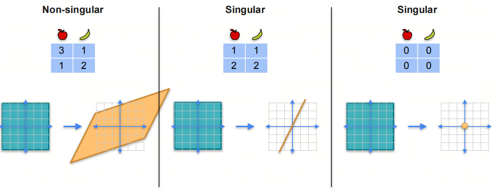
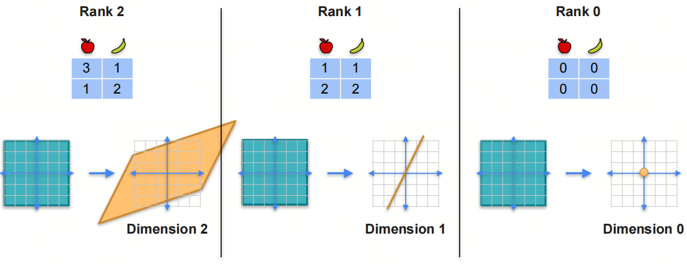
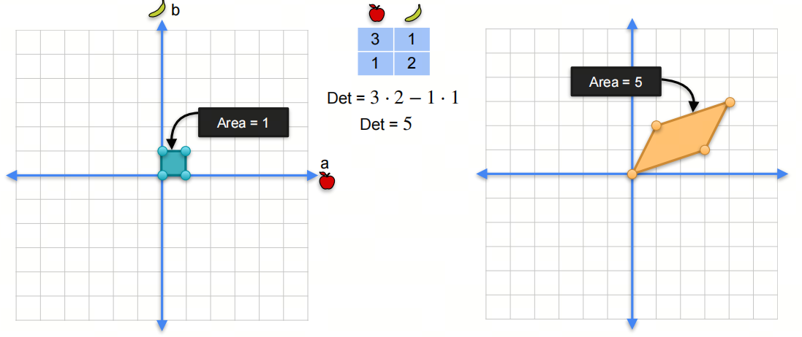
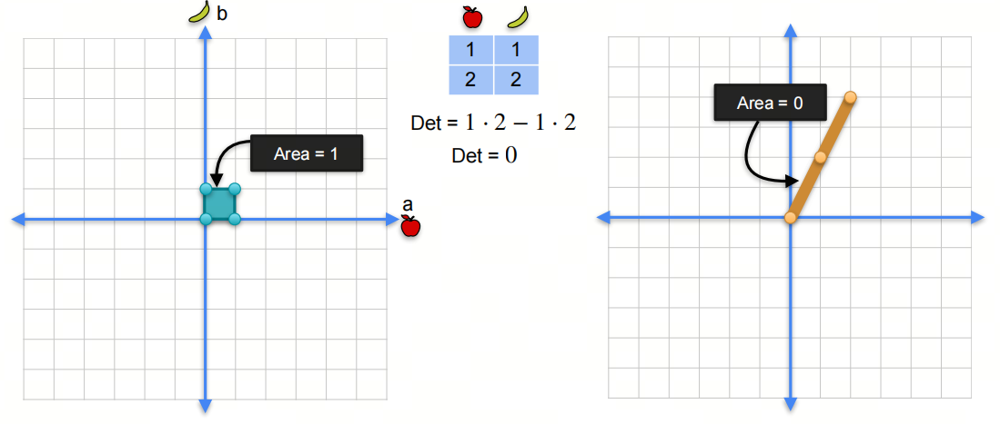
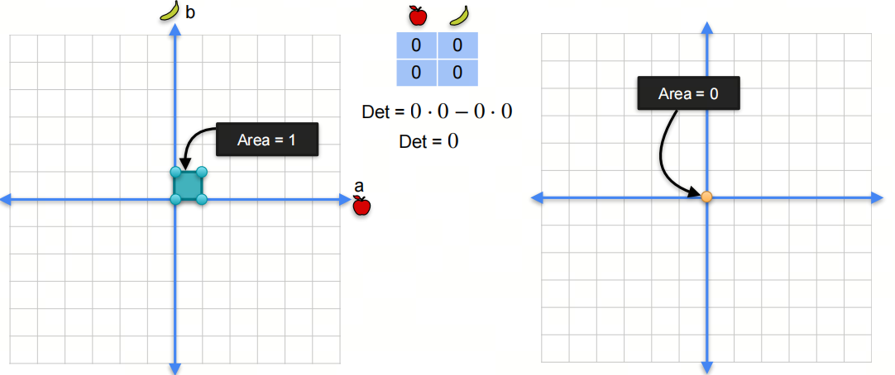
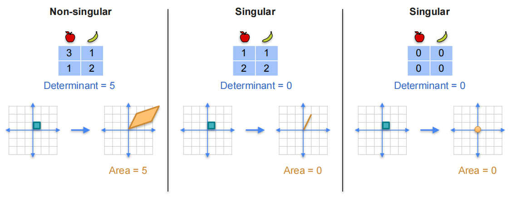

# Mathematics for AI/LLM from Scratch: Linear Algebra, Part 4, Linear Transformations and Determinant

## 1. Introduction to the series

AI is an interdisciplinary field at the intersection of natural sciences and engineering, and a solid mathematical foundation helps you understand the essence of algorithms.

Linear algebra is one of the foundational mathematical areas for AI. Mastering linear algebra is critical for understanding deep learning algorithms and models. In this series, we go through the linear algebra knowledge needed for AI large models, so we can better understand the principles and applications of large models.

We will focus on basic concepts and give key mathematical terms their English names to make understanding easier. We will also share some things usually not taught at university, to help build an intuitive understanding of linear algebra.

## 2. Linear transformation

### 2.1. Singular and non-singular linear transformations

We know that a matrix can be seen as a linear transformation: it maps one vector space to another vector space. Linear transformation can be divided into singular and non-singular cases.

- **Non-singular linear transformation**: if a linear transformation is a bijection, meaning a one-to-one correspondence, it is non-singular. A non-singular linear transformation is invertible: through inverse transformation, the output space can be mapped back to the input space.

- **Singular linear transformation**: if a linear transformation is not a bijection, meaning not a one-to-one correspondence, it is singular. A singular linear transformation is not invertible: through inverse transformation, the output space cannot be mapped back to the input space.

A singular linear transformation is actually a dimensionality-reducing linear transformation. After dimensionality reduction, it can no longer be reversed.

### 2.2. Rank of a linear transformation

Earlier, we studied matrix rank. Matrix rank is the smaller of column rank and row rank. Rank of a linear transformation means the dimension of the output space of the linear transformation.

## 3. Determinant

### 3.1. Determinant and area

Suppose we have a linear transformation:
$$
\begin{pmatrix}
3 & 1  \\
1 & 2
\end{pmatrix}
$$

It maps points from a two-dimensional space to points in another two-dimensional space. We can see that the original four coordinate points $(0,0)$, $(1,0)$, $(0,1)$, $(1,1)$ become new coordinate points $(0,0)$, $(3,1)$, $(1,2)$, $(4,3)$ after the linear transformation.

The area of the original coordinate points is 1, and the area of the new coordinate points is 5. We say this linear transformation expanded the original area by 5 times. This 5 is the determinant of the matrix (linear transformation).

Let's look at more singular examples. For example, matrix:

$$
\begin{pmatrix}
1 & 1  \\
2 & 2
\end{pmatrix}
$$

Its determinant is 0. This means the linear transformation of this matrix compresses the original area to 0, meaning it turns the original area into a line.

Another example, matrix:

$$
\begin{pmatrix}
0 & 0  \\
0 & 0
\end{pmatrix}
$$

Its determinant is 0. This means the linear transformation of this matrix compresses the original area to 0, meaning it turns the original area into a point.

Summary:

### 3.2. Determinant of matrix product

For two matrices $A$ and $B$, the determinant of their product equals the product of their determinants.

$det(AB) = det(A)det(B)$

### 3.3. Determinant of inverse matrix

For matrix $A$, if it is invertible, the determinant of its inverse matrix $A^{-1}$ equals the reciprocal of determinant $A$.

$det(A^{-1}) = \frac{1}{det(A)}$

### 3.4. Determinant of identity matrix

The determinant of the identity matrix is 1.

$det(I) = 1$

## References

[1] [machine-learning-linear-algebra](https://www.coursera.org/learn/machine-learning-linear-algebra/home/week/4)
