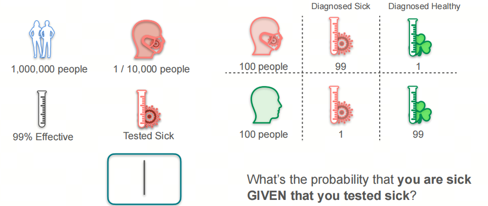
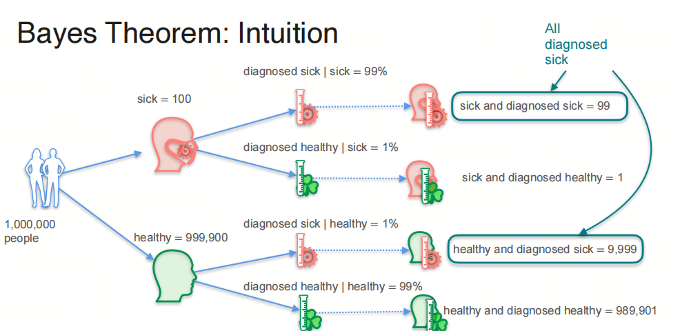
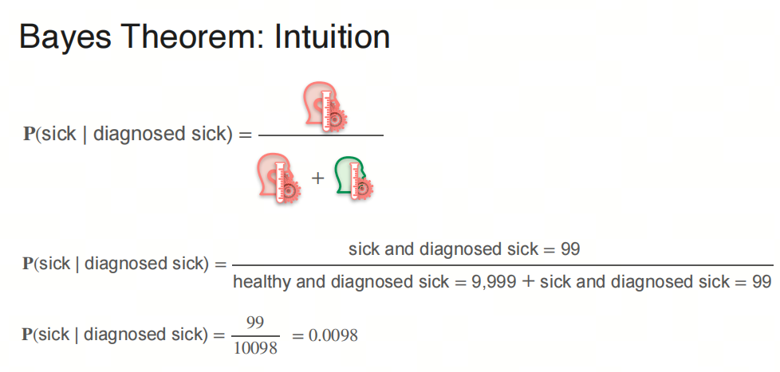
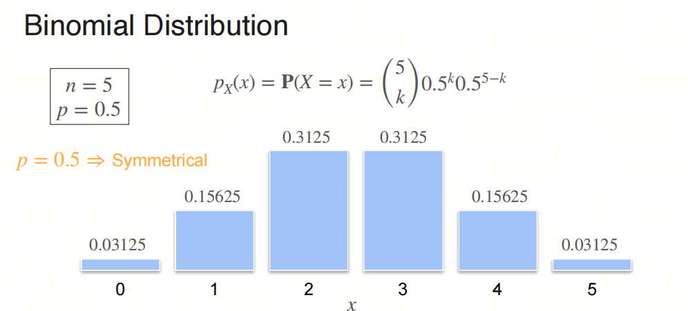
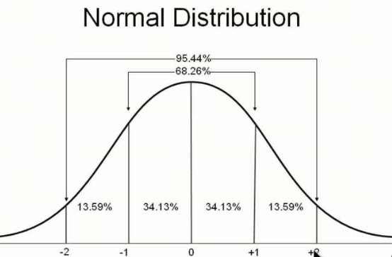

# Mathematics for AI/LLM from Scratch: Probability and Statistics, Part 1, Bayes' Theorem and Probability Distributions

## 1. Series Introduction

AI is an interdisciplinary field, somewhere between natural sciences and engineering, and a solid math base makes it much easier to understand what the algorithms are really doing.

Probability and statistics are core math areas for AI. If you want to understand deep learning algorithms and models, you cannot really avoid them. In this series, we will go through the probability and statistics needed for AI large models, so the principles and applications of large models feel less mysterious.

We will focus on the basic concepts, and we will keep the important mathematical terms in English as we go. I will also add a few things that usually do not get much attention in university courses, mostly to help build a more intuitive feel for probability and statistics.

- Probability is a mathematical tool for describing the possibility of random phenomena. It is a mathematical model for uncertainty.
- Statistics is the science of collecting, processing, analyzing, and interpreting data. It is a way to study data and extract information from it.

## 1. Bayes

### 1.1. An Intuitive View of Bayes' Theorem

Every day you may feel like dying, but the medical checkup still has to come back clean.

What would you think if a medical report said you had a certain disease?

Suppose the incidence rate of the disease is 1 in 10,000, and the medical center's test accuracy is 99%. The question is: if the report says you have this disease, what is the probability that you are actually sick?

***Think for a moment: what does your intuition say? Is the probability high or low?***

We can reason it out like this:

1. Among 1,000,000 people, 100 are sick and 999,900 are not sick.
2. Of the 100 sick people, 99 will get a positive result, and 1 will be missed.
3. Of the 999,900 healthy people, 9,999 will get a positive result, and 989,901 will not.

So, if your report shows this disease, the probability that you are actually sick is:

Did that match your intuition?

### 1.2. Prior and Posterior Probability

Prior Probability: the initial estimate of an event's probability before considering new evidence.

In this scenario, that is the probability that a person is sick: P(sick) = 0.0001

Posterior Probability: the updated estimate of an event's probability after considering new evidence.

In this scenario, that is the probability that a person is actually sick when the medical report says they are sick: P(sick|diagnosed sick) = 0.0098

### 1.3. Bayes' Theorem

Let us write the problem, **the incidence rate is 1 in 10,000 and the medical center's test accuracy is 99%**, in mathematical form:

$$P(sick) = 0.0001$$

$$P(not\ sick) = 0.9999$$

$$P(diagnosed\ sick|sick) = 0.99$$

$$P(diagnosed\ sick|not sick) = 0.01$$

Our goal is:

$$P(sick|diagnosed\ sick)$$

Bayes' Theorem:

$$P(sick|diagnosed\ sick) = \frac{P(diagnosed\ sick|sick)P(sick)}{P(diagnosed\ sick)}$$

The problem is that we do not know $P(diagnosed\ sick)$. But we can get it from the Total Probability Theorem:

$$P(diagnosed\ sick) = P(diagnosed\ sick|sick)P(sick) + P(diagnosed\ sick|not\ sick)P(not\ sick)$$

So:

$$P(sick|diagnosed\ sick) = \frac{P(diagnosed\ sick|sick)P(sick)}{P(diagnosed\ sick|sick)P(sick) + P(diagnosed\ sick|not\ sick)P(not\ sick)}$$

Substitute the numbers:

$$P(sick|diagnosed\ sick) = \frac{0.99*0.0001}{0.99*0.0001 + 0.01*0.9999} = 0.0098$$

So if your report shows this disease, the probability that you are actually sick is 0.0098, which is less than 1%.

### 1.4. Naive Bayes

One important application of Bayes' theorem is the Naive Bayes Classifier.

Naive Bayes Classifier is a simple probabilistic classifier based on Bayes' theorem. It assumes that features are independent of each other.

- Some people born in the 80s or 90s probably still remember phrases like "interesting" and "too young too simple". Young people should not be too naive.

Naive Bayes is called naive because it assumes feature independence. That assumption often does not hold in real applications, but in practice the Naive Bayes Classifier still works surprisingly well.

## 2. Discrete Probability Distribution

### 2.1. Binomial Distribution

Binomial distribution is a discrete probability distribution in statistics. It describes the probability distribution of the number of successes in a fixed number of independent experiments, where each experiment has only two possible outcomes, success or failure, and the probability of success is the same each time.

The formula for the binomial distribution is:

$P(X = k) = \binom{n}{k} p^k (1-p)^{n-k}$

Where:

- $n$ is the total number of experiments.
- $k$ is the number of successes.
- $p$ is the probability of success in each experiment.
- $\binom{n}{k}$ is the combination count, the number of ways to choose $k$ successes from $n$ experiments. The formula is $\binom{n}{k} = \frac{n!}{k!(n-k)!}$.

The expected value $E(X)$ and variance $Var(X)$ of the binomial distribution are:

$E(X) = np$

$Var(X) = np(1-p)$

The graph of a binomial distribution is discrete and asymmetric. When $p = 0.5$, the distribution is symmetric. When $n$ is large, the binomial distribution can be approximated by a normal distribution.

### 2.2. Bernoulli Distribution

Bernoulli distribution is a special case of the binomial distribution: when $n = 1$, the binomial distribution becomes the Bernoulli distribution.

The formula for the Bernoulli distribution is:

$P(X = k) = p^k (1-p)^{1-k}$

Where:

- $k = 0$ or $k = 1$.

The expected value $E(X)$ and variance $Var(X)$ of the Bernoulli distribution are:

$E(X) = p$

$Var(X) = p(1-p)$

- The Bernoulli name appears in different fields, for example Bernoulli's law in fluid mechanics. Was all of this done by one person? Not quite. These were members of the Bernoulli family. They were related, but they were not the same person. Bernoulli distribution was proposed by the Swiss mathematician Jacob Bernoulli. His younger brother Johann Bernoulli was also a famous mathematician and Euler's teacher. Bernoulli's law in fluid mechanics was proposed by Daniel Bernoulli, Johann Bernoulli's son.

## 3. Continuous Probability Distribution

### 3.1. Probability Density Function

Probability Density Function (PDF) describes the probability distribution of a continuous random variable. For a continuous random variable, unlike a discrete random variable, we cannot directly assign a probability to each value, because the variable can take infinitely many values and the probability of a single exact value is usually 0. So the PDF describes the probability that a continuous random variable falls within a certain interval.

The PDF $f(x)$ has these properties:

1. Non-negativity: for every $x$, $f(x) \geq 0$.
2. Normalization: the integral of the PDF over the whole domain is 1: $\int_{-\infty}^{\infty} f(x) \, dx = 1$.
3. Probability calculation: the probability that a continuous random variable $X$ falls in the interval $[a, b]$ is the integral of the PDF over that interval: $P(a \leq X \leq b) = \int_{a}^{b} f(x) \, dx$.

### 3.2. Cumulative Distribution Function

Cumulative Distribution Function (CDF) is a function that describes the probability distribution of a random variable. It gives the probability that the random variable takes a value less than or equal to some value. For any real number $x$, the CDF $F(x)$ is defined as:

$F(x) = P(X \leq x)$

Where $X$ is a random variable.

The CDF has these properties:

1. **Non-decreasing**: $F(x)$ is non-decreasing. If $x_1 < x_2$, then $F(x_1) \leq F(x_2)$.
2. **Right-continuity**: $F(x)$ is right-continuous, meaning $\lim_{y \to x^+} F(y) = F(x)$.
3. **Limits**:
   - as $x$ approaches negative infinity, $F(x)$ approaches 0: $\lim_{x \to -\infty} F(x) = 0$.
   - as $x$ approaches positive infinity, $F(x)$ approaches 1: $\lim_{x \to \infty} F(x) = 1$.

For a discrete random variable, the CDF is a step function. It jumps at every possible value of the random variable, and the height of each jump is the probability of that value.

For a continuous random variable, the CDF is continuous and can be obtained by integrating the PDF $f(x)$:

$F(x) = \int_{-\infty}^{x} f(t) \, dt$

The CDF is very important in statistics. It is used to calculate the probability that a random variable falls in an interval, and also to compare and analyze probability distributions. With the CDF, we can obtain the median, quantiles, expected value, variance, and other statistics of a random variable.

### 3.3. Uniform Distribution

Uniform Distribution is a simple continuous probability distribution whose PDF $f(x)$ is constant inside an interval and 0 outside the interval. The PDF of the uniform distribution is:

$$f(x) = \begin{cases} \frac{1}{b-a}, & a \leq x \leq b \\ 0, & x < a \text{ or } x > b \end{cases}$$

### 3.4. Normal Distribution

Normal Distribution is one of the most important continuous probability distributions in statistics. It has many important properties and is widely used in natural sciences, social sciences, engineering, and other fields.

The PDF of a normal distribution $f(x)$ is:

$$f(x) = \frac{1}{\sqrt{2\pi}\sigma} e^{-\frac{(x-\mu)^2}{2\sigma^2}}$$

Where $\mu$ is the mean and $\sigma$ is the standard deviation.

The expected value $E(X)$ and variance $Var(X)$ of the normal distribution are:

$$E(X) = \mu$$

$$Var(X) = \sigma^2$$

Normal distribution has an important property, the 68-95-99.7 rule: in a normal distribution, 68% of the data lies within one standard deviation of the mean, 95% lies within two standard deviations, and 99.7% lies within three standard deviations.

- Normal distribution is also called Gaussian distribution. It was proposed by the German mathematician Gauss in the 19th century. Gauss is a mathematician among mathematicians: he had an enormous number of achievements not only in mathematics, but also in physics, astronomy, statistics, and other fields. Gaussian distribution is the most common distribution in nature. Many natural phenomena can be described with Gaussian distribution, for example human height, weight, and IQ.

**Have you ever wondered why normal distribution appears so often in nature?** Follow along, because next we will talk about the Central Limit Theorem.

## References

[1] [probability-and-statistics](https://www.coursera.org/learn/machine-learning-probability-and-statistics/home/week/1)

[2] [Bernoulli family](https://zh.wikipedia.org/wiki/%E4%BC%AF%E5%8A%AA%E5%88%A9%E5%AE%B6%E6%97%8F)

[3] [Bernoulli's principle](https://zh.wikipedia.org/wiki/%E4%BC%AF%E5%8A%AA%E5%88%A9%E5%AE%9A%E5%BE%8B)

## Follow my GitHub and WeChat Official Account [The Real Ship of Theseus]. No time to explain, everybody aboard!

[GitHub: LLMForEverybody](https://github.com/luhengshiwo/LLMForEverybody)

The repository contains the original Markdown files. Everything is fully open source, and Stars and Forks are very welcome.
