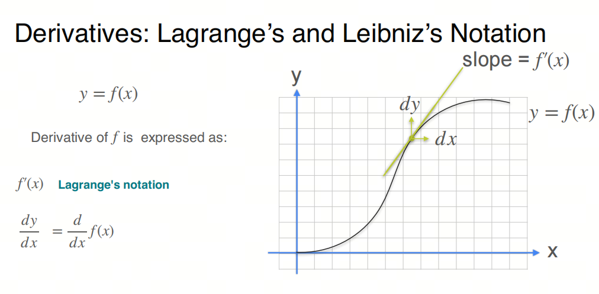
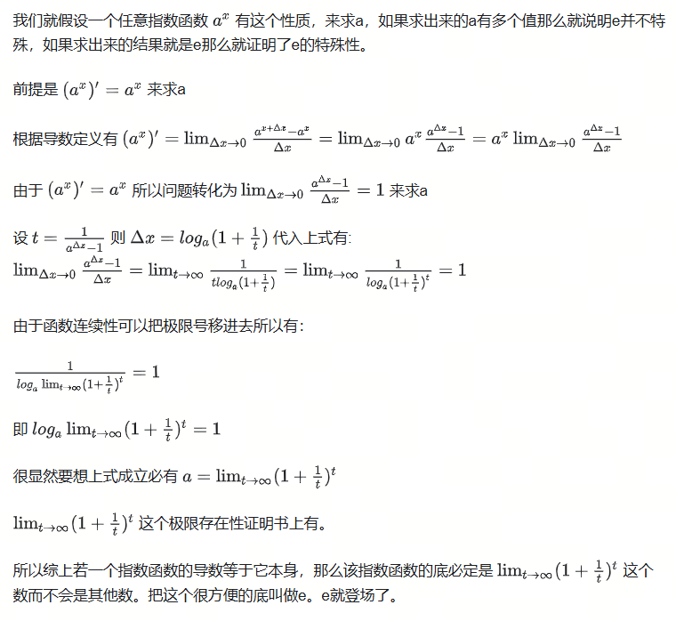
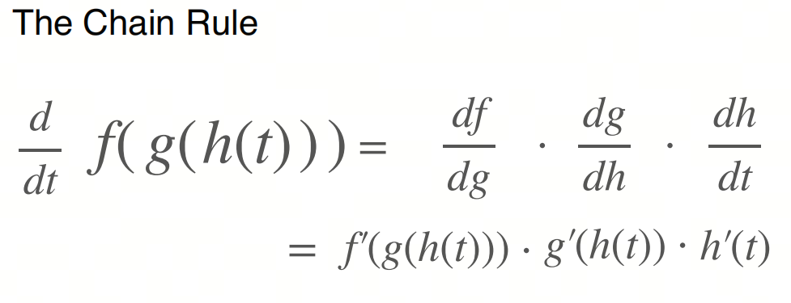

# Mathematics for AI/LLM from Scratch: Calculus, Part 1, Derivative

## 1. Introduction to the series

AI is an interdisciplinary field at the intersection of natural sciences and engineering, and a solid mathematical foundation helps you understand the essence of algorithms.

When people talk about the mathematics needed for AI, some remember their university fear of advanced mathematics or wonder whether they need to pull out both volumes of an advanced mathematics course again.

In reality, the basic advanced mathematics needed for AI is mainly calculus, mostly for gradient descent and backpropagation. This knowledge is not difficult: once you understand the basic concepts of calculus, everything else can be worked through.

We will focus on basic concepts and give key mathematical terms their English names to make understanding easier. We will also share some things that are usually not taught at university, to help build an intuitive understanding of calculus.

- Although we talk about calculus, the most important thing in AI mathematics is differentiation, or more precisely, the differential coefficient, meaning the derivative.

## 2. Derivative

Derivative has two notation forms: Lagrange notation and Leibniz notation. They were proposed independently by different mathematicians in the history of calculus and reflect different ways of understanding and applying it.

1. **Lagrange notation**: this notation was proposed by the French mathematician Joseph-Louis Lagrange. It uses a prime (`'`) to denote the derivative. For example, the derivative of function $f(x)$ is written as $f'(x)$. Lagrange notation is especially intuitive and convenient for higher-order derivatives: the second derivative can be written as $f''(x)$, the third derivative as $f'''(x)$, and so on.

2. **Leibniz notation**: this notation was proposed by the German mathematician Gottfried Wilhelm Leibniz. It uses a fractional form, for example the derivative of function $f(x)$ with respect to $x$ is written as $\frac{df}{dx}$. Leibniz notation is convenient when representing relationships between physical quantities and solving differential equations with separable variables, because it emphasizes the derivative as a ratio.

These two notations have different advantages and features, so they are widely used in different fields and applications. Lagrange notation is more convenient when writing systems of equations and calculating derivatives, while Leibniz notation is more intuitive when working with relationships between physical quantities and functions of several variables. Also, Leibniz notation is widely recognizable because of its use in integral notation. The coexistence of these two notations reflects the diversity and richness of calculus development and gives flexible ways to express different mathematical and scientific tasks.

## 3. The natural base e

Back in school, we learn about the special mathematical constant $e$: it is an infinite non-repeating decimal, meaning an irrational number.

It has a special property: its derivative is itself, meaning the derivative of $e^x$ is $e^x$.

For e, see the previous article.

## 4. Chain rule

Chain rule is an important concept in calculus, used to find the derivative of a composite function. A composite function is a function made from one function and another, for example $f(g(x))$. Chain rule describes the relationship between the derivative of a composite function and the derivatives of the original functions, helping compute derivatives of complex functions.

## References

[1] [machine-learning-calculus](https://www.coursera.org/learn/machine-learning-calculus/home/module/1)
