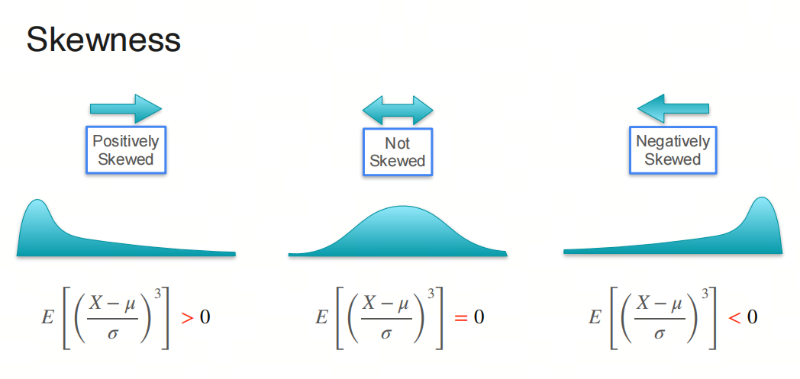
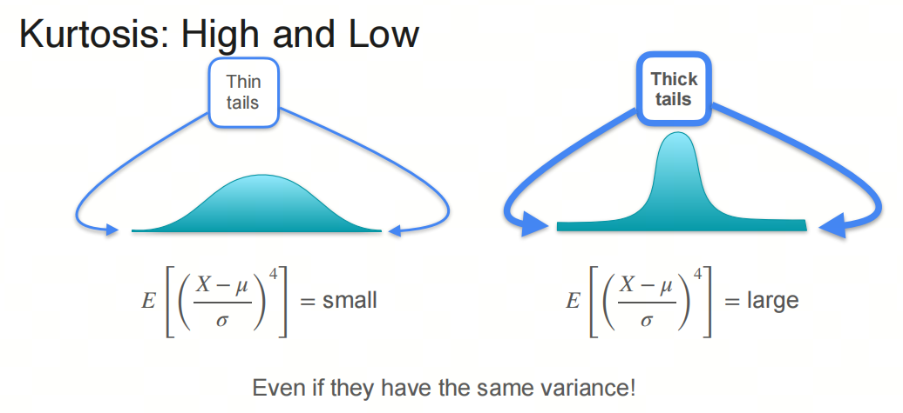
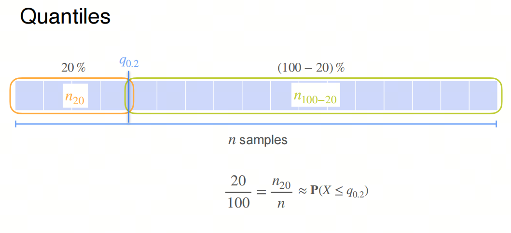
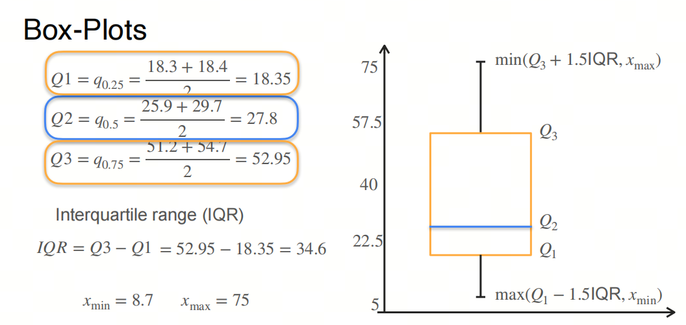
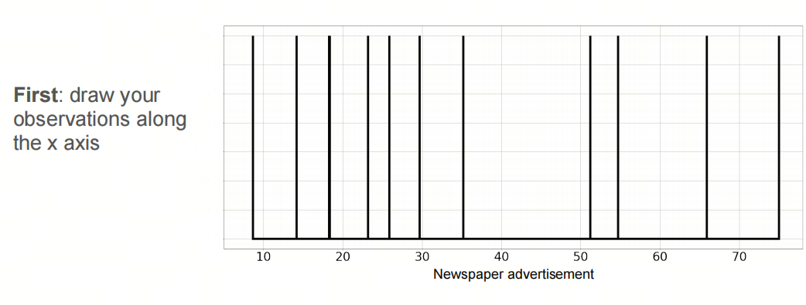
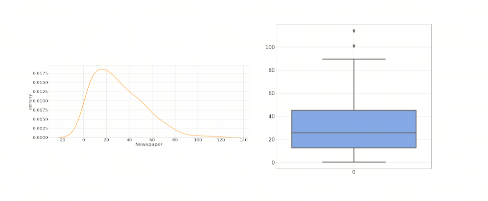
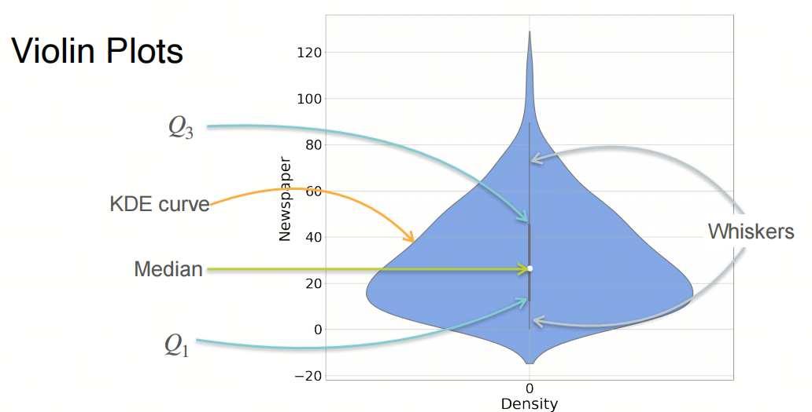
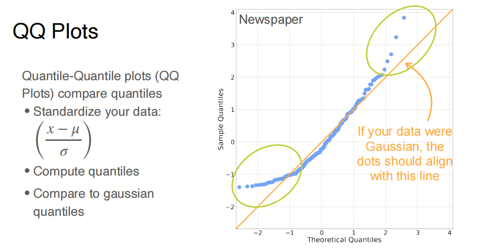

# Mathematics for AI/LLM from Scratch: Probability and Statistics, Part 2, Ways to Describe Distributions

## 1. Series Introduction

AI is an interdisciplinary field, somewhere between natural sciences and engineering, and a solid math base makes it much easier to understand what the algorithms are really doing.

Probability and statistics are core math areas for AI. If you want to understand deep learning algorithms and models, you cannot really avoid them. In this series, we will go through the probability and statistics needed for AI large models, so the principles and applications of large models feel less mysterious.

We will focus on the basic concepts, and we will keep the important mathematical terms in English as we go. I will also add a few things that usually do not get much attention in university courses, mostly to help build a more intuitive feel for probability and statistics.

- Probability is a mathematical tool for describing the possibility of random phenomena. It is a mathematical model for uncertainty.
- Statistics is the science of collecting, processing, analyzing, and interpreting data. It is a way to study data and extract information from it.

## 1. Expectation and Variance

Expected Value and Variance are two basic concepts in probability theory and statistics. They describe the ***central tendency*** and ***dispersion*** of a random variable.

### Expected Value

Expected value is the mean, or long-term average, of a random variable. For a discrete random variable $X$, the expected value $E(X)$ is defined as:

$E(X) = \sum_{i} x_i \cdot P(x_i)$

where $x_i$ are all possible values of the random variable $X$, and $P(x_i)$ is the probability that $X$ takes the value $x_i$.

For a continuous random variable $X$, the expected value $E(X)$ is defined as:

$E(X) = \int_{-\infty}^{\infty} x \cdot f(x) \, dx$

where $f(x)$ is the probability density function of $X$.

### Variance

Variance is a metric for the dispersion of a random variable. It describes how far the values of the random variable deviate from the expected value. For a discrete random variable $X$, the variance $Var(X)$ is:

$Var(X) = E[(X - E(X))^2] = \sum_{i} (x_i - E(X))^2 \cdot P(x_i)$

For a continuous random variable $X$, the variance $Var(X)$ is:

$Var(X) = E[(X - E(X))^2] = \int_{-\infty}^{\infty} (x - E(X))^2 \cdot f(x) \, dx$

The square root of variance is called Standard Deviation. It has the same units as the original random variable, so it is usually more intuitive in practice.

### Properties of Expectation and Variance

1. Linearity of expectation: for any constants $a$ and $b$, and random variables $X$ and $Y$:
   $E(aX + bY) = aE(X) + bE(Y)$

2. Properties of variance: for any constants $a$ and $b$, and random variable $X$:
   $Var(aX + b) = a^2 Var(X)$
   Notice that the constant $b$ does not affect variance, because variance describes dispersion and does not depend on location.

## 2. Skewness and Kurtosis

Expected value and variance are two basic statistics for describing the central tendency and dispersion of a random variable distribution. Expected value gives the average random variable, and variance describes how much the values deviate from the expected value. These two statistics are useful, but they are not enough to describe every feature of a distribution. That is why we also need Skewness and Kurtosis.

### Skewness

Skewness is a statistic that describes the asymmetry of a distribution. It measures the degree of skew, meaning which side of the distribution has the longer or shorter tail. If a distribution is symmetric, skewness is 0. If the right side, or positive side, is longer than the left side, skewness is positive. This is called right-skewed or positive skew. If the left side is longer than the right side, skewness is negative. This is called left-skewed or negative skew. Formula:

$Skewness = \frac{E[(X - \mu)^3]}{\sigma^3}$

where $\mu$ is the mean and $\sigma$ is the standard deviation.



### Kurtosis

Kurtosis is a statistic that describes the "peakedness" or "flatness" of a distribution. It measures the sharpness of the top of the distribution and the thickness of the tails. Kurtosis is compared with the normal distribution, whose kurtosis is 0. If the kurtosis of a distribution is greater than 0, it is sharper than a normal distribution. If it is less than 0, it is flatter than a normal distribution. Formula:

$Kurtosis = \frac{E[(X - \mu)^4]}{\sigma^4} - 3$

where $\mu$ is the mean and $\sigma$ is the standard deviation.



### Why We Need Skewness and Kurtosis

1. **A fuller description of a distribution**: expected value and variance only describe the center and dispersion. Skewness and kurtosis add information about the shape of the distribution, which helps us understand the data better.
2. **Detecting abnormal distributions**: skewness and kurtosis help find distributions that do not satisfy the normality assumption, which matters in many statistical analyses and model-building workflows.
3. **Risk management**: in finance and other fields, skewness and kurtosis are important for risk assessment because they tell us something about the possibility of extreme values. That is critical for portfolio management and risk control.

So skewness and kurtosis are important additions when describing the features of a random variable distribution. Together with expected value and variance, they give a more complete picture.

## 3. Quantile and Boxplot

### 3.1. Quantile

Quantile is a value in statistics that describes a data distribution. It divides a dataset into continuous intervals with equal probability. Quantiles help measure the relative position of data, as well as the shape and dispersion of the distribution.

### Definition

For a random variable $X$ and a given probability $p$ (where $0 < p < 1$), the quantile $Q(p)$ is the value that satisfies:

$P(X \leq Q(p)) = p$

In other words, the quantile $Q(p)$ is the value of the random variable $X$ such that the probability of $X$ being less than or equal to $Q(p)$ is $p$.

### Common Quantiles

1. **Median**: the quantile at $p = 0.5$, meaning $Q(0.5)$. It divides the dataset into two 50% parts.
2. **Quartiles**: these divide the dataset into four equal parts, each containing 25% of the data:
   - First quartile (Q1): quantile at $p = 0.25$, meaning $Q(0.25)$.
   - Second quartile (Q2): quantile at $p = 0.5$, meaning the median.
   - Third quartile (Q3): quantile at $p = 0.75$, meaning $Q(0.75)$.
3. **Percentiles**: quantiles for $p$ from 0.01 to 0.99. For example, the 90th percentile is the quantile at $p = 0.90$, meaning $Q(0.90)$.



### Calculation

For a given dataset, the steps for calculating a quantile are:

1. Sort the dataset in ascending order.
2. Determine the quantile position. For the $p$-quantile, the position $P$ is:
   $P = np$
   where $n$ is the dataset size.
3. If $P$ is an integer, the $p$-quantile is the average of the $P$-th and $(P+1)$-th data points.
4. If $P$ is not an integer, the $p$-quantile is the $\lceil P \rceil$-th data point, where $\lceil P \rceil$ means the ceiling of $P$.

### Applications

Quantiles have many applications in statistics:

- describing the shape and dispersion of a data distribution;
- detecting outliers;
- standardizing and transforming data;
- building a Boxplot to visualize a data distribution.

Quantiles are an important tool for understanding data distributions. They give useful information about relative position and distribution features.

### 3.2. Boxplot

Boxplot, also called a box-and-whisker plot, is a statistical chart for showing data distribution features. It gives an intuitive view of the minimum, first quartile (Q1), median (Q2), third quartile (Q3), maximum, and outliers if they exist. The basic steps are:

### Manual Steps for a Boxplot

1. **Collect data**: first, prepare a group of data for analysis.

2. **Sort**: sort the data in ascending order.

3. **Calculate quartiles**:
   - **Q1**: the median of the lower half of the data. If the dataset size is odd, the overall median is not included.
   - **Q2 / Median**: the median of the whole dataset.
   - **Q3**: the median of the upper half of the data. If the dataset size is odd, the overall median is not included.

4. **Determine max and min**:
   - Max: the maximum value of the dataset after excluding outliers.
   - Min: the minimum value of the dataset after excluding outliers.

5. **Draw the box**:
   - The lower bound of the box is Q1, and the upper bound is Q3.

6. **Draw the median line**:
   - Draw a line inside the box to mark the median Q2.

7. **Draw whiskers**:
   - Whiskers are lines extending from the box that show the range of the data. Usually the ends of the whiskers are the min and max, but when there are outliers, the whiskers go to the min and max non-outlier values.

8. **Mark outliers**:
   - Outliers are usually marked as dots or stars. These are data points outside the whiskers.



#### Python (using matplotlib and seaborn):

```python
import seaborn as sns
import matplotlib.pyplot as plt

# Suppose data is a Pandas Series or a DataFrame column
sns.boxplot(data)
plt.show()
```

### 3.3. Kernel Density Estimation

Kernel Density Estimation (KDE) is a non-parametric method for estimating a Probability Density Function (PDF). It places a "kernel" around each data point, usually a smooth symmetric function such as a Gaussian function, and then sums those kernel functions to get a smooth continuous PDF.

### Principle

Suppose we have a sample set $\{x_1, x_2, \ldots, x_n\}$, and we want to estimate the PDF $f(x)$. KDE is:

$\hat{f}(x) = \frac{1}{n} \sum_{i=1}^{n} K\left(\frac{x - x_i}{h}\right)$

Where:

- $\hat{f}(x)$ is the estimated PDF.
- $K(\cdot)$ is the kernel function, a non-negative symmetric function satisfying $\int K(u) \, du = 1$.
- $h$ is the bandwidth, a positive number that controls the width of the kernel function and the smoothness of the estimate.



### Common Kernels

1. **Gaussian Kernel**:
   $K(u) = \frac{1}{\sqrt{2\pi}} e^{-\frac{u^2}{2}}$
   Gaussian kernel is the most common kernel function. It is smooth and symmetric.

2. **Uniform Kernel**:
   $K(u) = \begin{cases}
   \frac{1}{2} & \text{if } |u| \leq 1 \\
   0 & \text{otherwise}
   \end{cases}$
   Uniform kernel is constant when $|u| \leq 1$, and 0 otherwise.

3. **Triangular Kernel**:
   $K(u) = \begin{cases}
   1 - |u| & \text{if } |u| \leq 1 \\
   0 & \text{otherwise}
   \end{cases}$
   Triangular kernel is linear when $|u| \leq 1$, and 0 otherwise.

### Bandwidth Selection

The choice of bandwidth $h$ strongly affects the KDE result. If the bandwidth is too small, the estimated density becomes too rough and overfitted. If it is too large, the estimated density becomes too smooth and underfitted. Common bandwidth selection methods include:

1. **Cross-Validation**: choose the bandwidth that minimizes the difference between the estimated density and the actual density.
2. **Silverman's Rule of Thumb**: choose the bandwidth based on sample size $n$ and sample standard deviation $\sigma$:
   $h = \left(\frac{4\sigma^5}{3n}\right)^{\frac{1}{5}}$

### 3.4. Violin Plot

Violin Plot is a data visualization chart that combines features of a boxplot and a kernel density plot. It is used to show a data distribution.





### 3.5. Quantile-Quantile Plot

QQ plot is a chart for checking whether data matches a certain distribution. It compares data quantiles with theoretical quantiles to see whether the data follows a specific distribution.

QQ plot checks the data distribution by comparing sample quantiles and quantiles of a theoretical distribution, usually a normal distribution. More specifically, sample quantiles, also called empirical quantiles, are paired with corresponding quantiles from the theoretical distribution, called theoretical quantiles, and those pairs are shown on a scatter plot.



If the sample data follows the given theoretical distribution, the points on the QQ plot should roughly lie on a straight line. The slope of the line equals the sample standard deviation, and the intercept equals the sample mean.

## References

[1] [probability-and-statistics](https://www.coursera.org/learn/machine-learning-probability-and-statistics/home/week/2)


---

## 📚 相关概念

[[concepts/Transformer 架构|Transformer 架构]]

> 📌 来源：[[sources/LLMForEverybody/索引|LLMForEverybody 导航]] · 章节：数学
