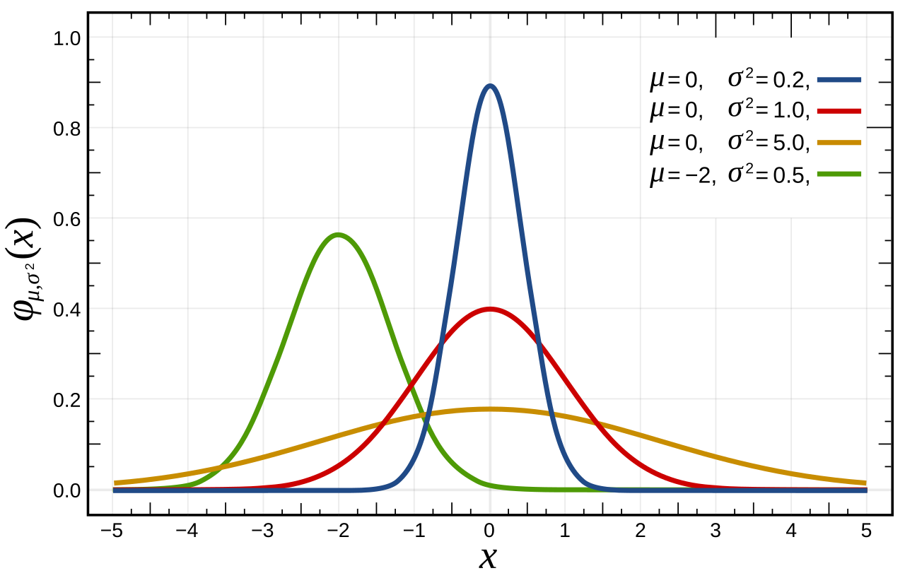
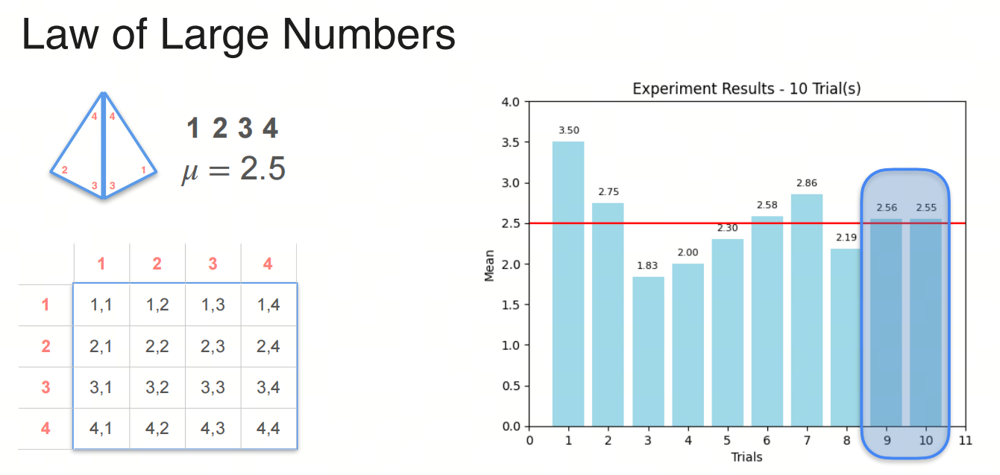
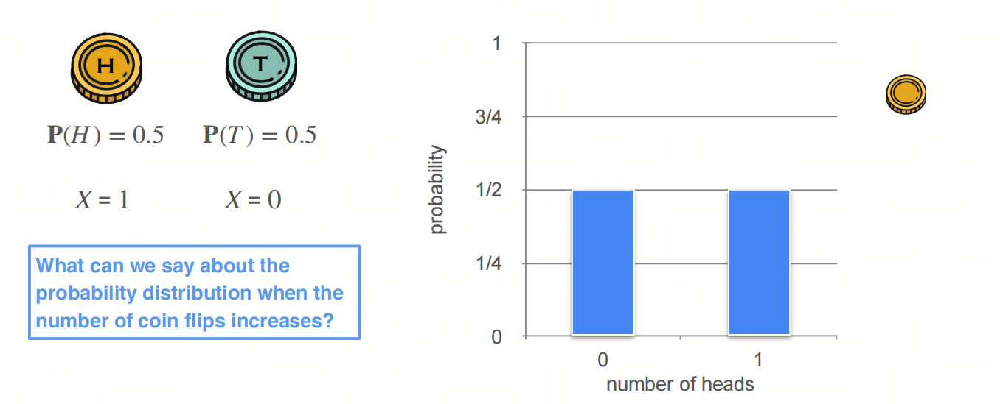
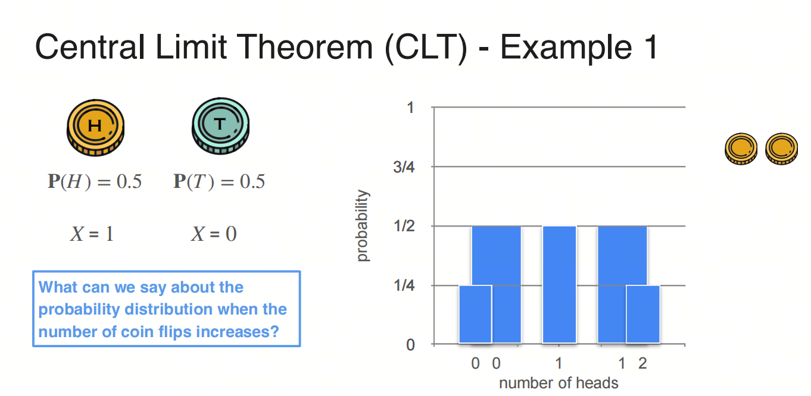
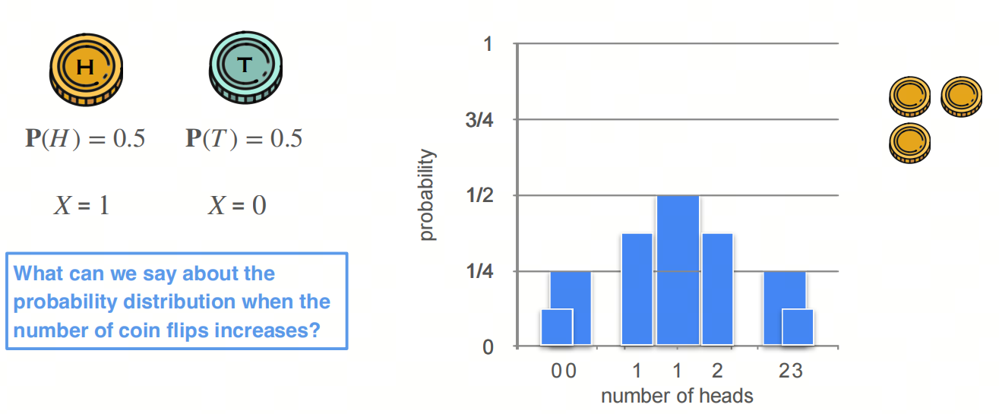
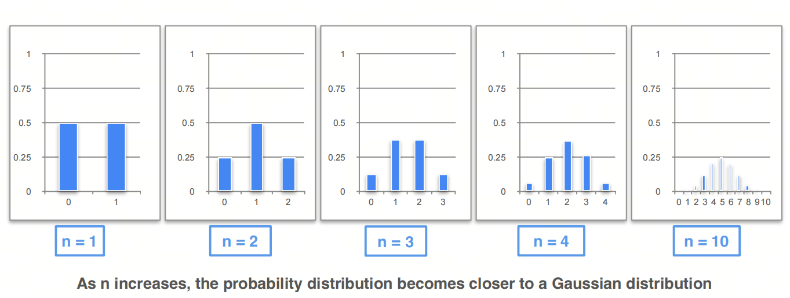
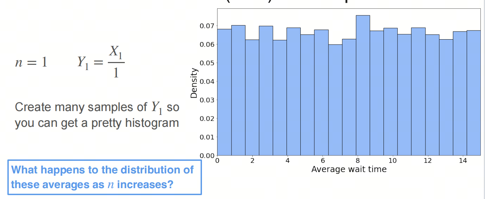
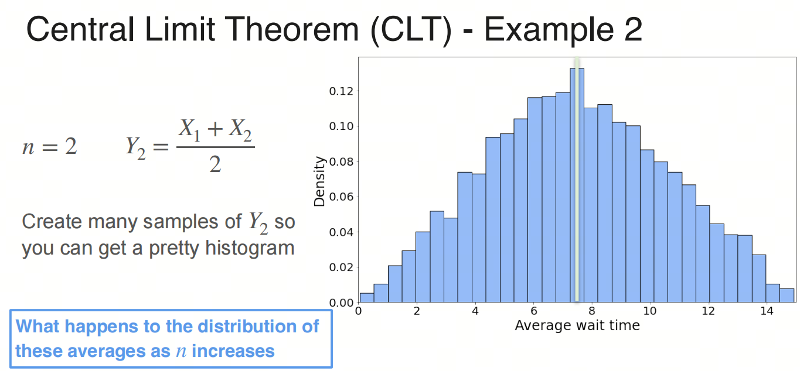
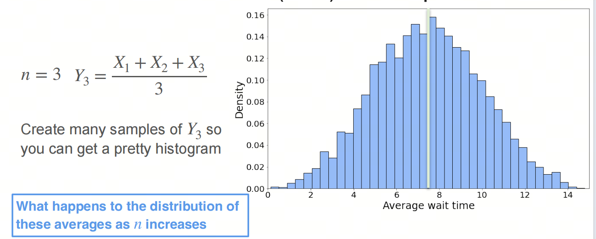
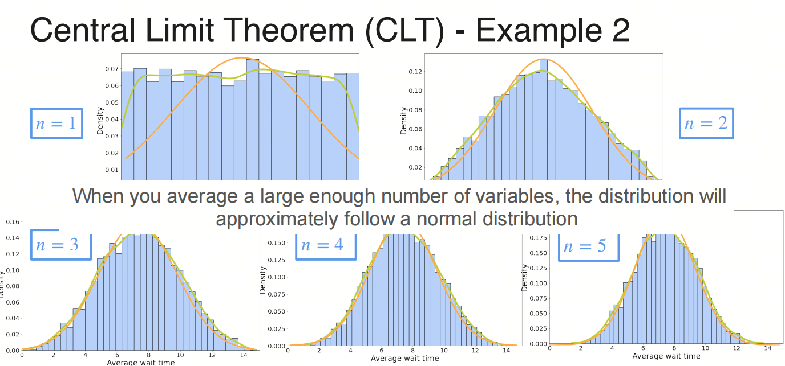

# Mathematics for AI/LLM from Scratch: Probability and Statistics, Part 3, Central Limit Theorem

## 1. Series Introduction

AI is an interdisciplinary field, somewhere between natural sciences and engineering, and a solid math base makes it much easier to understand what the algorithms are really doing.

Probability and statistics are core math areas for AI. If you want to understand deep learning algorithms and models, you cannot really avoid them. In this series, we will go through the probability and statistics needed for AI large models, so the principles and applications of large models feel less mysterious.

We will focus on the basic concepts, and we will keep the important mathematical terms in English as we go. I will also add a few things that usually do not get much attention in university courses, mostly to help build a more intuitive feel for probability and statistics.

- Probability is a mathematical tool for describing the possibility of random phenomena. It is a mathematical model for uncertainty.
- Statistics is the science of collecting, processing, analyzing, and interpreting data. It is a way to study data and extract information from it.

## 1. Normal Distribution

- Normal Distribution, also called Gaussian Distribution, is one of the most important distributions in probability and statistics, and one of the most common distributions overall.

You have probably heard of normal distribution and know that it is the most common distribution in nature. Even the English word `Normal` points to how common it is: human height, weight, IQ, and many other traits often follow a normal distribution.

But do you know why height, weight, IQ, and other human traits follow a normal distribution? The answer is the Central Limit Theorem.

The Central Limit Theorem says: as the number of random variables grows, the sum of many independent and identically distributed random variables with finite variance tends toward a normal distribution.

Human height, weight, IQ, and so on are determined by many genes. Each gene can be treated as a random variable, and the sum of those random variables gives height, weight, IQ, and so on. According to the Central Limit Theorem, those sums tend toward a normal distribution.

## 2. Law of Large Numbers

The Law of Large Numbers is an important theorem in probability and statistics. It describes the phenomenon where the mean of a sequence of random variables in repeated experiments approaches the expected value.

The Law of Large Numbers is divided into the Weak Law of Large Numbers and the Strong Law of Large Numbers.

- Weak Law of Large Numbers: for a sequence of independent and identically distributed random variables, the mean in repeated experiments converges to the expected value with probability 1.

- Strong Law of Large Numbers: for a sequence of independent and identically distributed random variables, the mean almost surely converges to the expected value.

## 3. Central Limit Theorem

### Intuitive Understanding

An intuitive way to understand the Central Limit Theorem is this: for random variables with any distribution, if you repeat the experiments enough times, the distribution of their sum will tend toward a normal distribution.

### CLT for Discrete Random Variables

Consider a coin toss. The outcome of a coin toss is heads or tails. If we count heads as 1, then the outcome is either 0 or 1 and follows a binomial distribution.

One toss: possible outcomes are 0 and 1, with probabilities 0.5 and 0.5.

Two tosses: possible outcomes are 0, 1, and 2, with probabilities 0.25, 0.5, and 0.25.

Three tosses: possible outcomes are 0, 1, 2, and 3, with probabilities 0.125, 0.375, 0.375, and 0.125.

As the number of coin tosses increases, the distribution graph moves toward a normal distribution.

### CLT for Continuous Random Variables

Consider a uniform distribution. Here the example is waiting time for a customer service call. Suppose the duration is between 0 and 15 minutes, so the duration follows a uniform distribution.

Distribution of the sample for one phone call:

Distribution of the sum of waiting times for two calls:

Distribution of the sum of waiting times for three calls:

As the number of samples increases, the distribution graph moves toward a normal distribution.

## 4. History of the Central Limit Theorem

The Central Limit Theorem has an interesting history. The first version of the theorem was discovered by the French mathematician de Moivre. In an outstanding 1733 paper, he used the normal distribution to estimate the distribution of the number of heads in a large number of coin tosses. This ahead-of-its-time result was almost forgotten, but the famous French mathematician Laplace rescued the little-known theory in his work `Théorie Analytique des Probabilités`, published in 1812.

Laplace extended de Moivre's theory and showed that the binomial distribution can be approximated by the normal distribution. But, like de Moivre's discovery, Laplace's result did not receive much attention at the time. Only by the end of the 19th century did the importance of the Central Limit Theorem become widely known.

In 1901, the Russian mathematician Lyapunov gave a definition of the Central Limit Theorem for more general random variables and proved it rigorously. Today, the Central Limit Theorem is considered the central theorem of probability theory.

## References

[1] [probability-and-statistics](https://www.coursera.org/learn/machine-learning-probability-and-statistics/home/week/3)

[2] [Central Limit Theorem](https://zh.wikipedia.org/wiki/%E4%B8%AD%E5%BF%83%E6%9E%81%E9%99%90%E5%AE%9A%E7%90%86)
