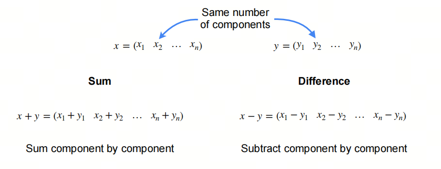
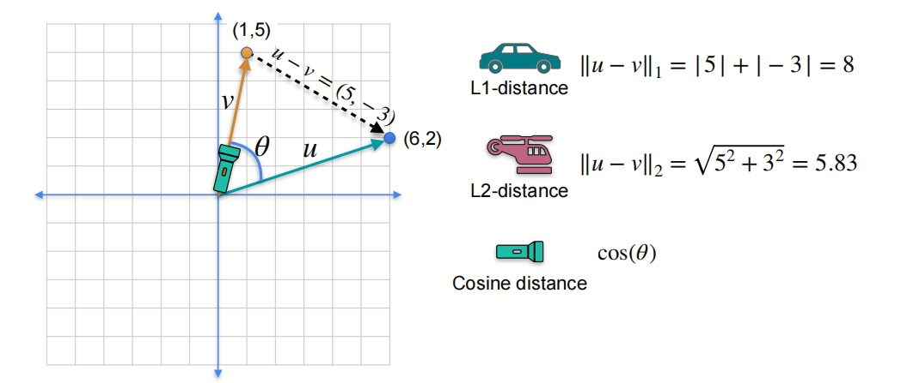
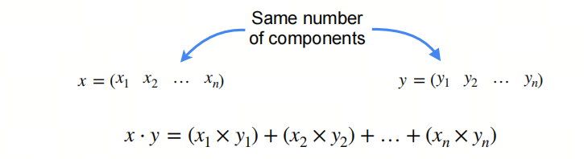
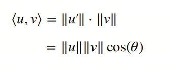
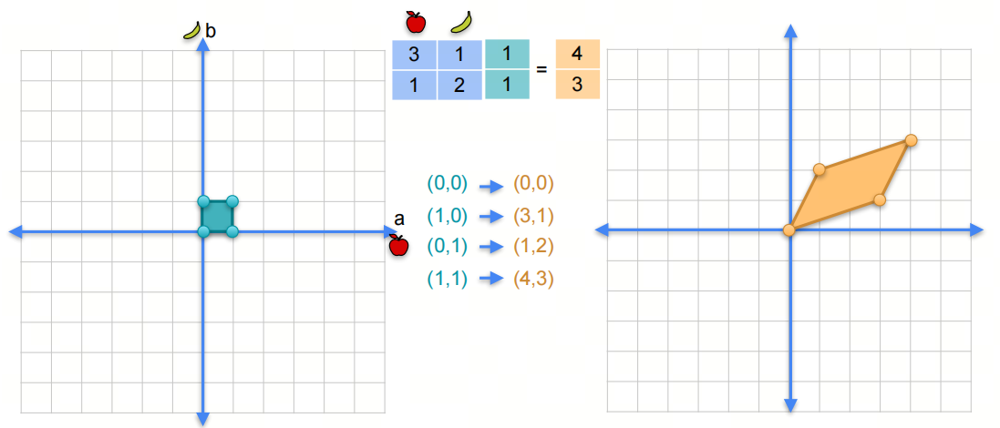
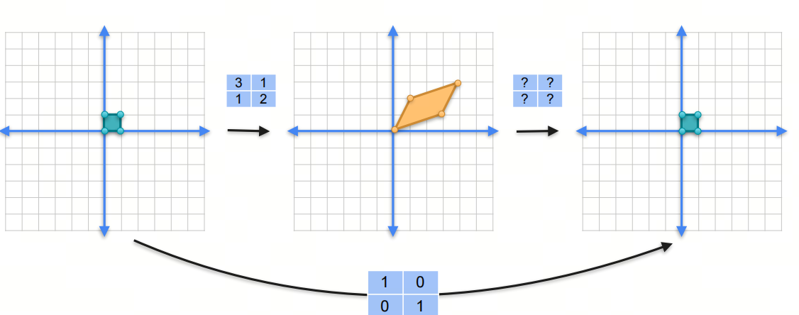
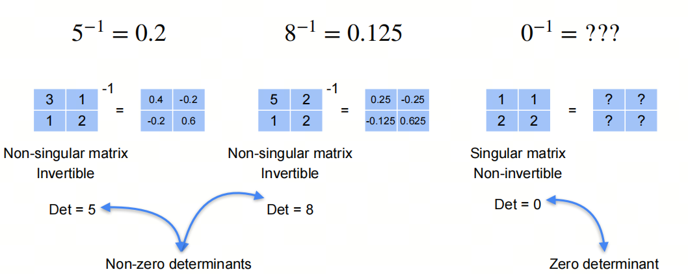

# Mathematics for AI/LLM from Scratch: Linear Algebra, Part 3, Vectors and Linear Transformations

## 1. Introduction to the series

AI is an interdisciplinary field at the intersection of natural sciences and engineering, and a solid mathematical foundation helps you understand the essence of algorithms.

Linear algebra is one of the foundational mathematical areas for AI. Mastering linear algebra is critical for understanding deep learning algorithms and models. In this series, we go through the linear algebra knowledge needed for AI large models, so we can better understand the principles and applications of large models.

We will focus on basic concepts and give key mathematical terms their English names to make understanding easier. We will also share some things usually not taught at university, to help build an intuitive understanding of linear algebra.

## 2. Vector

Vector is a mathematical object with magnitude and direction. It is widely used in physics, engineering, and mathematics to represent quantities with direction, such as force, velocity, and displacement. A vector is usually drawn as an arrow: arrow length shows magnitude (or norm), and arrow direction shows direction.

### 2.1. Operations on Vectors

Vector addition means adding two vectors, producing a new vector. Vector addition satisfies the commutative and associative laws.

Vector subtraction means subtracting one vector from another, producing a new vector.

### 2.2. Distance

L1-norm and L2-norm are two common methods for computing distance:

L1-norm, also Manhattan distance in machine learning, is the sum of absolute values of all vector elements.

L2-norm, also Euclidean distance in machine learning, is the square root of the sum of squares of all vector elements.

Cosine similarity is the cosine of the angle between two vectors.

### 2.3. Dot Product

Dot product is a scalar obtained by multiplying two vectors. The geometric meaning of dot product is the projection of one vector onto another.

Dot product has two notation forms: $x·y$ and $<x,y>$

### 2.4. Hadamard Product

The operation where corresponding elements of two vectors are multiplied to produce a new vector is called **Hadamard product**, also **element-wise product** or **Schur product**. This operation appears very often in mathematics, physics, and engineering, especially in matrix theory, signal processing, and large models.

Definition of Hadamard product:

Let there be two vectors of the same dimension, $\mathbf{a} = [a_1, a_2, \ldots, a_n]$ and $\mathbf{b} = [b_1, b_2, \ldots, b_n]$. Their Hadamard product is a new vector $\mathbf{c} = [c_1, c_2, \ldots, c_n]$, where each element $c_i$ is the product of corresponding elements $a_i$ and $b_i$:

$c_i = a_i \cdot b_i$

for all $i = 1, 2, \ldots, n$.

## 3. Linear Transformations

Matrix-vector multiplication is a linear transformation that maps one vector into another. The result of matrix-vector multiplication is a new vector.

### 3.1. Rank and linear transformation

Suppose we have a matrix:
$$
\begin{pmatrix}
3 & 1  \\
1 & 2
\end{pmatrix}
$$

We say this is actually a linear transformation, because it maps one vector to another. How should we understand this?

In the original two-dimensional space, there is a vector $\begin{pmatrix} 1 \\ 1 \end{pmatrix}$ with coordinates $(1,1)$. When we multiply this vector by the matrix, we get a new vector $\begin{pmatrix} 5 \\ 3 \end{pmatrix}$ with coordinates $(4,3)$.

Similarly, for three other coordinate points $(0,0)$, $(1,0)$, $(0,1)$, we get new points $(0,0)$, $(3,1)$, $(1,2)$.

This is equivalent to a linear transformation of the original coordinate system.

- Some may have noticed that the area of the parallelogram formed by the new points $(0,0)$, $(3,1)$, $(1,2)$, $(4,3)$ is exactly the rank of the matrix. Is that a coincidence?

### 3.2. The identity matrix

`identity` in English means "identity", and in mathematics it also means identity. The identity matrix is a matrix which, when multiplied by a vector, gives the same vector as the original.

Identity matrix is a square matrix whose diagonal elements are 1 and all other elements are 0. Usually, identity matrix is denoted $I$.

### 3.3. Inverse

A matrix multiplied by its inverse matrix gives the identity matrix.

Only a non-singular matrix is invertible; a singular matrix is not invertible. Why? Welcome to the next article.

## References

[1] [machine-learning-linear-algebra](https://www.coursera.org/learn/machine-learning-linear-algebra/home/week/3)

## Follow my GitHub and WeChat Official Account [The Real Ship of Theseus]. No time to explain, come aboard!

[GitHub: LLMForEverybody](https://github.com/luhengshiwo/LLMForEverybody)

The repository has the original Markdown files. Everything is fully open source, and stars and forks are very welcome!
