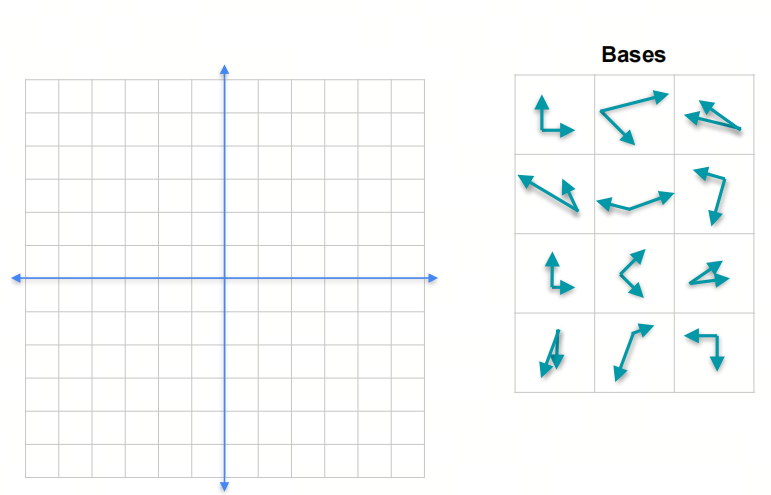
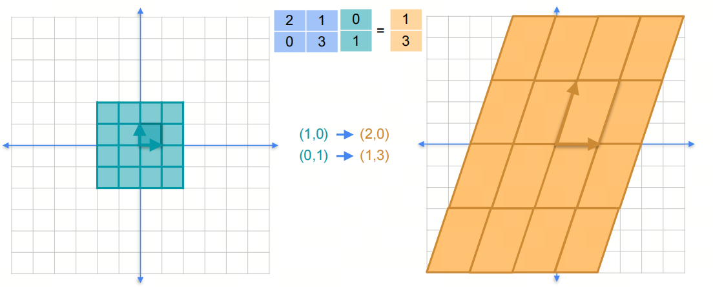
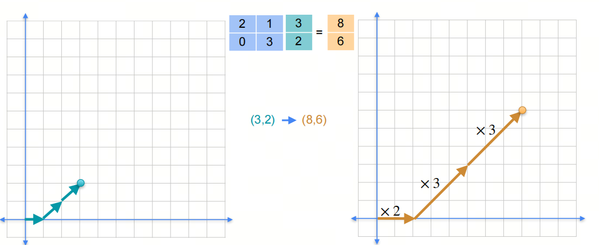
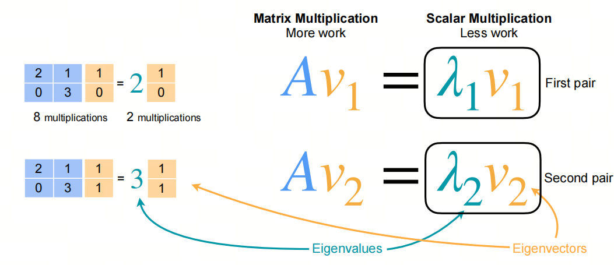

# Mathematics for AI/LLM from Scratch: Linear Algebra, Part 5, Basis, Eigenvalues, and Eigenvectors

## 1. Introduction to the series

AI is an interdisciplinary field at the intersection of natural sciences and engineering, and a solid mathematical foundation helps you understand the essence of algorithms.

Linear algebra is one of the foundational mathematical areas for AI. Mastering linear algebra is critical for understanding deep learning algorithms and models. In this series, we go through the linear algebra knowledge needed for AI large models, so we can better understand the principles and applications of large models.

We will focus on basic concepts and give key mathematical terms their English names to make understanding easier. We will also share some things usually not taught at university, to help build an intuitive understanding of linear algebra.

## 2. Basis and Span

- In different papers, you may see `Basis` and `Bases`. In English, `basis` means "foundation; base; main component; basic principle", and in linear algebra it means `basis`. The plural form of `basis` is `bases`. Another word that is easy to confuse is `base`; its plural form is also `bases`.

### 2.1. Basis

Basis is a set of basic vectors of a vector space; through their linear combinations, any vector in that vector space can be obtained. In two-dimensional space, two linearly independent vectors can be used to represent this space: these two vectors are the basis of the space.

### 2.2. Span

Span is the set of all possible linear combinations in a vector space. In two-dimensional space, two linearly independent vectors can be used to represent this space, and the span of these two vectors is this space.

### 2.3. Eigenbases

Eigenbasis is a special set of basis worth paying attention to, because it has special properties.

- The word `eigen` comes from German and literally means "own." In mathematics and physics, `eigen` is usually related to "intrinsic", "proper", or "characteristic", and describes properties inherently belonging to a system or object.
At the beginning of the 20th century, the great German mathematician Hilbert first used the word `eigenvalue` to denote characteristic value. Because of Hilbert's huge influence, `eigenvalue` is now the most common word in mathematics and is used more often than the Anglo-French `characteristic value`.

For matrix (linear transformation):
$$
\begin{pmatrix}
3 & 1  \\
1 & 2
\end{pmatrix}
$$

It maps points from a two-dimensional space to points in another two-dimensional space. We can see that the original four coordinate points $(0,0)$, $(1,0)$, $(0,1)$, $(1,1)$ become new coordinate points $(0,0)$, $(3,1)$, $(1,2)$, $(4,3)$ after the linear transformation.

On this two-dimensional plane, there are infinitely many bases (vector groups), but among them there is a special basis (vector group): after this matrix is applied, the direction of this basis does not change, only its length changes. This basis is called an eigenbasis.

***Meaning***:

1. We know that any vector on a plane (`Span`) can be expressed through a linear combination of some basis.
2. Therefore, any vector can of course be expressed through a linear combination of eigenbasis.
3. The action of a linear transformation on any vector equals its action on a linear combination of eigenbasis.
4. When a linear transformation acts on eigenbasis, it only **changes the length of the eigenbasis**, while direction stays the same.
5. Eigenbasis can simplify computations of linear transformations.

$$ A =
\begin{pmatrix}
2 & 1  \\
0 & 3
\end{pmatrix}
$$

Eigenbasis for it: $(1,0),(1,1)$

$v$ = $(3,2)$

$(3,2) = 1*(1,0)+2*(1,1)$

$Av$ = $A(3,2)$ = $A*1*(1,0)+A*2*(1,1)$ = $1*A(1,0)+2*A(1,1)$ = $1*2*(1,0)+2*3*(1,1)$ = $(2,0)+(6,6)$ = $(8,6)$

## 3. Eigenvalues and Eigenvectors

The eigenbasis above and the measure of how it **changes the length of the eigenbasis** lead, after further analysis, to eigenvectors and eigenvalues.

The method for computing eigenvectors and eigenvalues is to solve the characteristic polynomial of the matrix.

- `Characteristic` and `Eigen` are two mathematical forms of expression in English and German; the meaning is the same.

Definition of characteristic polynomial:

$$ det(A-\lambda I) = 0 $$

## References

[1] [machine-learning-linear-algebra](https://www.coursera.org/learn/machine-learning-linear-algebra/home/week/3)

---

## 📚 相关概念

[[concepts/Transformer 架构|Transformer 架构]]

> 📌 来源：[[sources/LLMForEverybody/索引|LLMForEverybody 导航]] · 章节：数学
