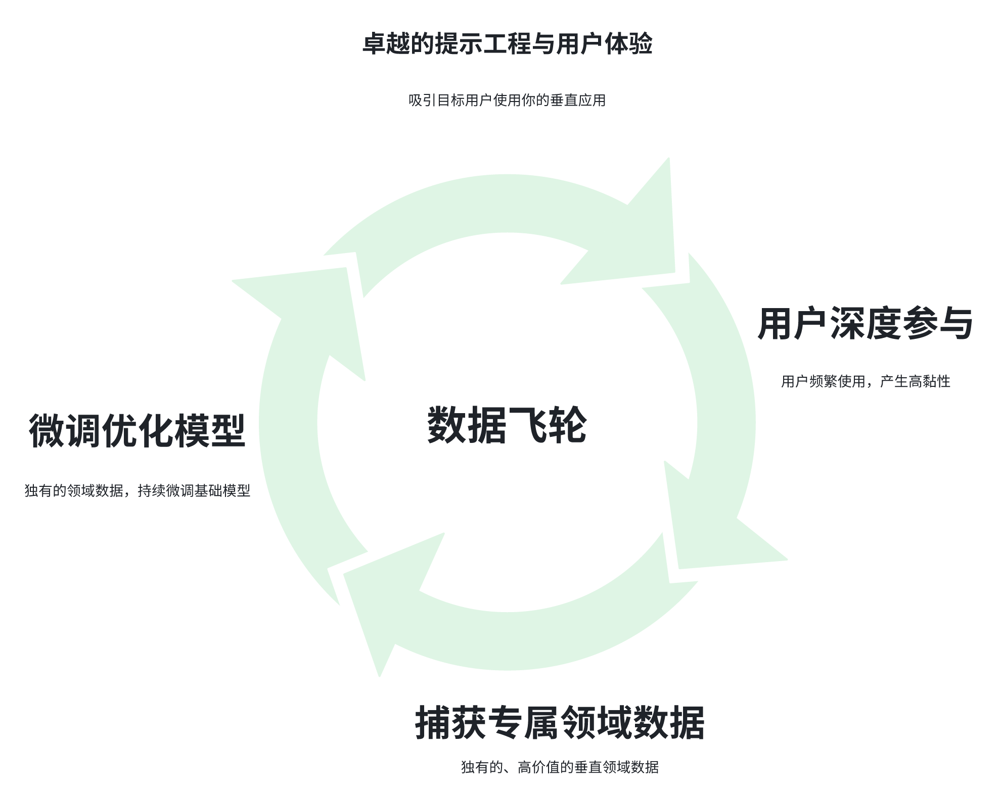

# The Main Battlefield of GenAI: From Imitator to Platform Controller

- Unbundle -> barrier -> core -> rebundle: the four steps of a winner

The popularity of generative AI is beyond doubt. The sudden rise of ChatGPT lit up global interest, and this year all kinds of products with "Agent" in the name followed. But behind the shine there is a hard reality: **simple copying does not create a real moat**.

So in this seemingly crowded red ocean, **who will become the small group of final winners**? How does a company move from imitator to "platform controller", the kind of player that defines the future power structure?

Around that key question, this article tries to describe how value is captured in generative AI and extract four key steps toward success. Today we will walk through this "winner's roadmap" in detail.

## 1. Step One: Slice the Pie, Look for "Deep and Precise" Instead of "Broad and Everything" (Unbundle)

Foundation models such as Qwen and DeepSeek are strong in "horizontal general capabilities": they can chat, write, and code. But **real user needs are often vertical, specific scenarios**:

- marketers need AI that can create high-conversion copy;
- programmers need AI that can accurately generate and debug code;
- designers need an AI tool that understands instructions for a specific style.

This is how "Agent applications" appear. In essence, they put scenario-specific "clothing" on top of a foundation model. Through carefully designed Prompt Engineering, with the help of an Agent or workflow and a user interface (UI), they decompose a general ability into a specific vertical task.

The point: the user's usage threshold goes down, and they get an out-of-the-box solution.

The trap: **simple packaging has a very low barrier. Imitators will rush in quickly, and eventually homogeneous competition begins**. A layer of "clothing" is not enough to become a core advantage.

## 2. Step Two: Build a Barrier, Create Your Own "Data Flywheel" (Vertical Advantage)

How do you evolve from a "copyable wrapper" into a "hard-to-break barrier"? The key is building Vertical Advantage, a self-reinforcing flywheel loop:

1. Excellent prompt engineering and user experience: they attract target users to your vertical application.
2. Deep user engagement: users use the product often, creating high stickiness.
3. Capturing proprietary domain data: when users solve specific problems through your application, you collect a large amount of unique, high-value vertical domain data. For example, the concrete details of how lawyers use AI to edit contract templates, or how designers prefer to adjust style. This kind of data is hard for others to get.
4. Fine-tuning and model optimization: using this unique domain data, you continuously fine-tune the foundation model, making it stronger and more competent in your domain.
5. Better user experience: the better the model performance, the happier the users. The happier the users, the more often they use the product. The more often they use it, the more data is created. The flywheel keeps accelerating.

Core competitiveness: the heart of the flywheel is **the combination of domain-specific data accumulation and model iteration capability**. This requires close cooperation between the product team and the technical/model team, so the product and model can be improved quickly and iteratively based on realtime user feedback. In large organizations, departmental barriers often become the biggest obstacle on this path.

In short: **enter the market through unbundling, then build an almost impossible-to-copy vertical barrier through the data flywheel**. You are no longer an optional wrapper. You become a player with core competitiveness, deeply embedded in a specific domain.

## 3. Step Three: Master the Core, Find the "Lifeline" of the Workflow (Core Creative Activity)

Building a vertical barrier (step 2) is the foundation for survival. But if you really want to capture more value and make VCs' pulse speed up, you need a more ambitious step: rebundling.

Unbundling is like disruption: it cuts the pie apart. Rebundling rebuilds the value chain and becomes the center of the new pie.

The best example for understanding rebundling is WeChat:

- Start: unbundling breaks the traditional structure. WeChat first entered as a vertical replacement for SMS, basically a communication tool.
- Capture core horizontal capabilities: it quickly mastered two extremely universal horizontal capabilities, communication and payment.
- Create a new platform: relying on these two core capabilities, WeChat built a new platform layer on top of the mobile operating system.
- Rebundling: in the end, official accounts, mini programs, local services, games, and many other functions/services were bundled into this new platform. WeChat came to manage the relationship between users and a huge number of services, turning into a super hub for digital life.

In generative AI, the key to rebundling is to identify and control The Core Creative Activity in the workflow of that domain:

- Distinguish predictive AI from generative AI:
  - In predictive AI, for example recommendation algorithms, the core is the Core Decision: deciding "what to recommend".
  - In generative AI, the core is "creation". Core creative activity is the creative stage that determines the final output and carries the most value.

- Where is the core in an industry?
  - Architecture design: concept development, final structural safety review.
  - Drug discovery: target discovery, molecular structure design.
  - Content creation: generation of the core creative concept and final shaping/approval.
  - Software development: core architecture design, complex logic construction.

Whoever controls the core creative activity gets the key to becoming the new hub. Other tools will be built around it, integrated into it, or made dependent on that core.

## 4. Step Four: Create the Hub, Become the "Definer" of the New Order (Rebundling)

Once you clearly understand which core creative activity you want to control, how do you turn yourself into the new platform hub of that domain? You need three key competitive advantages, which can overlap:

1. Scenario Advantage: how deeply is your product embedded in the target scenario? Do users have to go through your product to complete the core creative activity? You control the entrance to the core workflow.

2. Intelligence Advantage: do you have a powerful model, the best-performing one on this core activity, specialized for this domain? Usually this is the result of proprietary data and continuous fine-tuning accumulated through your data flywheel.

3. Relationship Advantage: do you have deep relationships with the key people doing the core activity, for example top designers, researchers, or engineers? Do they trust you and choose your tools first?

## 5. Winner's Roadmap: From Entry to Dominance

Four clear steps, each built on the previous one:

1. Unbundle: use a strong foundation model and enter a vertical market precisely, where you can gain a foothold.

2. Vertical Advantage: build a "data flywheel" in the vertical domain, forming a hard-to-copy vertical advantage and moat.

3. Core Creative Activity: identify and lock onto the core creative activity in the workflow of this vertical domain.

4. Rebundle: relying on core advantages in workflow, intelligence, relationships, or a combination of them, control the core activity, become the new hub, and lead the next-generation value chain in this domain.

## 6. Reflection: Where Is Your Battlefield?

Let us return to the industry you work in, or the industry you are studying deeply:

1. What exactly is the most valuable "core creative activity"? Concept development? Structural design? Gene screening? Creative direction?

2. Look around: who, an existing giant, a new player, or maybe you yourself, is most likely to use AI to strengthen or even control this core activity?

3. Can they, or can you, successfully rebundle and become the key hub that defines the future?

## References

[GitHub: LLMForEverybody](https://github.com/luhengshiwo/LLMForEverybody)

---

## 📚 相关概念

[[concepts/LLM 应用 生态|LLM 应用 生态]]

> 📌 来源：[[sources/LLMForEverybody/索引|LLMForEverybody 导航]] · 章节：企业与个人思考
