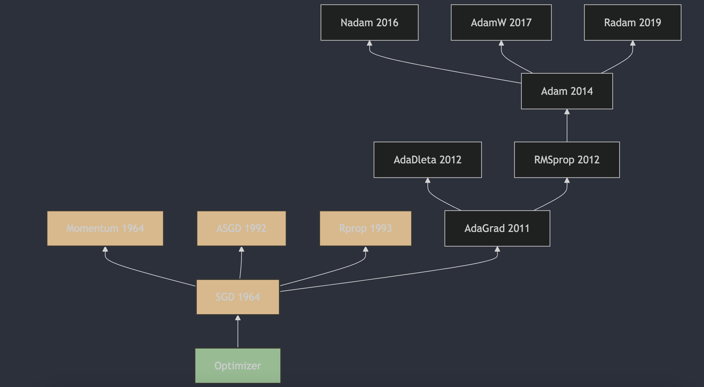

Разбираемся с оптимизаторами нейронных сетей за 3 минуты в день (часть 5): Rprop

Алгоритм Resilient Backpropagation был предложен Martin Riedmiller и Hermann Braun в 1993 году. Rprop вычисляет обновления, используя только знак градиента, а не его величину, и тем самым динамически подстраивает шаг независимо для каждого веса.

## 1. Появление алгоритма Rprop
Алгоритм Rprop (Resilient Backpropagation, или эластичное обратное распространение) был предложен Martin Riedmiller и Hermann Braun в 1993 году. Он подробно описан в статье «A Direct Adaptive Method for Faster Backpropagation Learning: The RPROP Algorithm» [1](#refer-anchor-5), опубликованной на международной конференции IEEE в 1993 году. Rprop вычисляет обновления, используя только знак градиента, а не его величину, и тем самым динамически подстраивает шаг независимо для каждого веса. Такой подход преодолевает некоторые врожденные недостатки традиционного градиентного спуска, а благодаря локальной адаптации к поведению функции ошибки делает процесс обучения более эффективным и прозрачным.

## 2. Принцип работы алгоритма Rprop

1. **Инициализация**: для каждого веса $w_i$ инициализировать индивидуальную величину шага $\Delta_i$. Обычно начальное значение $\Delta_i$ задают небольшим положительным числом.

2. **Правила обновления**:
   - Если $g_t$ (текущий градиент) и $ g_{t-1} $ (градиент на предыдущем шаге) имеют одинаковый знак, увеличить величину шага:
     $\Delta_i = \min(\Delta_{\text{max}}, \eta_i + \Delta_i)$
   - Если $ g_t $ и $ g_{t-1} $ имеют разные знаки или $ g_t $ равен нулю, уменьшить величину шага:
     $\Delta_i = \max(\Delta_{\text{min}}, \eta_i - \Delta_i)$
   - Если $ g_t $ и $ g_{t-1} $ оба равны нулю, сбросить величину шага:
     $\Delta_i = \Delta_{\text{init}}$

3. **Обновление весов**:
   $w_i = w_i - \Delta_i \cdot \text{sign}(g_t)$
   где $g_t$ - текущий градиент, а $\text{sign}(g_t)$ - знаковая функция градиента.

### Параметры:
- $\Delta_{\text{max}}$: максимальная величина изменения, предотвращает слишком большой шаг;
- $\Delta_{\text{min}}$: минимальная величина изменения, предотвращает слишком маленький шаг;
- $\Delta_{\text{init}}$: начальная величина изменения;

Благодаря такому механизму Rprop может адаптивно настраивать шаг для каждого веса, что делает обучение более гибким и эффективным. Он особенно подходит для задач, где нужно тонко регулировать величину обновления, чтобы не застрять в локальном минимуме.

## 3. Основные особенности алгоритма Rprop:

1. **Адаптивный шаг**: Rprop задает шаг отдельно для каждого веса, а не использует один глобальный learning rate. Это значит, что шаг каждого веса может корректироваться на основе истории его градиентов;

2. **Быстрая сходимость**: благодаря адаптивной настройке шага Rprop обычно сходится быстрее;

3. **Устойчивость**: алгоритм Rprop слабо чувствителен к выбору начального шага, что обеспечивает ему хорошую устойчивость на разных задачах.

## Ссылки

[1] [A Direct Adaptive Method for Faster Backpropagation Learning: The RPROP Algorithm](https://citeseerx.ist.psu.edu/viewdoc/summary?doi=10.1.1.21.1417)

## GitHub и WeChat автора

[GitHub: LLMForEverybody](https://github.com/luhengshiwo/LLMForEverybody)

В репозитории есть исходные Markdown-файлы, он полностью open source. Буду рад вашим Star и Fork!

---

## 📚 相关概念

[[concepts/Transformer 架构|Transformer 架构]] | [[concepts/分词器 LLM|分词器 LLM]] | [[concepts/LLM 训练 流水线|LLM 训练 流水线]] | [[concepts/RLHF DPO 对齐|RLHF DPO 对齐]] | [[concepts/LoRA PEFT 微调|LoRA PEFT 微调]] | [[concepts/多模态 LLM|多模态 LLM]] | [[concepts/模型 压缩 蒸馏|模型 压缩 蒸馏]] | [[entities/Hugging Face|Hugging Face]] | [[entities/DeepSeek|DeepSeek]] | [[entities/mindspore Transformer|mindspore Transformer]] | [[sources/Vaswani 2017 Attention|Vaswani 2017 Attention]] | [[sources/LLM 训练 流水线 指南|LLM 训练 流水线 指南]] | [[sources/DeepSeek 4 技术|DeepSeek 4 技术]]

> 📌 来源：[[sources/LLMForEverybody/索引|LLMForEverybody 导航]] · 章节：预训练
