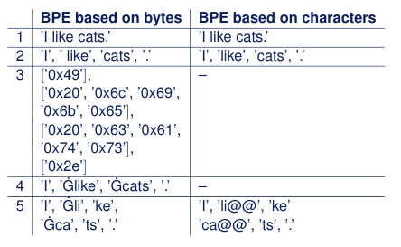
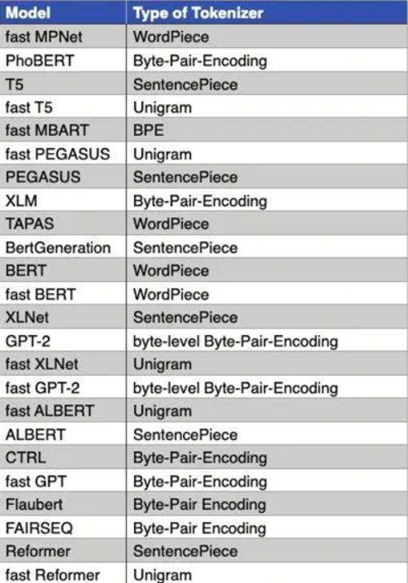

Каждый день за 5 минут: разбираемся с Tokenizer в LLM, часть 6: BBPE

BBPE — это токенизатор на основе BPE, один из вариантов BPE, предложенный командой Google Brain. Полное название BBPE — Byte-level BPE, то есть BPE-токенизатор на уровне байтов.

## 1. Интуитивное понимание

BPE см. в предыдущей статье: [Разбираемся с Tokenizer в LLM, часть 2: BPE (Byte-Pair Encoding)](разбираемся-с-токенизаторами-llm-часть-2.md)

Ключевая идея BBPE — объединять пары символов в тексте (в UTF-8 это пары байтов), чтобы формировать частые словарные или символьные паттерны. Процесс продолжается, пока не будет достигнут заданный размер словаря или пока больше нельзя будет выполнять объединения.

Разница между BPE и BBPE в том, что BPE работает на уровне character, а BBPE — на уровне byte.

У BBPE есть такие преимущества:

- универсальность между языками: поскольку он основан на byte-level представлении, его проще переносить между разными языками и письменностями;
- уменьшение размера словаря: объединяя пары байтов, BBPE может получать более универсальные subword-единицы и тем самым уменьшать размер словаря;
- обработка редких символов и OOV: BBPE эффективнее работает с редкими символами, потому что не выделяет отдельную словарную запись для каждого редкого символа, а обрабатывает их как последовательности байтов.

## Итоги серии

В этой серии про токенизаторы мы начали с самых простых word level и character level и разобрали плюсы и минусы токенизации по словам и символам.

Затем мы познакомились с sub-word level токенизаторами, включая BPE, WordPiece, Unigram и другие.

В конце мы рассмотрели два варианта. Первый — инструмент SentencePiece: он рассматривает многоязычный текст как последовательность Unicode-символов и не зависит от логики конкретного языка. SentencePiece может основываться на BPE или Unigram, а также может использовать BBPE.

Второй — алгоритм BBPE, BPE-токенизатор на byte-level, где минимальной единицей является байт.

Вы уже освоили базовые принципы и реализацию токенизаторов. Дальше мы разберем еще больше знаний о LLM, так что продолжение следует!

## Ссылки

[1] [Unigram tokenization](https://huggingface.co/learn/nlp-course/en/chapter6/7?fw=pt)

## Подписывайтесь на мой GitHub и WeChat-канал. Некогда объяснять, быстро на борт!

[GitHub: LLMForEverybody](https://github.com/luhengshiwo/LLMForEverybody)

В репозитории есть исходные Markdown-файлы, все полностью open source. Буду рад Star и Fork!

---

## 📚 相关概念

[[concepts/Transformer 架构|Transformer 架构]] | [[concepts/分词器 LLM|分词器 LLM]] | [[concepts/LLM 训练 流水线|LLM 训练 流水线]] | [[concepts/RLHF DPO 对齐|RLHF DPO 对齐]] | [[concepts/LoRA PEFT 微调|LoRA PEFT 微调]] | [[concepts/多模态 LLM|多模态 LLM]] | [[concepts/模型 压缩 蒸馏|模型 压缩 蒸馏]] | [[entities/Hugging Face|Hugging Face]] | [[entities/DeepSeek|DeepSeek]] | [[entities/mindspore Transformer|mindspore Transformer]] | [[sources/Vaswani 2017 Attention|Vaswani 2017 Attention]] | [[sources/LLM 训练 流水线 指南|LLM 训练 流水线 指南]] | [[sources/DeepSeek 4 技术|DeepSeek 4 技术]]

> 📌 来源：[[sources/LLMForEverybody/索引|LLMForEverybody 导航]] · 章节：预训练
