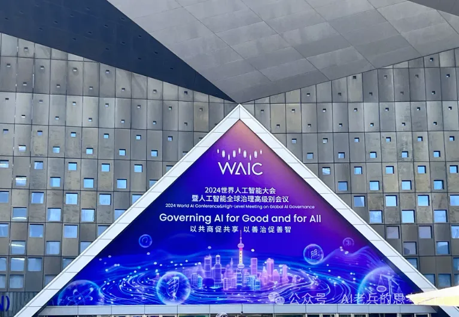
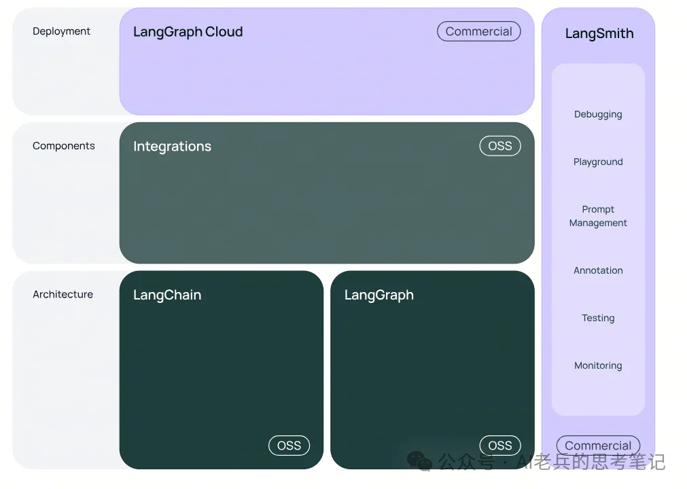
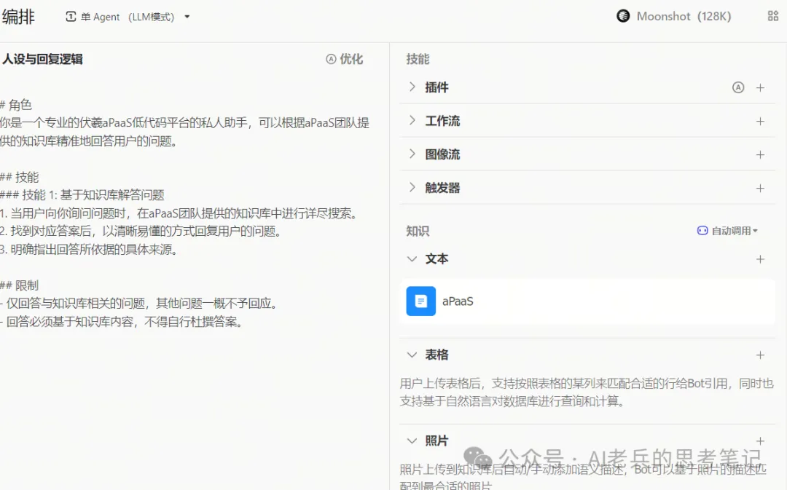
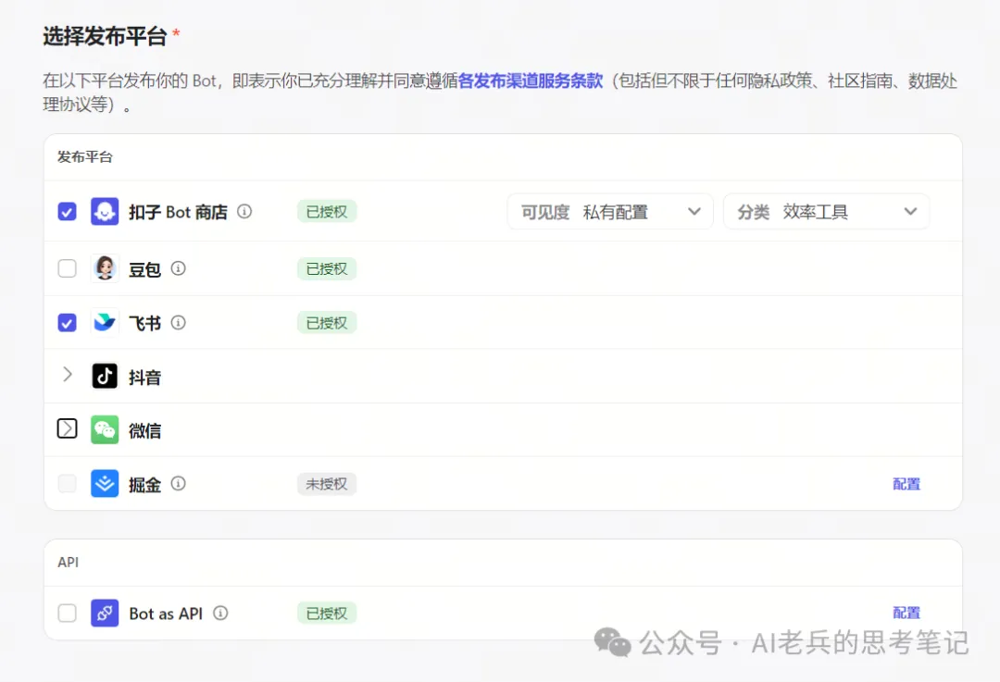

LangChain налево, Coze направо

## 1. Предыстория

Для многих людей LangChain и Coze больше похожи на инструменты для двух разных аудиторий. LangChain, как самый популярный сегодня фреймворк для разработки Agent, ориентирован на разработчиков приложений на базе больших моделей; а Coze в большей степени воспринимается как развлекательный инструмент: пользователи могут с минимальным no-code-порогом — только через prompt engineering — собирать собственных bot и делиться ими в сообществах. Но теперь, по мере углубления разработки API у платформ вроде Coze, позиция LangChain оказалась под вызовом.

На World Artificial Intelligence Conference (WAIC) 2023 года шла «битва ста моделей», а ключевое слово WAIC этого года — «приложения прежде всего». Если посмотреть на горячие темы форумов этого года, будь то embodied intelligence или AI Agent, все они указывают на вертикальное применение AI-технологий на базе больших моделей в разных сценариях.

**Agent**

Agent — это система, способная воспринимать окружение и на основе воспринятой информации принимать решения для достижения конкретной цели. Благодаря поддержке больших моделей Agent стал заметнее, чем когда-либо раньше.

## 2. LangChain

Agent-фреймворки во главе с LangChain сейчас являются самыми широко используемыми open source-фреймворками в Китае. Изначальная идея дизайна LangChain заключалась в том, чтобы представлять workflow как DAG (directed acyclic graph, направленный ациклический граф); отсюда и произошло Chain.

По мере распространения идеи Multi-Agent и постепенного закрепления Agent-парадигмы Agent workflow становится все сложнее: в нем появляются циклы и другие условия. Для этого уже нужен Graph-подход, и так появился LangGraph.

**Критика LangChain**

Слава велика — и критики тоже много. В адрес LangChain часто высказывают претензии, и ключевая из них касается объема кода и уровня абстракции: объем кода при использовании LangChain примерно сопоставим с объемом кода при использовании только официальной библиотеки OpenAI, при этом LangChain объединяет больше объектных классов, но явного преимущества в коде не дает. Кроме того, абстракции LangChain повышают сложность кода без очевидной выгоды, из-за чего разработка и сопровождение становятся труднее.

## 3. Coze

**Что такое Coze**

Coze — это AI-платформа нового поколения для разработки приложений на базе больших моделей. Независимо от того, есть ли у вас навыки программирования, вы можете быстро собрать разные Bot и в один клик опубликовать их на крупных социальных платформах или легко развернуть на собственном сайте.

**Платформы публикации**

Помимо публикации в социальных сетях, готового Bot можно опубликовать как API. Это означает, что Agent можно создать через drag-and-drop (low-code), а затем встроить через API в любой workflow. Так Coze в один момент превращается из развлекательного инструмента в настоящий инструмент продуктивности.

## 4. Изменение парадигмы разработки

**Сдвиг парадигмы**

Для крупных компаний конкуренция платформ означает конкуренцию экосистем, и у Coze уже есть преимущество первого хода. Раньше все собирали небольших bot, публиковали их в Doubao или размещали в WeChat Official Account. После открытия API мы можем помещать Agent в любой workflow, а значит, можно создавать большое количество инструментов продуктивности и встраивать их в уже существующие workflow в самых разных отраслях.

**Мое мнение**

По крайней мере в Китае обычным разработчикам стоит больше фокусироваться на бизнес-задачах, которые решает Agent, а не тратить много времени на нижний уровень LangChain. Если все игроки последуют за API, создание Agent станет работой почти без затрат на разработку, и тогда идеи станут невероятно важны!

## Ссылки

[1] [GitHub: LLMForEverybody](https://github.com/luhengshiwo/LLMForEverybody)

---

## 📚 相关概念

[[concepts/RAG 检索 增强 生成|RAG 检索 增强 生成]] | [[concepts/向量 DB 嵌入|向量 DB 嵌入]] | [[concepts/混合 检索 bm 25 语义 融合|混合 检索 bm 25 语义 融合]] | [[concepts/智能体 编排 模式|智能体 编排 模式]] | [[concepts/智能体 编程|智能体 编程]] | [[concepts/智能体 工具 使用 MCP|智能体 工具 使用 MCP]] | [[concepts/智能体 长 期 内存|智能体 长 期 内存]] | [[concepts/多 智能体 协作|多 智能体 协作]] | [[concepts/LLM 智能体 测试框架|LLM 智能体 测试框架]] | [[concepts/浏览器 智能体|浏览器 智能体]] | [[concepts/轻量 智能体 框架|轻量 智能体 框架]] | [[concepts/LLM 应用 生态|LLM 应用 生态]] | [[entities/LangChain|LangChain]] | [[entities/CrewAI|CrewAI]] | [[entities/Anthropic|Anthropic]] | [[entities/OpenAI|OpenAI]] | [[entities/Google ADK|Google ADK]] | [[sources/Anthropic 智能体 构建|Anthropic 智能体 构建]] | [[sources/LangChain 入门|LangChain 入门]] | [[sources/MCP 规范|MCP 规范]] | [[sources/智能体 框架 对比|智能体 框架 对比]]

> 📌 来源：[[sources/LLMForEverybody/索引|LLMForEverybody 导航]] · 章节：Agent
