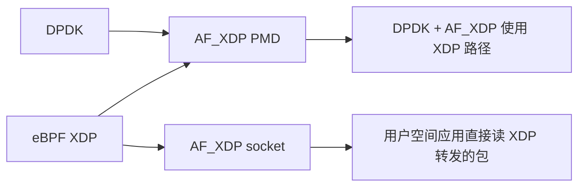

# DPDK 与 eBPF XDP 技术对比

## 设计哲学对比

| 维度 | DPDK | eBPF + XDP |
|------|------|-------------|
| 核心思路 | 内核旁路 (kernel bypass) | 内核内加速 (in-kernel acceleration) |
| 数据路径 | 用户空间 PMD 轮询 | 内核驱动层/TC hook |
| 与内核关系 | 绕过内核协议栈 | 嵌入内核执行 |
| 安全性 | 无内置安全机制（root 权限） | 验证器 + CAP_BPF + BPF token 三层保护 |
| 隔离性 | 独占网卡设备 | 与内核网络栈共存 |

## 技术细节对比

### 包处理模型

```
DPDK:
  网卡 → DMA → 用户空间内存 (hugepage)
       ↓
   应用轮询收包 (PMD)
       ↓
   用户空间处理 / 转发
       ↓
   轮询发包 (PMD)

eBPF XDP:
  网卡 → DMA → 内核原生缓冲区
       ↓
   XDP 程序（驱动层执行）
       ↓
   动作：DROP/PASS/TX/REDIRECT
       ↓
   （PASS 时）正常进入内核协议栈
```

### 性能特征

| 指标 | DPDK | XDP (native) | XDP (generic) |
|------|------|-------------|---------------|
| 包处理延迟 | ~1µs (L2 forward) | ~50 ns | ~1-2µs |
| 吞吐量 (64B) | 线速 (14.88 Mpps@10GbE) | 线速或接近线速 | 受中断/拷贝限制 |
| CPU 消耗 | ~100%/核（轮询） | ~100%/核（中断+轮询混合） | 与正常内核一致 |
| 零拷贝 | ✅ DMA 到用户空间 | ✅ DMA 到内核（可重定向） | ❌ |
| 上下文切换 | 零（用户态一致） | 零（内核态一致） | 有中断开销 |

### 开发与运维对比

| 维度 | DPDK | eBPF + XDP |
|------|------|-------------|
| 编程语言 | C (EAL/PMD API) | C / Rust / Go (BPF C 子集) |
| 学习曲线 | 陡：hugepage + 网卡绑定 + CPU 隔离 | 中：C 子集 + map 约束 + verifier |
| 部署要求 | CPU isolcpus、hugepage 配、PCI 直通 | 内核 4.8+ (XDP)、5.8+ (CO-RE) |
| 云环境 | 需 SR-IOV (直通/PF/VF) | ✅ 原生支持（virtio + native XDP） |
| 生态规模 | NFV/运营商级大厂使用 | 全行业广泛采用 |
| 调试难度 | gdb + DPDK 日志 | bpftrace/tracepipe + verifier log |
| 升级影响 | 应用需升级，网卡重新绑定 | 内核升级即可（CO-RE 兼容） |

### 内存模型

| 特性 | DPDK | XDP |
|------|------|-----|
| 页面大小 | hugepage (2MB/1GB) | 内核标准页面 (4KB) |
| NUMA 感知 | 显式绑定 | 内核自动处理 |
| TLB miss | 极低（TLB 覆盖大） | 标准 |
| 内存预分配 | 启动时分配池 | 按需分配（XDP 框架管理） |
| 跨核通信 | rte_ring (无锁) | BPF maps (与内核同步) |

## 选择指引

### 选 DPDK 的场景

- **运营商 NFV** — VPP/OVS-DPDK 已是事实标准
- **超高性能需求** — 需要 100GbE 线速处理，用户空间协议栈
- **硬件可控** — 专有硬件、裸金属部署
- **存储场景** — SPDK 生态（NVMe over Fabrics）
- **传统网元转型** — 已有 C 代码 DPDK 项目

### 选 eBPF/XDP 的场景

- **云原生 / K8s** — Cilium 已是 CNI 事实标准
- **DDoS 防护** — XDP 纳秒级包丢弃/限速
- **安全监控** — 运行时安全工具 (Falco/Tetragon/Tracee)
- **可观测性** — Hubble/Pixie 连接级跟踪
- **新项目** — eBPF 开发效率更高，社区活跃

### 融合趋势



- **AF_XDP PMD** (DPDK 19.08+)：DPDK 可通过 AF_XDP socket 复用 XDP 路径，在虚拟化/云环境中间接使用 DPDK
- **AF_XDP socket** (内核 5.4+)：XDP 程序可将包重定向到用户空间 socket，零拷贝
- **SPDK eBPF**：存储领域 DPDK SPDK 集成 eBPF 过滤
- 两条技术路线正在以 AF_XDP 为桥梁走向互补，而非替代

## 参考来源

- [[concepts/DPDK 核心架构]]
- [[entities/DPDK 开发实战]]
- [[concepts/XDP 高速数据路径]]
- [[entities/eBPF 开发实战]]
- [[synthesis/eBPF 技术全景]]
- [[sources/eBPF 调研来源]]
